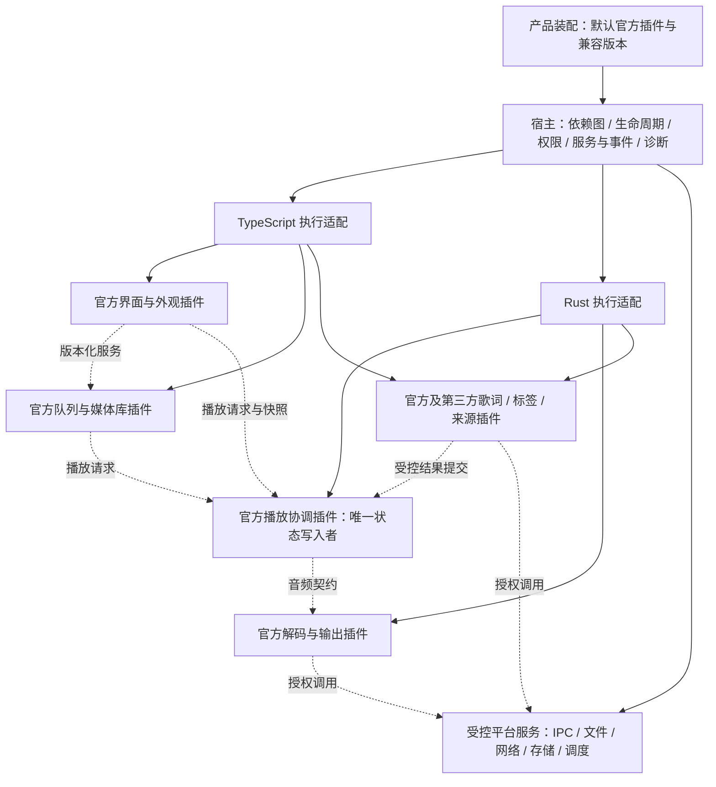

# 架构目标：所有业务能力插件化与完整宿主

## 摘要

SpMusic 的长期目标是由宿主装配所有业务插件，官方播放、队列、媒体库、歌词、外观、界面和来源插件组成默认产品。宿主负责插件治理与通用运行基础；业务功能，包括基础播放，都通过插件契约提供。官方插件随产品交付，首次启动无需用户自行寻找或安装基础功能。

本文固定目标与架构约束，不表示插件系统已经实现，也不批准即时迁移业务代码。它覆盖旧总体蓝图中“插件只能增强、不得承担基础业务”的长期限制；历史版本的实施范围继续按各自决策执行。

2026-10-01 的[插件宿主设计](plugin-host-design.md)与[技术路线决策](../decisions/2026-09-30-plugin-host-architecture.md)已明确 Rust 全局治理、选择性 Cordis 可信 TS 适配、官方 Rust 静态工厂及第三方受限 JS/WASM runner 的设计基线。下文“待评估”描述原目标阶段的开放项；已解决的职责和运行路径以该设计为准，具体库版本、平台隔离、性能与安装恢复仍须 G1～G5 验证。设计接受不表示依赖接入或业务实现已完成。

## 范围与边界

| 层级 | 目标职责 | 边界 |
| --- | --- | --- |
| 宿主 | 启动与装配、插件管理、契约注册与路由、权限执行、运行环境管理、资源治理、诊断与恢复 | 不内置隐藏的播放、队列、歌词、媒体库或界面业务实现 |
| 平台适配 | Tauri IPC、窗口原语、受控文件和网络访问、通用存储与任务执行基础 | 经宿主服务暴露能力，不把原生句柄和任意系统调用交给第三方插件 |
| 官方业务插件 | 播放控制与状态、解码与输出、队列策略、媒体库、标签与歌词、外观及业务视图、来源与同步 | 依赖公开且版本化的服务契约；同样遵守生命周期、权限和清理规则 |
| 第三方业务插件 | 提供、补充或在产品规则允许时替换业务能力 | 是否允许替换、依赖和权限由装配规则决定，不通过修改宿主源码接入 |
| 产品装配配置 | 默认官方插件组合、必要能力、兼容版本、提供器选择和恢复策略 | 基础能力可以依赖官方插件；缺失时明确说明受影响能力并提供恢复入口 |

业务划分按稳定服务与独立变更边界确定，不要求一个函数对应一个插件。官方音频插件内部可以继续使用 Rust 模块与现有音频库；内部依赖库无需伪装为可独立安装的业务插件。宿主完整性以治理能力与验证结果衡量，不以宿主代码量小作为目标。

## 统一插件模型与执行环境

TypeScript 与 Rust 使用统一的插件身份、版本、生命周期、能力声明、依赖图、配置、诊断和安装单元。一个业务插件可以包含前端与后端部分；宿主协调其契约兼容与启动、停止，不把两部分作为不相关插件独立升级。

| 契约维度 | 目标要求 |
| --- | --- |
| 身份与包 | 稳定插件 ID、插件版本、平台与架构条件、来源与完整性记录；复合包的前后端版本一致性可校验 |
| 兼容性 | 明确宿主 API 版本范围、提供与消费的服务版本、消息模式版本；加载前检查，禁止不兼容实例参与注册 |
| 依赖 | 区分必需、可选依赖与冲突，标注依赖服务；拒绝循环和无法满足的版本组合，解释阻塞链 |
| 生命周期 | 安装、配置、启用、启动、运行、停止、禁用、更新、卸载及失败恢复有明确状态；支持重复操作与部分启动回滚 |
| 权限与资源 | 声明所需能力及范围，登记订阅、任务、文件句柄、缓存、视图、服务与存储；停止和权限撤销可回收 |
| 调用与结果 | 类型化请求、事件和错误，携带调用身份、请求 ID、超时与取消语义；运行时验证跨环境输入输出 |

统一治理不要求统一执行环境。TypeScript 部分可以承载业务视图和异步业务；Rust 部分可以承载本地能力与音频业务。宿主用适配器连接各执行环境，跨环境调用使用序列化 DTO、受控句柄和版本化协议，不共享 Rust 内存布局、`AppHandle`、`Sink` 或可变业务对象。

运行环境、包格式及原生 ABI 尚未确定。官方随构建交付的 Rust 插件与可安装的第三方 Rust 插件必须分别说明支持方式；不能把 Rust 模块或 trait 注册等同于运行时原生插件加载。若采用原生动态库，必须另外设计稳定 ABI、平台矩阵、崩溃边界和卸载约束。

## 完整宿主的模块责任

| 宿主模块 | 必须提供的能力 |
| --- | --- |
| 包与插件管理 | 发现、验证、安装、启停、配置、升级、降级和卸载；识别官方与第三方来源及包完整性 |
| 依赖与装配 | 兼容检查、依赖图、冲突检测、启动顺序、反向停止顺序、提供器选择、默认官方组合与必要能力检查 |
| 生命周期与资源作用域 | 跟踪运行实例与资源所有者；部分启动失败回滚、任务取消、订阅释放、服务撤销、重复启停不泄漏 |
| 服务与事件 | 类型化服务注册、调用路由与事件分发；唯一状态写入者、事件序号、快照重连、过期实例拒绝、流量与背压治理 |
| 权限与平台服务 | 安装时声明、启用时授予、调用时校验、撤销时清理；按插件身份限定文件、网络、写入及设备等能力 |
| 运行环境与隔离 | 管理 TS/Rust 适配器、信任级别、资源限额和故障范围；第三方异常可阻断或终止，影响有明确界限 |
| 配置与存储 | 插件命名空间、配置校验、数据迁移与导出、卸载保留策略、恢复和版本回滚兼容性 |
| 诊断与恢复 | 实例状态、依赖故障链、结构化错误、调用与事件关联、性能观测、故障禁用、上次可用装配与恢复入口 |
| 开发与验证支持 | 公开 SDK、契约检查、测试宿主或替身、插件验证套件与宿主/插件版本兼容矩阵 |

依赖注入或 Cordis 等框架可以协助服务注册与资源作用域，但不能替代权限检查、消息校验和执行隔离。普通同进程 JavaScript 上下文、`vm` 或同进程 Rust 模块不能自动成为安全沙箱；未经证明的隔离不能宣称能够抵御不可信代码。具体隔离方式与允许执行的信任等级须在实现前独立决策。

## 依赖方向与默认装配

虚线表示经宿主路由的契约调用，不允许跨插件直接导入内部实现。图中服务分组表达目标责任，具体插件粒度及 TS/Rust 分布仍需设计评审。UI 只消费状态和发送请求；基础能力缺失或版本不兼容时，宿主保持管理与恢复入口可用，产品能力按装配规则禁用或恢复。

## 状态权威与当前代码演进约束

播放状态机仍由一个服务实例负责提交。目标中它属于官方播放协调插件，宿主保证提供器唯一性与调用治理，不把播放业务永久留在宿主内。队列和媒体库各自拥有唯一写入者和版本化快照，插件只能经服务提交请求或结果。

| 当前耦合点 | 迁移约束 |
| --- | --- |
| `controller.rs` 的消息队列与 `runtime.rs` 的 `LatestLoadAndPlayIntent`、播放代际 | 保留串行提交与最新意图获胜语义；迁移为官方播放服务内部实现，插件不能绕过状态提交入口 |
| `AudioController` 直接依赖 `AppHandle` / 事件广播，Tauri command 直接访问控制器 | 分离平台 IPC/事件适配与业务服务；前端和插件均通过稳定服务契约进入，禁止任意 `invoke`、裸原生句柄和无授权路径访问 |
| `apply_track_details` 校验代际后整份替换 `AudioTrackRef` | 改为来源明确的字段合并，保留曲目 ID/路径等权威字段；校验曲目代际、任务、插件实例和提供器版本，旧实例结果不可提交 |
| 固定元数据读取链、单 parser worker 与包含解码探测的详情补水 | 拆分播放必需数据和异步补充任务，定义提供器优先级、缓存及失效；慢插件不能占住播放控制线程或阻断其他补充任务 |
| React `useAudioPlayer` 中队列策略、自然结束触发下一首与轮询 | 队列业务迁入官方服务；结束等业务事件由权威服务产生，React 轮询仅作同步兜底，插件运行不依赖视图挂载 |
| `AudioSource` 固定 rodio `i16`、Symphonia 创建和具体下混器，runtime 直接持有输出对象 | 通过音频服务契约承接解码、DSP 与输出插件；音频库和设备对象留在插件内部，契约不泄露实现类型 |
| 现有主题 `capabilities` 与高级 CSS | 主题数据可保留；外观业务由官方插件承载，主题字段不能作为插件执行授权或隔离证明 |

状态事件保持高频轻量，歌词、封面与标签使用低频详情契约。业务错误、提供器失败和宿主错误分别归属：歌词失败不使播放进入错误态；必要解码或输出服务失败则由权威播放服务按恢复策略提交状态。错误须带稳定码与插件/服务/请求关联信息，不依赖展示文案判断。

## 权限、隔离与实时音频

所有插件包括官方插件，都必须声明能力并经过宿主检查；官方信任等级可以影响执行策略，不能绕开契约与资源登记。文件读取、网络请求、标签写入和设备访问分别授权，并限制路径或资源、网络目标、操作及额度。撤销权限后拒绝新调用并处理在途任务；授权不能仅靠前端按钮隐藏实现。

显式标签写入继续与读取分离，现有 `audio_embed_lyrics` 所体现的用户动作和安全写回边界必须迁入相应官方插件。只读插件不能因拿到歌曲路径就获得写入能力。第三方故障隔离须覆盖异常、超时、崩溃及资源耗尽；同进程可信插件的共享故障风险必须如实记录。

解码与 DSP 属于完整目标，实施顺序可以与普通异步插件不同。音频契约必须定义 PCM 格式、声道、采样率、缓冲所有权、seek/flush、时长、DSP 顺序与延迟、输出协商和错误恢复。这里的实时路径指设备回调及与其同步的有界处理链，不包括解码预读 worker；预读 worker 可以执行经授权且有缓冲与背压控制的文件 I/O。实时路径不得调用网络、磁盘、通用 IPC、等待任意异步任务或执行无界分配；控制与参数更新通过有界机制进入，链路切换在安全点进行。

音频插件须有处理预算、缓冲与背压上限、欠载观测、旁路/停止规则和设备中断处理证据。预算数值、支持平台与采样格式由后续基线和技术评审确定；不能把普通脚本插件协议直接用于逐样本实时调用。停止、更新或卸载活动音频插件前，须先安全交接或停止输出并释放资源。

## 兼容、升级、回滚与诊断

安装与启用之前检查插件包、宿主 API、服务版本、平台、依赖和权限；失败不产生半注册实例。更新复合插件时前后端、依赖组合与数据迁移一致生效，活动实例交接和旧资源释放可追溯。

回滚覆盖插件版本、装配配置与数据状态。不可逆数据迁移不能承诺直接降级，必须有备份/恢复或明确拒绝路径。官方必要插件失败时提供上次可用装配或故障恢复入口；保留旧业务实现作为迁移期回退时，明确退出条件，不能作为长期隐藏内核。

诊断至少能回答哪个插件实例在何时因何契约、权限或依赖失败，影响哪些能力，是否已经清理以及如何恢复。日志和性能数据按插件、服务、请求与代际关联，导出诊断时隐藏凭证与敏感数据。

## 备选方案与待评估项

“硬编码核心业务 + 增强插件”与本次目标冲突，不作为目标方案。全面插件化可以采用框架辅助治理，也可以自研宿主；两者均必须满足本文的业务边界和完整治理要求。

后续比较 Cordis 等框架复用与自研的生命周期、作用域、服务注册、前端接入和 Rust 协调成本，选型需给出真实场景验证。TS 执行环境、进程/沙箱隔离、Rust 静态交付或动态加载、原生 ABI、包签名机制和热更新能力均待独立决策。此阶段不引入依赖、不指定运行环境、不承诺所有插件无中断热更新。

## 质量属性与演进路径

性能与启动速度通过按依赖启动、按需启用和受控任务治理保证；内存通过资源归属、配额与清理控制。跨平台支持以每种执行环境和音频链路的证据为准。维护与扩展以公开契约、可追踪依赖和唯一写入者保证；测试以契约套件、宿主替身与真实整合证据保证。安全边界以调用时权限执行和已验证隔离保证。

后续先评审宿主契约、装配与运行环境，再建立完整治理路径，逐域迁入官方业务插件并验证默认装配；歌词或元数据可以作为早期契约验证场景，但不能把这两个插件上线视为全面目标完成。音频与其他高风险业务按独立评审推进，迁移过程中保持现有产品可用并有明确回退。

## 可验证的目标验收要求

- 所有业务域有明确官方插件归属与服务契约；默认产品的基础播放、队列及业务界面由插件装配提供，宿主没有同名硬编码业务后备。
- TS/Rust 插件及复合包可按统一身份、依赖、兼容性、权限、生命周期与诊断治理；跨环境契约有运行时校验与版本测试。
- 循环依赖、冲突、缺失必要服务、不兼容版本、未授予/已撤销权限被稳定拒绝；诊断给出原因、依赖链和恢复路径。
- 安装、启动失败、重复启停、更新、卸载和宿主退出后，任务、订阅、句柄、视图、服务与存储按约定回收，无旧实例回调或重复注册。
- 快速换曲、旧插件返回、并发字段补充、队列变更和订阅重连不会覆盖较新状态；播放及各业务域只有一个权威写入者。
- 故障插件的异常、超时、资源耗尽和所声明崩溃场景有可验证边界；普通补充插件失败不阻断正常播放，必要音频服务失败按明确策略处理。
- 默认官方装配在支持平台无需手工安装即可运行；升级失败可恢复，降级涉及数据迁移时按已验证规则执行，无静默丢失数据。
- 音频插件在确定预算和平台矩阵下通过解码、seek、DSP/链切换、设备中断、欠载与安全卸载检查，控制任务与实时路径隔离。
- SDK 与验证套件覆盖宿主/插件版本组合、官方与第三方适配、契约错误和生命周期；发布必须附兼容矩阵与性能/资源基线。

## 风险与下一负责 Agent

主要风险是迁移期双状态权威、服务契约泄露内部结构、框架注册被误当成安全隔离、原生版本兼容和音频时序回归。出现这些问题时暂停相关迁移，回退到已验证装配并重新评审契约；目标不因此缩成仅增强插件。

PM Agent 维护目标决策、范围与实施门槛，Requirements Agent 维护需求和产品验收；Architecture Agent 后续评审契约与运行环境。Frontend Agent 与 Rust/Tauri Agent 按明确所有权执行迁移，Test Agent 独立验证生命周期、兼容、隔离、性能和业务回归。本文不创建任务卡或变更 Agent 注册状态。
