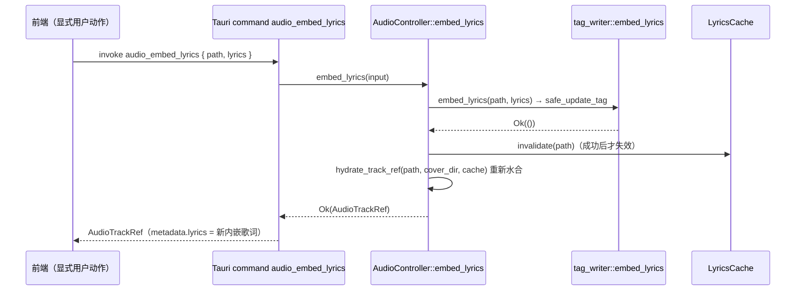

# 架构说明：歌词缓存与显式内嵌歌词边界

## 摘要

本方案落实 OPT-0002 的三个已批准方向：(1) 在 `audio` 模块内新增内存歌词缓存（`lyrics_cache.rs`），对 **sidecar `.lrc` 的解析结果**做有界 LRU 缓存，用「mtime + 大小指纹 + 负缓存 TTL」感知文件变更，`read_metadata` 是唯一的命中/回填入口，parser 线程与 command 线程安全并发读；(2) 新增唯一写入口 Tauri command `audio_embed_lyrics`，直接复用 `tag_writer::embed_lyrics`，成功后使缓存失效并返回重新水合的 `AudioTrackRef`；(3) 确认读取路径无写回，并以「只读模块不得引用 `tag_writer`」作为防回归约束。

对方向 3 的解读（需 PM/Requirements 复核）：**「内嵌歌词」从默认读取流程中移除的是「写回动作」**——读取路径绝不再把歌词写入音频文件；「内嵌歌词」作为展示数据的**读取保留**（内嵌优先、sidecar 后备），否则显式内嵌命令将失去意义，并与 `real-audio-playback.md`「嵌入式歌词优先」契约及既有测试冲突。

## 背景

- OPT-0002 原缺陷：只读路径会调用 `embed_lyrics` → `safe_update_tag`（临时副本 + 替换原文件）把 sidecar 歌词写回用户音频文件。
- 当前代码状态（2026-08-13 已核实）：`read_metadata`（`metadata.rs:57`）只读内嵌元数据 + sidecar `.lrc`，不再写回；`tag_writer.rs` 的 `embed_lyrics` / `safe_update_tag` 仍存在但**仅测试引用**，无生产调用点、无 Tauri command 暴露。
- 剩余问题：同一文件在 hydrate（command 线程）、load（parser 线程）中被反复执行 `read_metadata`，每次都对无 sidecar 的文件做目录扫描、对有 sidecar 的文件重复读取 `.lrc`，属于重复 I/O。
- 既有契约：`real-audio-playback.md` 规定「嵌入式歌词优先；无嵌入式歌词时读取同目录同名 `.lrc` 作为展示后备」，并把 sidecar 写回列为必须修复偏差；`OPT-0001` 决策规定 `audio_hydrate_track` 仍在 command 线程同步解析，解析结果复用归 OPT-0002。

## 范围

本次覆盖的模块边界：

1. **应用侧内存歌词缓存**：新模块 `src-tauri/src/audio/lyrics_cache.rs`；缓存内容、键、失效策略、容量、线程安全、命中/回填时机；`read_metadata`、`source.rs`、`runtime.rs`、`controller.rs` 的签名扩展。
2. **显式内嵌歌词命令契约**：新 command `audio_embed_lyrics` 的名称、输入输出、错误语义、权限边界、对缓存的影响、与 `tag_writer.rs` 的关系。
3. **sidecar 只读保障**：确认读取路径无写回；防回归的架构约束。
4. **前端消费契约**：`src/features/player/services/audioCommands.ts` 需要新增的类型与 invoke 封装位置（只设计契约，不实现）。

## 不在范围内

- 不做歌词缓存持久化（不建 `cache_dir/lyrics` 目录、不写数据库）——仅在本方案中为它预留边界。
- 不做前端 UI 按钮 / 确认对话框 / 交互设计（属 UI/UX Agent 与 Frontend Agent）。
- 不做全量 metadata 缓存（title/artist/cover 等）——本次只缓存歌词；全量解析复用属 OPT-0008 队列场景。
- 不做文件监听（不引入 notify 等依赖）——mtime/大小指纹 + 负缓存 TTL 已足够。
- 不做同文件并发解析去重（两次并发首次解析仍可能重复读取；去重属 OPT-0008）。
- 不改 `AudioPlaybackState`、`audio_state_changed` 事件、`audio_list_folder_tracks` 行为。
- 不优化播放链路 `open_source` → `replay_gain_multiplier` 的额外 tag 读取。
- 后端不做二次确认对话框/两阶段确认协议（见命令契约权限边界）。

## 质量属性

- 性能：缓存命中时省去 `.lrc` 文件读取与父目录扫描；内嵌歌词始终随 tag 实时读取（不额外开文件）；未命中回填时**不重复读取 tag**（缓存只承担 sidecar 解析）。
- 启动速度：无影响——缓存为内存对象，随 `AudioController` 创建，无预热。
- 内存占用：有界 LRU，默认 512 条；典型歌词 2–10 KB，常规会话（100–200 首）约 1–4 MB，最坏（512 × 50 KB）约 25 MB，有明确上限。
- 跨平台一致性：mtime + 大小指纹在主流桌面文件系统可用；粗粒度 mtime 文件系统（如 FAT）可能漏检「同长度快速编辑」，由负缓存 TTL 与重读兜底，属已知限制。
- 可测试性：`LyricsCache` 为纯内存 + 真实临时文件即可测；命中/未命中计数可观测；命令错误码可测。
- 可维护性：缓存逻辑收敛在独立模块；`read_metadata` 只通过 `get_or_load` / `invalidate` 与缓存交互；写入口唯一。
- 扩展性：持久化层可在 `lyrics_cache.rs` 内部叠加而不改变任何调用点；全量 metadata 缓存不改变本边界。
- 权限最小化：唯一写入口为显式命令；只读模块编译期/约定上不得引用 `tag_writer`。

## 建议边界

### 模块职责与依赖方向

```mermaid
flowchart LR
  subgraph 只读路径（禁止引用 tag_writer）
    Meta["metadata.rs<br/>read_metadata / read_sidecar_lyrics"]
    Src["source.rs<br/>hydrate_track_ref"]
    Parser["runtime.rs<br/>start_track_parser（worker 线程）"]
    Playlist["playlist.rs"]
  end
  Cache["lyrics_cache.rs<br/>LyricsCache（内存 LRU + 指纹）"]
  Ctl["controller.rs<br/>AudioController"]
  Writer["tag_writer.rs<br/>embed_lyrics / safe_update_tag"]
  Cmd["lib.rs<br/>audio_embed_lyrics"]
  Sidecar[".lrc sidecar 文件"]
  Fe["audioCommands.ts<br/>embedAudioLyrics"]

  Ctl --> Cache
  Meta --> Cache
  Cache --> Sidecar
  Ctl --> Writer
  Cmd --> Ctl
  Ctl --> Src
  Parser --> Src
  Src --> Meta
  Fe --> Cmd

  style Writer fill:#fde2e2
  style Cmd fill:#e2f0fd
```

依赖方向规则：

- `LyricsCache` 只被 `controller.rs`（持有）与 `metadata.rs`（调用 `get_or_load` / `invalidate`）依赖；它自己只依赖 `metadata.rs` 的 sidecar 解析函数与 `source.rs` 的 `track_id`。
- `tag_writer` 只允许被 `controller.rs`（生产写入口）与测试（`source_tests.rs`）引用；`metadata`、`source`、`runtime`、`playlist`、`duration`、`cover_cache`、`symphonia_source`、`cue`、`chapters`、`device` 不得引用 `tag_writer`。
- 前端只通过 command 边界访问写能力：`audio_embed_lyrics`；任何只读流程不得调用 `embedAudioLyrics`。

### 数据流：歌词解析（read_metadata）

```mermaid
sequenceDiagram
    participant Caller as hydrate（command 线程）/ parser（worker 线程）
    participant Meta as metadata::read_metadata
    participant Cache as LyricsCache
    participant Sidecar as .lrc / 目录

    Caller->>Meta: read_metadata(path, cover_dir, lyrics_cache)
    Meta->>Meta: read_embedded_metadata（lofty tag 读，含内嵌歌词与其他字段）
    alt 内嵌歌词存在
        Meta-->>Caller: metadata.lyrics = 内嵌歌词（实时，不走缓存）
    else 内嵌歌词缺失
        Meta->>Cache: get_or_load(path)
        alt 命中且指纹有效（正条目 stat 比对 / 负条目 TTL 内）
            Cache-->>Meta: 缓存 Option&lt;String&gt;
        else 未命中或已失效
            Cache->>Sidecar: read_sidecar_lyrics_with_source（锁外 I/O）
            Cache->>Cache: 记录 sidecar 路径指纹 / 负条目时间戳，回填（double-checked）
            Cache-->>Meta: Option&lt;String&gt;
        end
        Meta-->>Caller: metadata.lyrics = sidecar 歌词
    end
```

### 数据流：显式内嵌（唯一写入口）



## 数据契约

### 缓存模块（Rust，`src-tauri/src/audio/lyrics_cache.rs`）

```rust
/// 有界 LRU + 指纹校验的内存歌词缓存，只缓存 sidecar 歌词解析结果。
pub(crate) struct LyricsCache { /* 内部 Mutex<Inner>，外部经 Arc 共享 */ }

pub(crate) enum LyricsSource { Embedded, Sidecar } // 如需要区分来源可扩展，本版本可不引入

impl LyricsCache {
    /// capacity：条目上限；TTL 使用模块内常量 NEGATIVE_LYRICS_TTL（默认 30s）。
    pub(crate) fn new(capacity: usize) -> Self;
    /// 解析并缓存 sidecar 歌词。命中：指纹校验通过直接返回；未命中：锁外读盘，锁内回填。
    /// 只负责 sidecar 解析结果（内嵌歌词由 read_metadata 实时读取，不经过本缓存）。
    pub(crate) fn get_or_load(&self, path: &Path) -> Option<String>;
    /// 显式失效（audio_embed_lyrics 成功后调用）。
    pub(crate) fn invalidate(&self, path: &Path);
    /// 可观测性：命中/未命中计数（供 tracing 与测试断言）。
    pub(crate) fn stats(&self) -> LyricsCacheStats;
}
```

内部结构契约：

```rust
struct LyricsCacheEntry {
    lyrics: Option<String>,                       // sidecar 歌词内容；None = 已确认无 sidecar（负缓存）
    sidecar_fingerprint: Option<SidecarFingerprint>, // Some = 当时找到的 .lrc 路径+指纹；None = 当时无
    recorded_at: Instant,                         // 负条目 TTL 基准
}

struct SidecarFingerprint {
    path: PathBuf,       // 实际读取的 .lrc 路径（含大小写变体扫描命中的路径）
    modified: SystemTime,
    len: u64,
}
```

键与命中/失效规则：

- **键**：`track_id(path)`（`source.rs` 现有函数：canonicalize + 小写 + blake3 前 16 hex，`local-` 前缀）。理由：统一 hydrate（command 线程）与 load（parser 线程）可能携带的不同路径拼写（大小写、相对/绝对），共享命中。
- **命中判定（锁内只做 stat，不做文件读取）**：
  - 正条目：`fs::metadata(entry.sidecar_fingerprint.path)` 存在且 `(modified, len)` 与指纹一致 → 命中。
  - 负条目：`recorded_at.elapsed() < NEGATIVE_LYRICS_TTL` 且 `path.with_extension("lrc")` 仍不存在 → 命中；否则视为未命中（允许重新扫描发现新出现的 `.lrc`，含大小写变体，最迟 TTL 内可见）。
- **失效**：显式 `invalidate(path)`（`audio_embed_lyrics` 成功后调用）；进程生命周期结束（`AudioController` 随应用退出 drop）即释放全部条目。
- **容量**：默认 `MAX_LYRICS_CACHE_ENTRIES = 512`；LRU 淘汰最久未用条目（`HashMap` + 访问序 `VecDeque`，命中时移到队尾）。
- **线程安全与并发**：`Arc<LyricsCache>` 由 `AudioController` 持有，克隆给 parser 线程；内部 `std::sync::Mutex`。锁内只执行 stat 与哈希表操作；磁盘读取（`.lrc` 文件读、目录扫描）在**锁外**执行，随后 double-checked 回填。锁中毒：`tracing::warn` + 降级为直接读取，绝不 panic、绝不使 `read_metadata` 失败。
- **回填时机**：`get_or_load` 未命中时回填；即「read_metadata 内命中/回填」的唯一入口。

### metadata.rs 变更契约

```rust
pub(crate) fn read_metadata(
    path: &Path,
    cover_cache_dir: Option<&Path>,
    lyrics_cache: Option<&LyricsCache>,
) -> AudioTrackMetadata
```

- 内嵌歌词**始终**从 `read_embedded_metadata` 的 tag 实时读取（不回缓存、不查缓存）。
- 仅当内嵌歌词为 `None` 时走 `resolve_sidecar_lyrics(path, lyrics_cache)`：有缓存 → `get_or_load`；无缓存（测试传 `None`）→ 直接 `read_sidecar_lyrics`，行为与现状完全一致。
- 新增 `pub(super) fn read_sidecar_lyrics_with_source(path: &Path) -> Option<(String, PathBuf)>`，返回「歌词 + 实际读取的 `.lrc` 路径」供缓存记指纹；`read_sidecar_lyrics` 改为其薄包装（保持现有测试兼容）。
- `read_sidecar_lyrics` 保持纯读取（仅 `fs::read`），不新增任何写路径。

### source.rs / runtime.rs 签名扩展契约

```rust
pub(crate) fn hydrate_track_ref(
    path: &Path,
    cover_cache_dir: Option<&Path>,
    lyrics_cache: Option<&LyricsCache>,
) -> Result<AudioTrackRef, AudioCommandError>

// runtime.rs：parser worker 增加缓存参数（Arc 克隆）
pub(crate) fn start_track_parser(
    rx: Receiver<TrackParseRequest>,
    runtime_tx: Sender<AudioRuntimeRequest>,
    cover_cache_dir: PathBuf,
    lyrics_cache: Arc<LyricsCache>,
) -> thread::JoinHandle<()>
```

- `controller.rs`：`AudioController` 新增字段 `lyrics_cache: Arc<LyricsCache>`；`hydrate_track` 传入 `Some(&self.lyrics_cache)`；`start_track_parser` 传入 `Arc::clone(&self.lyrics_cache)`。
- 测试路径（`load_track_ref` / `source_tests.rs` 直接调用 `read_metadata`）传 `None`，行为不变。

### 命令契约：`audio_embed_lyrics`（新增）

名称：`audio_embed_lyrics`（独立命令名，与任何只读命令无共享路径）。

输入（`src-tauri/src/audio/types.rs` 新增，`#[derive(Debug, Deserialize, TS)]` + `#[serde(rename_all = "camelCase")]`）：

```ts
type AudioEmbedLyricsInput = {
  path: string
  lyrics: string   // 可为空字符串：表示清除内嵌歌词；非空则覆盖写入
}
```

输出：`AudioTrackRef`（嵌入成功后重新水合的完整曲目引用，`metadata.lyrics` 为刚写入的内嵌歌词）。

错误语义（复用现有 `AudioCommandError` / `AudioErrorCode`，由 controller 层把 `embed_lyrics` 的 `Result<(), String>` 映射为稳定错误码）：

| 场景 | 错误码 | recoverable |
| --- | --- | --- |
| 路径空白 / 无父目录 / 无扩展名 | `INVALID_PATH` | true |
| 文件不存在 | `FILE_NOT_FOUND` | true |
| 复制、读取、写回 I/O 失败 | `UNREADABLE_FILE` | true |
| 标签解析失败或重写后 Symphonia 校验失败 | `UNSUPPORTED_FORMAT` | true |
| 安装失败且回滚也失败（原子性被破坏） | `INTERNAL_ERROR` | false |

- `lyrics` 接受任意字符串（含空串=清除）；长度/内容校验属前端职责，后端不设上限（复用 `safe_update_tag` 现有行为）。
- 幂等性：重复嵌入相同歌词是安全的重写；已存在内嵌歌词时执行覆盖。

权限边界：

- **唯一生产写入口**：`controller::embed_lyrics` → `tag_writer::embed_lyrics` → `safe_update_tag`；`tag_writer` 从「仅测试引用」变为「唯一写入口 + 测试」。
- **显式用户意图**：前端必须由显式用户动作（按钮）触发，且不得出现在任何只读流程；建议 UI 在写前做确认对话框（UI/UX Agent 设计，本方案不实现）。
- **后端不引入二次确认/两阶段协议**：本地桌面应用，独立命令边界 + 前端确认 + 审计日志已构成显式意图保障；若未来出现不受信任的前端代码注入威胁模型，再评估 Tauri capability 或两阶段确认（本方案不引入，避免过度设计）。
- **审计**：`tracing::info!(operation = "audio.lyrics.embed", path, ...)`（`embed_lyrics` 已有 info 日志，保留并补充 command 层日志）。

对缓存的影响：

- 嵌入**成功后**调用 `lyrics_cache.invalidate(path)`——移除可能过期的 sidecar 条目；随后 `hydrate_track_ref` 重新水合（内嵌歌词实时读取，返回即新值）。
- 嵌入失败不失效（`safe_update_tag` 事务性失败，文件未变）。
- 缓存不优先于显式写回：写回以文件为权威，缓存只缓存 sidecar 解析结果，二者无冲突。

与 `tag_writer.rs` 的关系：**直接复用** `embed_lyrics` / `safe_update_tag`，不改其实现；`mod.rs` 移除 `#[allow(dead_code)]` 并把注释更新为「写回能力仅由 `audio_embed_lyrics`（controller）与测试使用」；`safe_update_tag` 保持 `pub(super)`。

### 只读保障与防回归约束

- 现状核实：`read_metadata` / `read_sidecar_lyrics` / `sidecar_lyrics_path` 均只读；`embed_lyrics` 无生产调用点。本方案维持该事实。
- 约束一（编译/结构）：`tag_writer` 只允许被 `controller.rs` 与测试引用；`mod.rs` 注释声明该依赖方向。
- 约束二（可验证）：Test Agent 用 grep 断言只读模块（`metadata`、`source`、`runtime`、`playlist`、`duration`、`cover_cache`、`symphonia_source`、`cue`、`chapters`、`device`）无 `tag_writer` 引用，生产代码除 `controller.rs` 外无 `embed_lyrics` 调用点。
- 约束三（行为）：`sidecar_lyrics_are_loaded_without_modifying_the_audio_file` 测试继续通过（读取后原文件字节与 mtime 不变）。

### 命令清单与前端消费（只设计契约）

- Rust 侧：
  - `src-tauri/src/audio/types.rs`：新增 `AudioEmbedLyricsInput`（`Deserialize` + `TS`，camelCase），并纳入现有 ts-rs 导出测试模式。
  - `src-tauri/src/audio/controller.rs`：新增 `pub fn embed_lyrics(&self, input: AudioEmbedLyricsInput) -> Result<AudioTrackRef, AudioCommandError>`（command 线程同步执行，与 `hydrate_track` 一致；不进入 runtime 状态机）。
  - `src-tauri/src/lib.rs`：新增 `#[tauri::command] fn audio_embed_lyrics(...)` 并注册进 `generate_handler!`（现有 12 个命令清单追加，不删改现有命令）。
  - `src-tauri/src/audio/mod.rs`：新增 `mod lyrics_cache;`；更新 `tag_writer` 注释。
- 前端侧：
  - `src/features/player/services/audioCommands.ts`：新增 `AudioEmbedLyricsInput` 类型与 `embedAudioLyrics(input: AudioEmbedLyricsInput): Promise<AudioTrackRef>` invoke 封装；不修改任何现有封装。
  - `src/features/player/model/audioTrackModel.ts`：**无改动**——`metadata.lyrics` 契约不变，歌词解析与高亮仍在前端。

## 备选方案与取舍

- 方案 A（采用）：缓存键用 `track_id(path)`。备选：原始路径字符串（实现最简，但 hydrate/load 拼写不一致时命中率低）。
- 方案 B（采用）：失效用「sidecar mtime+大小指纹 + 负缓存 TTL」。备选：文件监听（notify crate，引入依赖与常驻线程，属过度设计）；纯 TTL（周期性显示过期歌词）；每次全量重扫（未解决重复 I/O 问题）。
- 方案 C（采用）：只缓存 sidecar 解析结果，内嵌歌词始终实时读取。备选：缓存最终解析歌词（含内嵌）——未命中回填时需二次读 tag（`read_metadata` 已读一次），且内嵌歌词变更需额外指纹，复杂度大于收益。
- 方案 D（采用）：`read_metadata` 内命中/回填，缓存作为读穿层。备选：在 controller 层做请求去重（防并发重复解析）——属 OPT-0008 队列场景，本次不做。
- 方案 E（采用）：`audio_embed_lyrics` 在 command 线程同步执行。备选：走 runtime/worker 异步——写操作罕见、用户显式触发，阻塞 command 线程可接受；污染 runtime 状态机不值。
- 方案 F（采用）：后端不加二次确认。备选：两阶段 prepare/confirm 协议——本地应用过度设计；见权限边界。
- 方向 3 解读（需复核）：本方案按「内嵌歌词**读取**保留、**写回**显式化」设计（理由见摘要与背景）。备选解读「默认完全不读内嵌歌词」会令显式内嵌功能无法展示、推翻 `real-audio-playback.md` 既有契约与 `embedded_lyrics_take_precedence_over_sidecar_lyrics` 测试，且需要额外的显式读取命令——不属本方案，如 PM/Requirements 确认需要，另行排期。

## 演进路径

- 本版本（OPT-0002）：内存歌词缓存 + 显式 `audio_embed_lyrics` + 只读保障。
- 后续（预留边界，**不实现**）：
  - **持久化歌词缓存**：在 `lyrics_cache.rs` 内部叠加持久化后备（如 `cache_dir/lyrics/{key}.lrc` 内容寻址，仿 `cover_cache.rs`），`read_metadata` 调用点与 `get_or_load` / `invalidate` 契约不变。
  - **全量 metadata 缓存 / 并发解析去重**：随 OPT-0008 队列收敛后端时评估，不改变本边界。
- 稳定边界：`read_metadata` 只通过 `get_or_load` / `invalidate` 与缓存交互；唯一写入口 `audio_embed_lyrics`；只读模块不引用 `tag_writer`。

## 验收标准

可被 Test Agent 直接转化为验证标准：

1. 缓存单元测试（真实临时文件）：
   - 首次 `get_or_load` 未命中并返回 sidecar 歌词；第二次（文件未变）命中并返回相同值（命中计数 +1、未命中不增）。
   - 修改 `.lrc` 内容（mtime/大小变化）后再次 `get_or_load` 未命中并返回新歌词。
   - 删除 `.lrc` 后：正条目因 stat 失败转为未命中并回填负条目；负条目在 TTL 内命中（返回 `None`），TTL 过期或直接路径 `.lrc` 出现后重新扫描。
   - 超过容量上限（测试用小 capacity）后最久未用条目被淘汰。
   - 缺失文件、锁中毒场景不 panic、不使 `read_metadata` 失败（降级为直读）。
2. `read_metadata` 语义不变：内嵌优先、sidecar 后备、lofty 失败时返回空字段 + sidecar 歌词；`sidecar_lyrics_are_loaded_without_modifying_the_audio_file` 等既有测试继续通过。
3. 只读保障：加载/水合/解析带 `.lrc` 的音频后，原音频文件字节与修改时间不变（既有测试 + SP-018 人工验证）。
4. 命令契约：`audio_embed_lyrics` 成功 → 文件包含歌词、返回的 `metadata.lyrics` 为新歌词、再次读取（`read_metadata` / `audio_hydrate_track`）仍为新歌词（缓存已失效）；空 `lyrics` → 清除内嵌歌词；各失败场景返回上表稳定错误码且文件不变。
5. 依赖方向：grep 验证只读模块无 `tag_writer` 引用；生产代码 `embed_lyrics` 调用点仅存在于 `controller.rs`。
6. 前端契约：`audioCommands.ts` 存在 `AudioEmbedLyricsInput` 与 `embedAudioLyrics`；无任何只读流程调用它。
7. 全量构建与测试通过：`cargo test`（`src-tauri`）+ `npm run build` / `npm run lint`。

## 风险

- 方向 3 解读偏差：若 PM/Requirements 期望「默认完全不读内嵌歌词」，本方案需追加显式读取命令（另一范围）。已在摘要、备选方案中标注，建议排期时复核。
- 粗粒度 mtime 文件系统（FAT）可能漏检「同长度快速编辑」的 `.lrc`；负缓存 TTL 覆盖「新增 `.lrc`」主场景，极端情况最多延迟 TTL 时长（30s）生效。
- `embed_lyrics` 写回失败时文件处于临时/备份过渡态（`safe_update_tag` 已有回滚）；回滚也失败时返回 `INTERNAL_ERROR`（recoverable=false），前端应提示用户检查文件。
- 缓存键依赖 `track_id` 的 canonicalize，文件缺失时退化为原始路径——缺失文件不会进缓存命中路径（`validate_existing_file` 先拦截），无正确性问题。
- 512 条上限最坏约 25 MB 内存；若未来队列规模显著放大，可调低上限或增加总字节上限（预留常量即可）。

## 建议下一负责 Agent

- **Rust/Tauri Agent**：实现 `lyrics_cache.rs`、`read_metadata` / `source.rs` / `runtime.rs` / `controller.rs` 签名扩展、`AudioEmbedLyricsInput` 与 `audio_embed_lyrics` 命令、`mod.rs` 注释更新。
- **Test Agent**：按上文验收标准补充缓存、命令、只读保障与依赖方向测试。
- **Frontend Agent**：仅添加 `audioCommands.ts` 的类型与 invoke 封装（无 UI）。
- **PM Agent / Requirements Agent**：复核方向 3 解读口径与 `real-audio-playback.md` 偏差表更新。
