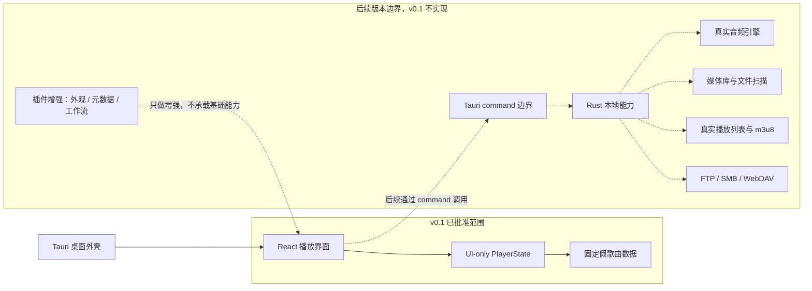

# 架构说明：总体架构蓝图

## 摘要

SpMusic 的长期架构应保持前端界面、前端状态、Tauri command、Rust 本地能力、音频引擎、媒体库、播放列表、网络存储和插件增强之间的清晰边界。v0.1 只实现 React 前端播放界面、UI-only 播放状态、UI-only 播放进度和演示频谱，不实现 Tauri command、真实音频播放、本地文件读取、真实音频进度同步、真实频谱分析、媒体库、真实播放列表、网络存储或插件系统；但前端实现应从第一版开始保留视觉 token、文案集中管理和状态枚举稳定性，避免后续主题与国际化改造返工。

## 背景

本说明基于 v0.1 已批准需求、Sprint 任务 `SP-004`、产品范围决策和 v0.1 UI 原型范围决策。当前 `src/App.tsx` 仍是 Tauri/Vite/React 模板页面，`src-tauri/src/lib.rs` 只有默认 Tauri 启动逻辑，`src-tauri/tauri.conf.json` 只有基础窗口配置。

v0.1 的目标是把模板项目收敛为可运行、可验证的 SpMusic 播放界面原型，而不是建立真实播放器内核。

## 范围

- 定义长期模块边界和调用方向。
- 定义 v0.1 当前允许实现的架构范围。
- 说明 v0.1 前端状态与未来音频、媒体库、播放列表和 Tauri 能力的隔离方式。
- 为 Frontend Agent、Test Agent 和后续 Architecture Agent 任务提供边界依据。

## 不在范围内

- 不实现任何业务代码。
- 不设计真实音频引擎、音频格式支持、音频输出后端或独占输出。
- 不设计或新增 Tauri command。
- 不设计本地文件读取、文件夹扫描、媒体库索引、数据库或迁移系统。
- 不设计真实播放列表、`m3u8` 导入导出或播放列表持久化。
- 不设计 FTP、SMB、WebDAV 网络存储来源抽象。
- 不设计插件 API、插件运行时、插件权限或插件市场。
- 不设计 v0.2 虚构播放列表管理 UI 的完整状态结构。

## 质量属性

- 性能：v0.1 只使用前端内存中的少量假歌曲数据，避免引入扫描、解码、索引或持久化开销。
- 启动速度：v0.1 启动后直接进入播放界面，不执行文件系统、网络、数据库或音频初始化。
- 内存占用：v0.1 状态只保存当前歌曲 ID、播放状态和假歌曲列表，不缓存音频、封面、歌词或媒体库索引。
- 跨平台一致性：v0.1 不调用平台相关能力，桌面差异主要限制在 Tauri 窗口外壳。
- 可测试性：播放、暂停、上一首、下一首和空列表分支都应能通过固定假数据与人工 UI 检查验证。
- 可维护性：前端 UI 与 UI-only 状态可以在单一前端边界内实现，避免当前阶段出现跨 Rust、文件系统和音频后端的职责耦合。
- 扩展性：长期模块边界保留音频、媒体库、播放列表、网络存储和插件位置，但 v0.1 不预先实现抽象层。
- 权限最小化：v0.1 不请求本地文件、网络、数据库、音频设备或插件执行权限。

## 建议边界

### v0.1 当前边界

- 前端 UI：负责渲染 SpMusic 播放界面、当前歌曲信息、基础播放控制、UI-only 播放进度条、演示频谱、当前歌曲标记和 Empty State。
- 前端状态：负责维护固定假歌曲列表、当前歌曲 ID、播放状态、UI-only 播放进度和演示频谱数据。
- 视觉基础：允许使用简易界面先行，但颜色、间距、圆角、阴影等基础视觉值应优先通过集中 CSS 变量或等价 token 表达。
- 文案基础：用户可见文案应集中在前端 copy 对象或简单文案模块中，业务状态使用稳定英文枚举，不使用中文展示文案作为状态值。
- Tauri 外壳：只负责启动桌面窗口和承载前端，不暴露业务 command。
- Rust 后端：保持默认启动逻辑，不承载播放器业务。

### 长期模块边界

- 前端 UI 只通过明确的前端状态或 command 结果展示数据，不直接访问文件系统、数据库或音频设备。
- Tauri command 是未来前端访问本地能力的唯一业务边界，不应把 Rust 内部结构直接暴露给 UI。
- Rust 本地能力负责文件、音频、媒体扫描、网络存储、持久化等平台相关工作。
- 音频引擎负责真实播放、暂停、停止、音量、进度、格式支持和输出设备，不负责 UI 布局和播放列表管理。
- 媒体库负责本地文件扫描、元数据索引、分类浏览和来源范围过滤，不负责真实音频解码。
- 播放列表负责列表内容、顺序、导入导出和 `m3u8` 兼容策略，不负责删除真实歌曲文件。
- 网络存储负责用户自有 FTP、SMB、WebDAV 来源访问和流式读取边界，不提供在线音乐平台能力。
- 插件增强只能扩展非基础能力，不得成为基础播放、媒体库、播放列表或网络存储的前提。

### 前期必须准备但不提前实现的边界

- 前后端通信：真实播放、本地文件读取或媒体库进入实现前，必须先定义 Tauri command 命名、输入输出 DTO、错误码、前端 `invoke` 封装位置和 Rust command 模块边界。v0.1 不实现该骨架，但不能让前端直接假设后端内部结构。
- 权限：文件系统、网络存储、音频设备、插件执行和同步能力必须按能力独立申请最小权限，不能在早期一次性开放全文件系统、全网络或任意执行能力。
- 主题：v0.1 不做可导入主题、主题文件格式、主题持久化或动态加载外部样式；但样式应使用集中 token，避免颜色、阴影和间距散落在组件逻辑中。
- 国际化：v0.1 不引入完整 i18n 框架、不做语言切换；但用户可见文案不得和业务状态混用，时长、数字和状态展示应在显示层格式化。
- 模块分离：音频引擎、媒体库、播放列表和前端播放器状态必须保持概念分离，不能把未来所有字段塞进一个“大播放器状态”。
- 来源边界：本地文件、FTP、SMB、WebDAV 等来源抽象不在 v0.1 实现，但后续媒体库设计必须能区分不同来源，避免把本地路径假设写成唯一来源。

### 插件增强范围

插件增强是长期可选能力，适合增强外观组件、自定义面板、额外视图、额外元数据源、第三方服务集成、额外同步目标、用户自定义工作流和非基础音频辅助工具。插件不得成为真实播放、媒体库、播放列表、网络存储播放、基础搜索、收藏或播放历史等基础能力的前提，也不得绕过后续定义的权限边界。

## 架构图

## 数据契约

v0.1 具体状态契约见 `docs/architecture/player-state-and-fake-track.md`。总体约束如下：

- `Track` 只表达假歌曲渲染所需字段。
- `PlayerState` 只表达当前歌曲、播放状态、假歌曲列表、UI-only 播放进度和演示频谱数据。
- 空歌曲列表以 `tracks: []` 和 `currentTrackId: null` 表达。
- v0.1 不包含音量、真实音频进度、真实频谱分析、音频文件路径、媒体库 ID、播放列表 ID、持久化状态、Tauri command 状态、真实音频错误或多语言资源加载状态。

## 备选方案与取舍

- 方案 A：v0.1 只做前端 UI-only 状态。优点是启动快、权限最小、验收直接、不会提前绑定真实音频和媒体库方案；缺点是前后端通信和真实播放风险后移。
- 方案 B：v0.1 同时加入最小 Tauri command 和 Rust 状态。优点是更早验证前后端通信；缺点是已被 v0.1 范围决策移出，会扩大任务并模糊当前验收重点。
- 方案 C：v0.1 直接设计音频、媒体库和播放列表抽象。优点是看似能服务长期愿景；缺点是需求未批准、技术风险高、会引入过早设计。
- 取舍理由：采用方案 A。它最符合 v0.1 “播放界面”目标，也符合产品范围边界和 v0.1 UI 原型范围决策。

## 演进路径

- v0.1：完成 UI-only 播放界面、固定假歌曲状态、UI-only 播放进度和演示频谱。
- v0.2：在不读取文件、不持久化的前提下，评估并定义虚构播放列表 UI 状态与 v0.1 当前歌曲状态的联动边界。
- v0.3：在真实播放或文件读取前，先建立薄前后端通信骨架，再单独评估真实音频播放方案，决定 Tauri command、Rust 音频模块和前端播放状态的同步契约。
- v0.4 及以后：在真实播放链路稳定后，再评估媒体库、持久化、真实播放列表、网络存储和插件边界。

稳定边界：前端不得直接访问本地文件、数据库、网络存储或音频设备；未来本地能力必须通过明确的 Tauri command 契约进入前端。

## v0.1 过早抽象禁区

- 不创建 `AudioEngine`、`MediaLibrary`、`PlaylistRepository`、`StorageService`、`PluginHost` 等当前不可验证的实现或模拟层。
- 不在 `Track` 中加入真实文件路径、文件句柄、URI、哈希、扫描来源、专辑封面路径或元数据解析状态。
- 不在 `PlayerState` 中加入音量、进度、循环、随机、播放队列、播放历史、设备输出或错误恢复字段。
- 不为了未来通信预留空 Tauri command。
- 不新增文件系统、网络、数据库或音频播放依赖。
- 不实现主题导入、主题编辑器、动态外部 CSS 加载或主题持久化。
- 不引入完整 i18n 框架、语言包加载或语言切换设置。
- 不让 Rust/Tauri 返回的用户可见中文文案成为前端判断错误类型的依据；后续后端错误应优先返回稳定错误码。

## 验收标准

- `docs/architecture/overall-architecture.md` 存在，并包含完整元数据。
- 文档明确前端 UI、前端状态、Tauri 边界、未来音频引擎、未来媒体库、未来播放列表、未来网络存储和未来插件增强的职责边界。
- 文档明确 v0.1 不实现真实音频、Tauri command、媒体库、真实播放列表、网络存储和插件系统。
- 文档说明 v0.1 前端实现应避免的过早抽象。
- 文档说明 v0.1 前端需要保留 CSS token、文案集中管理和稳定状态枚举等轻量护栏。
- 文档说明插件增强的长期适用范围和不得承载的基础能力。
- 文档给出至少一个备选方案和取舍理由。

## 风险

- 如果实现时把假歌曲数据设计成真实媒体库模型，后续媒体库方案会被当前原型约束。
- 如果当前引入 Tauri command 或 Rust 状态，容易与已批准 v0.1 范围冲突。
- 如果前端状态未覆盖空列表和索引异常，播放控制验收可能出现不可预测状态。
- 如果早期 UI 完全硬编码颜色、文案和状态展示，后续主题、明暗模式和国际化会产生不必要返工。

## 建议下一负责 Agent

Frontend Agent 根据本说明和 `docs/architecture/player-state-and-fake-track.md` 实现 v0.1 播放界面。Test Agent 在实现后验证 UI-only 状态流转、空列表分支和范围禁区。
