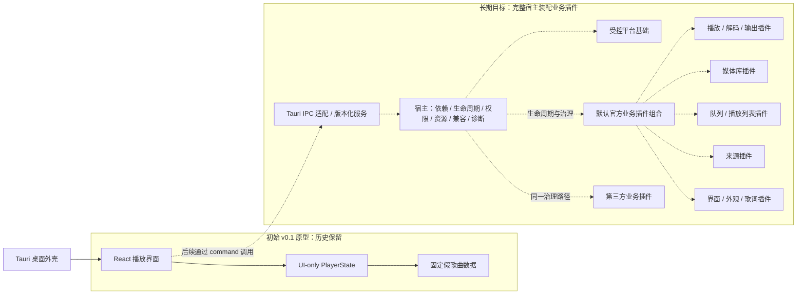

# 架构说明：总体架构蓝图

> 2026-09-30 更新仅覆盖长期插件分层目标：所有业务能力由插件提供，官方业务插件承担基础能力并随产品交付。详细目标见 [所有业务能力插件化与完整宿主](all-business-plugin-system.md)。本文保留初始 v0.1 原型的历史实施约束，其 `superseded` 状态不变；真实播放等后续能力以 [真实本地播放架构契约](real-audio-playback.md) 及相应决策为准。本文中的旧模板状态、UI-only 范围与版本顺序不能作为当前实现状态；本次未批准代码迁移。

## 摘要

SpMusic 的长期架构采用完整插件宿主与默认官方业务插件装配，前端业务界面、播放、媒体库、播放列表、歌词、外观和来源等业务能力均通过插件契约提供。宿主管理装配、生命周期、权限、资源、兼容与诊断，并提供受控平台基础；各业务域保持清晰职责与唯一状态写入者。

初始 v0.1 原型只允许 React 播放界面、UI-only 状态、进度与演示频谱，不实现真实播放、Tauri command 或插件系统；这一历史范围保留用于追溯，后续真实播放范围已由新决策覆盖。长期目标不等于当前实现，也不改变历史版本的验收依据。

## 背景

本说明最初基于 v0.1 已批准需求、Sprint 任务 `SP-004`、产品范围决策和 v0.1 UI 原型范围决策。当时 `src/App.tsx` 仍是 Tauri/Vite/React 模板页面，`src-tauri/src/lib.rs` 只有默认 Tauri 启动逻辑，`src-tauri/tauri.conf.json` 只有基础窗口配置。

初始 v0.1 原型的目标是把模板项目收敛为可运行、可验证的 SpMusic 播放界面。2026-09-30 用户确定所有业务插件化的长期目标，本文相应更新长期边界，详细宿主约束由新架构文档负责。

## 范围

- 定义长期模块边界和调用方向。
- 保留初始 v0.1 原型允许实现的历史架构范围。
- 说明 v0.1 前端状态与未来音频、媒体库、播放列表和 Tauri 能力的隔离方式。
- 为 Frontend Agent、Test Agent 和后续 Architecture Agent 任务提供边界依据。

## 初始 v0.1 说明的非目标（历史保留）

- 不实现任何业务代码。
- 不设计真实音频引擎、音频格式支持、音频输出后端或独占输出。
- 不设计或新增 Tauri command。
- 不设计本地文件读取、文件夹扫描、媒体库索引、数据库或迁移系统。
- 不设计真实播放列表、`m3u8` 导入导出或播放列表持久化。
- 不设计 FTP、SMB、WebDAV 网络存储来源抽象。
- 不设计插件 API、插件运行时、插件权限或插件市场。
- 不设计 v0.2 虚构播放列表管理 UI 的完整状态结构。

## 质量属性

- 性能：v0.1 只使用前端内存中的少量假歌曲数据，避免引入扫描、解码、索引或持久化开销。
- 启动速度：v0.1 启动后直接进入播放界面，不执行文件系统、网络、数据库或音频初始化。
- 内存占用：v0.1 状态只保存当前歌曲 ID、播放状态和假歌曲列表，不缓存音频、封面、歌词或媒体库索引。
- 跨平台一致性：v0.1 不调用平台相关能力，桌面差异主要限制在 Tauri 窗口外壳。
- 可测试性：播放、暂停、上一首、下一首和空列表分支都应能通过固定假数据与人工 UI 检查验证。
- 可维护性：前端 UI 与 UI-only 状态可以在单一前端边界内实现，避免当前阶段出现跨 Rust、文件系统和音频后端的职责耦合。
- 扩展性：长期所有业务由插件提供，宿主治理要求见新架构目标；历史 v0.1 原型不预先实现抽象层。
- 权限最小化：v0.1 不请求本地文件、网络、数据库、音频设备或插件执行权限。

## 建议边界

### 初始 v0.1 原型边界（历史保留）

- 前端 UI：负责渲染 SpMusic 播放界面、当前歌曲信息、基础播放控制、UI-only 播放进度条、演示频谱、当前歌曲标记和 Empty State。
- 前端状态：负责维护固定假歌曲列表、当前歌曲 ID、播放状态、UI-only 播放进度和演示频谱数据。
- 视觉基础：允许使用简易界面先行，但颜色、间距、圆角、阴影等基础视觉值应优先通过集中 CSS 变量或等价 token 表达。
- 文案基础：用户可见文案应集中在前端 copy 对象或简单文案模块中，业务状态使用稳定英文枚举，不使用中文展示文案作为状态值。
- Tauri 外壳：只负责启动桌面窗口和承载前端，不暴露业务 command。
- Rust 后端：保持默认启动逻辑，不承载播放器业务。

### 长期模块边界

- 前端 UI 只通过明确的前端状态或 command 结果展示数据，不直接访问文件系统、数据库或音频设备。
- TypeScript 与 Rust 业务插件共享身份、版本、依赖、生命周期、权限和诊断模型，分别通过经评审的执行适配运行；不要求共享执行环境或原生内存布局。
- Tauri command 承担跨前后端平台适配，通过宿主路由版本化业务服务；不把 Rust 内部结构或任意原生权限直接暴露给 UI 和第三方插件。
- 宿主负责依赖装配、契约与兼容检查、资源回收、权限执行、隔离和更新恢复；受控平台服务提供文件、网络、存储、调度及窗口等通用基础。
- 官方播放、解码和输出插件负责真实播放、暂停、停止、音量、进度、格式支持和输出设备。播放协调服务拥有唯一状态写入权，其他插件提交请求；不承担 UI 布局和队列策略。
- 官方媒体库插件负责本地文件扫描、元数据索引、分类浏览和来源范围过滤，不负责真实音频解码。
- 官方队列与播放列表插件负责内容、顺序、导入导出和 `m3u8` 兼容策略，不负责删除真实歌曲文件。
- 来源插件负责用户自有 FTP、SMB、WebDAV 等来源访问和流式读取边界；插件化目标不自动批准新的来源或在线服务。
- 界面、外观、标签、歌词、搜索、收藏、历史及同步等业务均按稳定服务边界由插件承载。官方基础插件随产品交付；第三方插件经同一治理路径接入，并按装配规则补充或替换提供器。

### 初始阶段的准备边界（历史保留）

- 前后端通信：真实播放、本地文件读取或媒体库进入实现前，必须先定义 Tauri command 命名、输入输出 DTO、错误码、前端 `invoke` 封装位置和 Rust command 模块边界。v0.1 不实现该骨架，但不能让前端直接假设后端内部结构。
- 权限：文件系统、网络存储、音频设备、插件执行和同步能力必须按能力独立申请最小权限，不能在早期一次性开放全文件系统、全网络或任意执行能力。
- 主题：v0.1 不做可导入主题、主题文件格式、主题持久化或动态加载外部样式；但样式应使用集中 token，避免颜色、阴影和间距散落在组件逻辑中。
- 国际化：v0.1 不引入完整 i18n 框架、不做语言切换；但用户可见文案不得和业务状态混用，时长、数字和状态展示应在显示层格式化。
- 模块分离：音频引擎、媒体库、播放列表和前端播放器状态必须保持概念分离，不能把未来所有字段塞进一个“大播放器状态”。
- 来源边界：本地文件、FTP、SMB、WebDAV 等来源抽象不在 v0.1 实现，但后续媒体库设计必须能区分不同来源，避免把本地路径假设写成唯一来源。

### 长期业务插件范围

所有业务能力均是插件，包括基础播放、解码与输出、媒体库、队列、界面、外观、歌词、搜索、收藏和历史。默认官方组合组成可直接使用的产品，基础能力可以依赖其中的必要插件；插件缺失或不兼容时宿主提供诊断和恢复入口。第三方扩展不绕过服务契约、权限和资源治理。宿主完整性覆盖安装启停、依赖图、版本兼容、更新回滚、隔离、配置存储、诊断与 SDK 验证，不能以 DI 或普通 `vm` 代替。

各业务域原有功能范围由对应需求决定，本次确定承载形式与宿主目标，不自动实现此前尚未批准的产品功能。框架复用、自研、TS/Rust 运行环境、原生 ABI 与实时音频协议的具体方案后续独立评审。

## 架构图

```mermaid
flowchart LR
  subgraph V01["初始 v0.1 原型：历史保留"]
    UI["React 播放界面"]
    State["UI-only PlayerState"]
    FakeTracks["固定假歌曲数据"]
  end

  Shell["Tauri 桌面外壳"]

  subgraph Future["长期目标：完整宿主装配业务插件"]
    Commands["Tauri IPC 适配 / 版本化服务"]
    Host["宿主：依赖 / 生命周期 / 权限 / 资源 / 兼容 / 诊断"]
    Platform["受控平台基础"]
    Plugins["默认官方业务插件组合"]
    Audio["播放 / 解码 / 输出插件"]
    Library["媒体库插件"]
    Playlists["队列 / 播放列表插件"]
    Network["来源插件"]
    Views["界面 / 外观 / 歌词插件"]
    ThirdParty["第三方业务插件"]
  end

  Shell --> UI
  UI --> State
  State --> FakeTracks

  UI -. "后续通过 command 调用" .-> Commands
  Commands -.-> Host
  Host -.-> Platform
  Host -. "生命周期与治理" .-> Plugins
  Host -. "同一治理路径" .-> ThirdParty
  Plugins -.-> Audio
  Plugins -.-> Library
  Plugins -.-> Playlists
  Plugins -.-> Network
  Plugins -.-> Views
```

## 数据契约

v0.1 具体状态契约见 `docs/architecture/player-state-and-fake-track.md`。总体约束如下：

- `Track` 只表达假歌曲渲染所需字段。
- `PlayerState` 只表达当前歌曲、播放状态、假歌曲列表、UI-only 播放进度和演示频谱数据。
- 空歌曲列表以 `tracks: []` 和 `currentTrackId: null` 表达。
- v0.1 不包含音量、真实音频进度、真实频谱分析、音频文件路径、媒体库 ID、播放列表 ID、持久化状态、Tauri command 状态、真实音频错误或多语言资源加载状态。

## 备选方案与取舍

- 方案 A：v0.1 只做前端 UI-only 状态。优点是启动快、权限最小、验收直接、不会提前绑定真实音频和媒体库方案；缺点是前后端通信和真实播放风险后移。
- 方案 B：v0.1 同时加入最小 Tauri command 和 Rust 状态。优点是更早验证前后端通信；缺点是已被 v0.1 范围决策移出，会扩大任务并模糊当前验收重点。
- 方案 C：v0.1 直接设计音频、媒体库和播放列表抽象。优点是看似能服务长期愿景；缺点是需求未批准、技术风险高、会引入过早设计。
- 取舍理由：采用方案 A。它最符合 v0.1 “播放界面”目标，也符合产品范围边界和 v0.1 UI 原型范围决策。

## 演进路径

以下版本顺序保留初始规划记录，真实播放提前纳入 v0.1 的后续决策已覆盖相关步骤。全面业务插件化的目标与迁移门槛见新架构文档，具体实施版本由 PM Agent 决策。

- v0.1：完成 UI-only 播放界面、固定假歌曲状态、UI-only 播放进度和演示频谱。
- v0.2：在不读取文件、不持久化的前提下，评估并定义虚构播放列表 UI 状态与 v0.1 当前歌曲状态的联动边界。
- v0.3：在真实播放或文件读取前，先建立薄前后端通信骨架，再单独评估真实音频播放方案，决定 Tauri command、Rust 音频模块和前端播放状态的同步契约。
- 长期插件化：以宿主完整治理路径和默认官方业务装配为目标，逐域迁移并验证；媒体库、持久化、播放列表和来源等功能按各自批准范围推进，不以仅歌词或主题插件作为最终交付。

稳定边界：前端不得直接访问本地文件、数据库、网络存储或音频设备；未来本地能力必须通过明确的 Tauri command 契约进入前端。

## v0.1 过早抽象禁区

- 不创建 `AudioEngine`、`MediaLibrary`、`PlaylistRepository`、`StorageService`、`PluginHost` 等当前不可验证的实现或模拟层。
- 不在 `Track` 中加入真实文件路径、文件句柄、URI、哈希、扫描来源、专辑封面路径或元数据解析状态。
- 不在 `PlayerState` 中加入音量、进度、循环、随机、播放队列、播放历史、设备输出或错误恢复字段。
- 不为了未来通信预留空 Tauri command。
- 不新增文件系统、网络、数据库或音频播放依赖。
- 不实现主题导入、主题编辑器、动态外部 CSS 加载或主题持久化。
- 不引入完整 i18n 框架、语言包加载或语言切换设置。
- 不让 Rust/Tauri 返回的用户可见中文文案成为前端判断错误类型的依据；后续后端错误应优先返回稳定错误码。

## 验收标准

- `docs/architecture/overall-architecture.md` 存在，并包含完整元数据。
- 文档明确宿主、平台基础与官方/第三方业务插件的职责、通信和唯一状态权威边界。
- 文档区分初始 v0.1 原型限制、后续真实播放契约和新长期插件化目标，不把历史范围当成当前实现状态。
- 文档说明 v0.1 前端实现应避免的过早抽象。
- 文档说明 v0.1 前端需要保留 CSS token、文案集中管理和稳定状态枚举等轻量护栏。
- 文档说明所有业务均由插件承载、官方基础插件随产品交付，以及完整宿主的治理责任；详细验收以新架构目标为准。
- 文档给出至少一个备选方案和取舍理由。

## 风险

- 如果实现时把假歌曲数据设计成真实媒体库模型，后续媒体库方案会被当前原型约束。
- 如果当前引入 Tauri command 或 Rust 状态，容易与已批准 v0.1 范围冲突。
- 如果前端状态未覆盖空列表和索引异常，播放控制验收可能出现不可预测状态。
- 如果早期 UI 完全硬编码颜色、文案和状态展示，后续主题、明暗模式和国际化会产生不必要返工。

## 建议下一负责 Agent

历史 v0.1 原型实施路由保留为 Frontend Agent 与 Test Agent。全面插件化后续由 PM Agent 确定范围与门槛，Architecture Agent 评审契约和执行环境，Frontend Agent / Rust/Tauri Agent 执行获批迁移，Test Agent 独立验证。当前文档更新不批准代码实现。
