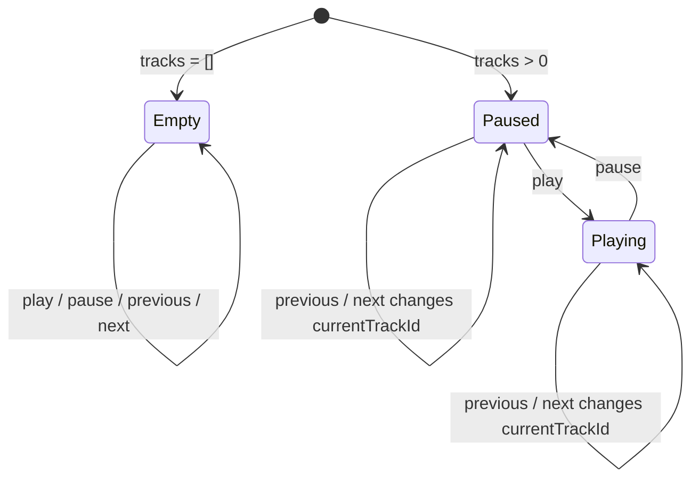

# 架构说明：播放器状态与假歌曲契约

## 摘要

v0.1 的播放器状态是纯前端、纯内存、UI-only 的最小契约。它只需要支持当前歌曲展示、播放 / 暂停状态切换、上一首 / 下一首切换和空歌曲列表 Empty State，不表达真实音频播放、播放队列、媒体库、播放列表或持久化能力。

## 背景

v0.1 要求至少 5 条虚构歌曲信息、当前歌曲展示、播放控制状态切换和空歌曲列表分支。当前版本不做真实音频播放、本地文件读取、Tauri command、媒体库、数据库和真实播放列表。

## 范围

- 定义 `Track` 假歌曲结构。
- 定义 `PlayerState` 前端播放器状态。
- 定义播放、暂停、上一首、下一首和空列表的状态规则。
- 定义文案、格式化和国际化前置约束。
- 定义 Frontend Agent 可直接使用的 TypeScript 形状。

## 不在范围内

- 不包含真实音频播放状态。
- 不包含音量、进度、缓冲、随机、循环、播放队列、播放历史。
- 不包含本地文件路径、文件读取权限、媒体库来源、扫描状态。
- 不包含播放列表 ID、`m3u8` 字段、跨列表条目关系。
- 不包含 Tauri command 输入输出、Rust 结构体或持久化字段。
- 不包含语言切换、语言包加载、主题导入或主题持久化字段。

## 质量属性

- 性能：固定小数组和简单状态切换，不触发异步 IO。
- 启动速度：状态可在前端初始化时同步创建。
- 内存占用：只保存用于展示和切歌验证的少量字符串与数字。
- 跨平台一致性：所有状态逻辑在前端执行，不依赖平台能力。
- 可测试性：每个状态变化都可由按钮点击和 DOM 文案变化验证。
- 可维护性：字段语义直观，用户可见文案集中管理，避免把未来真实媒体库模型提前塞入原型。
- 扩展性：后续版本可以在新契约中扩展播放队列、音频进度或播放列表，不要求 v0.1 兼容最终结构。
- 权限最小化：状态不携带路径、URL、文件句柄或外部服务标识。

## 建议边界

Frontend Agent 可以把假歌曲数据放在 `src/App.tsx` 内或前端专用 fixture 文件中。若拆出 fixture 文件，该文件仍只属于前端实现范围，不代表媒体库、播放列表或数据层。

`PlayerState` 应由前端组件或前端状态 helper 管理。v0.1 不需要全局状态库，也不需要异步 command 调用层。

## 数据契约

建议 TypeScript 形状如下：

```ts
type PlaybackStatus = 'paused' | 'playing'

type Track = {
  id: string
  title: string
  artist: string
  album: string
  durationSeconds: number
}

type PlayerState = {
  tracks: Track[]
  currentTrackId: string | null
  playbackStatus: PlaybackStatus
}
```

字段说明：

| 字段 | 所属 | 必填 | 说明 |
| --- | --- | --- | --- |
| `id` | `Track` | 是 | 前端唯一标识，用于当前歌曲匹配和切换。 |
| `title` | `Track` | 是 | 歌曲名，用于当前歌曲和列表展示。 |
| `artist` | `Track` | 是 | 艺术家，用于满足当前歌曲信息展示。 |
| `album` | `Track` | 是 | 专辑，用于满足当前歌曲信息展示。 |
| `durationSeconds` | `Track` | 是 | 时长秒数，前端可格式化为 `mm:ss`。 |
| `tracks` | `PlayerState` | 是 | 固定假歌曲列表，v0.1 默认至少 5 条。 |
| `currentTrackId` | `PlayerState` | 是 | 当前歌曲 ID；空列表时为 `null`。 |
| `playbackStatus` | `PlayerState` | 是 | UI-only 播放状态，只能是 `paused` 或 `playing`。 |

## 初始状态规则

- 默认假歌曲列表必须至少包含 5 条 `Track`。
- 当 `tracks.length > 0` 时，`currentTrackId` 默认使用第一首歌曲的 `id`。
- 当 `tracks.length === 0` 时，`currentTrackId` 必须为 `null`，界面展示 Empty State。
- 初始 `playbackStatus` 建议为 `paused`。

## 状态流转规则

### 播放 / 暂停

- 当 `tracks.length === 0` 时，播放 / 暂停操作不得导致界面崩溃；建议保持 `paused`。
- 当 `tracks.length > 0` 时，点击播放 / 暂停在 `paused` 与 `playing` 之间切换。
- 该状态只改变 UI 文案、图标或状态标识，不调用真实音频能力。

### 上一首

- 当 `tracks.length === 0` 时，`currentTrackId` 保持 `null`。
- 当 `tracks.length === 1` 时，`currentTrackId` 保持唯一歌曲 ID。
- 当 `tracks.length > 1` 时，切换到当前索引前一首。
- 当前索引为第一首时，建议循环到最后一首，确保连续点击始终有有效当前歌曲。
- 如果 `currentTrackId` 不存在于 `tracks` 中，建议回退到第一首歌曲。

### 下一首

- 当 `tracks.length === 0` 时，`currentTrackId` 保持 `null`。
- 当 `tracks.length === 1` 时，`currentTrackId` 保持唯一歌曲 ID。
- 当 `tracks.length > 1` 时，切换到当前索引后一首。
- 当前索引为最后一首时，建议循环到第一首，确保连续点击始终有有效当前歌曲。
- 如果 `currentTrackId` 不存在于 `tracks` 中，建议回退到第一首歌曲。

## 文案与格式化约束

- `PlaybackStatus` 使用 `paused`、`playing` 等稳定英文枚举，不使用 `播放中`、`已暂停` 等中文展示文案作为业务状态。
- 用户可见文案建议集中在组件附近的 `copy`、`texts`、`messages` 等对象中，或放入简单前端文案模块；v0.1 不要求正式 i18n 框架。
- `durationSeconds` 始终保存秒数，界面层负责格式化为 `mm:ss` 或其他展示形式。
- Empty State、按钮文案、状态标签和后备文案应从文案对象读取，方便后续替换为正式国际化资源。
- 后续 Tauri/Rust 错误不应直接把用户可见中文句子作为前端判断依据；应使用稳定错误码，由前端映射为展示文案。
- 播放器状态不包含主题名、语言名、主题文件路径或语言包加载状态。

## 架构图



## 备选方案与取舍

- 方案 A：使用 `currentTrackId` 表示当前歌曲。优点是列表顺序变化后仍能按 ID 找到歌曲，字段含义接近后续扩展；缺点是切换时需要查找索引。
- 方案 B：使用 `currentTrackIndex` 表示当前歌曲。优点是上一首 / 下一首实现更直接；缺点是空列表、删除或重排时更容易出现越界。
- 方案 C：直接保存 `currentTrack: Track | null`。优点是渲染简单；缺点是当前歌曲对象可能和 `tracks` 中的数据不同步。
- 取舍理由：采用方案 A。它对 v0.1 足够轻量，也能避免索引越界直接污染渲染状态。

## 演进路径

- v0.2 如需虚构播放列表 UI，可继续复用 `Track` 的展示字段，但应另行定义 `Playlist`、歌单条目和排序规则，不能把播放列表字段塞进 v0.1 `Track`。
- v0.3 如进入真实音频播放，应另行定义前端到 Tauri command 的播放命令、音频播放状态和错误状态，不能把真实音频状态混入此 UI-only 契约。
- 媒体库、文件路径、网络来源、持久化 ID、主题导入和正式国际化资源应在对应版本的架构任务中重新定义。

## 验收标准

- 文档定义 `Track` 假歌曲渲染所需字段。
- 文档定义 `PlayerState` 的 `tracks`、`currentTrackId` 和 `playbackStatus`。
- 文档定义空歌曲列表状态表达。
- 文档定义播放 / 暂停、上一首、下一首状态流转规则。
- 文档明确不包含真实播放、音量、进度、媒体库、Tauri command 和持久化字段。
- 文档明确播放状态枚举、文案集中管理和时长格式化约束。
- Frontend Agent 可以基于本文档直接实现 v0.1 状态结构。

## 风险

- 如果实现使用数组索引作为唯一状态，空列表或异常 ID 处理可能更脆弱。
- 如果在 `Track` 中加入文件路径或来源字段，容易把假数据误当成媒体库模型。
- 如果播放状态命名过多，可能暗示真实音频缓冲、加载或错误状态已经进入 v0.1。
- 如果中文展示文案直接作为状态值，后续国际化和测试断言会被 UI 文案变化牵动。

## 建议下一负责 Agent

Frontend Agent 使用本文档实现 v0.1 UI-only 播放状态。Test Agent 后续验证空列表、单曲列表、连续点击和异常当前歌曲 ID 的处理分支。
