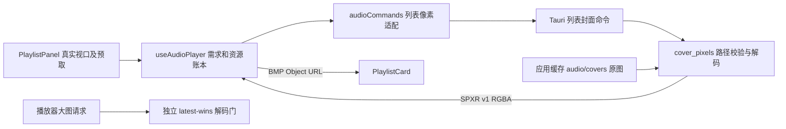

# 播放列表封面加载现状与性能优化边界

## 摘要

2026-09-28 的工作树已实现此前的封面完整性方案：列表没有固定 40 首资格截断，按真实视口与附近区域调度，列表缩略图可请求 128、256、512px，并管理有限并发、预算、重试和换图 URL。此前本文关于“仍截断 40 首”“只有 256/512px”“方案尚未实施”的叙述已经过时。

当前性能主因尚无 Release/WebView 基线。[SP-022](../tasks/sp-022-playlist-scroll-performance-plan.md) 先测量，再分别决定有界磁盘缩略图缓存、网格虚拟化或图片传输优化；本文件给出候选实施前必须守住的边界，不表示它们已经批准或完成。

## 范围与质量属性

本文覆盖列表几何需求、前端缩略图资源、Tauri 像素命令、Rust 原图缓存及候选衍生缓存。播放器大图通道只作为隔离边界。网络封面、媒体库数据库、音频引擎、标签写回和播放状态机不在范围内。

| 属性 | 当前约束与待验证点 |
| --- | --- |
| 完整性 | 稳定视口中有效封面最终应全部显示；无封面、坏图与安全限制需单列。真实 WebView 尚未完成完整性验收。 |
| 内存 | 前端列表受管资源目标为 96 MiB，优先保留屏内和转场资源；极端可见集合超预算时会告警。账本不等于 Renderer/GPU 总内存，需 Release 实测。 |
| 吞吐 | 前端元数据和视觉补水分别最多两个活动任务；Rust 列表解码单门串行，播放器封面使用独立解码门。不能通过无限并发掩盖延迟。 |
| 启动 | 不在打开列表时预解码整库，也不在启动时同步扫描整个衍生缓存。 |
| 权限 | 像素命令只读取应用缓存根目录下 `audio/covers` 中经过校验的普通文件；候选缩略图只能写入应用缓存目录，不新增任意文件或网络权限。 |
| 可维护性 | 组件负责可见几何，前端资源层负责需求和 URL，Rust 负责受限读取、解码与缓存。持久化缓存不能持有 DOM 或播放状态。 |

## 当前数据流与契约

1. [PlaylistPanel.tsx](../../src/features/player/components/PlaylistPanel.tsx) 挂载全部筛选后的卡片，滚动、`ResizeObserver`、窗口尺寸与 DPR 变化时，在动画帧里计算真实可见、附近一屏和转场保留集合；播放栏遮挡会缩小真实可见范围。当前几何计算仍遍历全量挂载卡片。
2. [useAudioPlayer.ts](../../src/features/player/hooks/useAudioPlayer.ts) 优先处理真实可见、首曲、播放栏和转场保留需求，余量才供预取；根据封面 CSS 尺寸和 DPR 选择 128/256/512px。96 MiB 是应用侧受管预算而非硬性进程上限。元数据补水与封面补水各有有限任务数，过期结果不会写入新列表。
3. [audioCommands.ts](../../src/features/player/services/audioCommands.ts) 的列表输入为 `clientId`、原图 `filePath`、`maxEdge` 和 `windowGeneration`。Rust 仅允许列表档位 128/256/512px；播放器大图命令有独立请求身份和档位。列表会话代次在列表资源会话失效时更新，不随每次普通滚动递增。
4. [cover_pixels.rs](../../src-tauri/src/audio/cover_pixels.rs) 校验原图在应用缓存 `audio/covers` 内、不是符号链接且是普通文件；限制原图字节、尺寸和解码量。当前每次未被前端驻留资源满足的请求都读取原图、完整解码、按 Lanczos3 缩放，并返回 SPXR v1 RGBA 像素。列表请求共享串行解码门，和播放器大图解码门隔离。
5. 前端将 RGBA 转成未压缩 BMP Blob URL 给 ``。升级换图时保留旧 URL 及更早回退链，等使用者真正加载新图后才撤销；失败恢复不能把仍在使用的旧图登记为自身的待撤销 URL。Object URL 释放和 WebView 原生图片内存需分别观察。

当前实现**缩小像素尺寸，但没有把列表响应压成 JPEG/WebP**。SPXR 头部与 RGBA 数据是现行跨端契约；候选性能方案不得悄悄改变它。

## 原图缓存边界

[cover_cache.rs](../../src-tauri/src/audio/cover_cache.rs) 解析音频标签时，以嵌入图片原始字节的 BLAKE3 哈希及 MIME 对应扩展名，写入 `AppPaths::cache_dir()/audio/covers`，并把路径交给曲目元数据。写入失败可回退数据 URL。目前原图写入使用直接 `fs::write`，没有原子发布、容量/文件数淘汰或启动清理；“路径名含内容哈希”不能等同于磁盘空间有界或文件完整性已经验证。

候选衍生缩略图缓存应使用独立子目录，例如 `AppPaths::cache_dir()/audio/thumbnails`。它只能缓存从上述已校验原图生成的结果，不能接收前端传来的任意缩略图路径。衍生缓存可以有自己的硬上限，但若不同时治理原图缓存，**整个应用封面磁盘占用仍不是有界的**。原图淘汰会影响现有 `filePath` 引用，不能作为衍生缓存清理的隐含副作用；若阶段 0 显示原图增长本身不可接受，需由 PM 单独界定原图生命周期与协调方案。

## SP-022 阶段 0 的分流条件

在同一 Release 构建、素材、操作脚本和冷/热定义下，记录可见需求到 `` 加载的分布、滚动帧、前后端排队/读图/解码/缩放/BMP 耗时、重复解码、挂载卡片数、Rust/Renderer/GPU 内存及磁盘占用。记录每轮原始数据和测量限制，不用单次开发构建观感裁决。具体样本规模、轮次、目标和验收按 SP-022 执行。

| 观测主因 | 可进入独立方案评审的条件 | 未满足时 |
| --- | --- | --- |
| 重复原图读取、完整解码和缩放 | 同一内容与档位的重复工作占可见延迟主要部分，热缓存的后端收益可测，冷路径和磁盘成本可接受。 | 保持当前受限解码；检查元数据等待、调度或外部磁盘 I/O。 |
| 全量 DOM、几何或布局 | 长列表时挂载数、几何扫描/布局长任务与掉帧相关，缩略图就绪并非主要等待。 | 不因曲目总数大就默认虚拟化。 |
| RGBA 传输及主线程 BMP 转换 | 分段计时和 A/B 证明其占主要部分，且候选格式在目标 WebView 有实际净收益。 | 保留 SPXR v1，避免无证据协议迁移。 |

真实 WebView 自动采集若受限，静态调用链和受控 Rust 代理可证明“重复解码的后端浪费”，却不能证明它是用户可见卡顿主因。PM 已批准把本轮收窄为可回退的 Rust 后端缓存探索实验：同一哈希/档位在 Release 代理中至少五轮冷/热配对，记录读取、解码、缩放、候选命中、CPU 和磁盘，热收益必须超过轮次波动且冷路径不能明显退化。此时只能声明后端代理结果，WebView 端到端延迟、帧率与内存仍待验收；若代理差异不稳定，应停止该实验。虚拟化与协议优化仍按完整阶段 0 证据选择。

## 候选一：有界磁盘缩略图缓存契约

本轮仅实施 PM 批准的探索实验，不据此宣称正式性能验收完成。Rust/Tauri Agent 拥有生成、读取、淘汰和恢复；前端维持现有视口调度、SPXR 响应和 Object URL 所有权。

- **键**：`实际读取的原图内容 BLAKE3 + maxEdge + 变换版本 + 磁盘编码版本`。沿用现有有界原图读取并对实际字节哈希，不仅信任路径名中的哈希；因此热命中仍可能读原图，但不再完整解码和缩放。原图路径、曲目 ID 或修改时间不能单独当键。`maxEdge` 仍只取 128/256/512；方向校正、缩放算法、像素格式或编码改变必须提高版本。原图同名内容改变时不得命中旧图。
- **读写与安全**：只读已按现有规则校验的原图；缩略图路径由 Rust 从键派生并限定在专属目录，拒绝符号链接/非普通文件和越界路径。缓存命中仍校验版本、尺寸、长度及编码完整性，输出不得突破现有像素限制。缓存文件不能成为前端可指定的任意文件读取入口。
- **原子发布**：在同目录以唯一临时文件独占创建，完整写入并刷新后原子发布为不可变键文件；并发同键写入至多保留一份有效结果，失败或崩溃残留的临时文件可清理。Windows 上目标已存在的冲突要安全处理，不能覆盖正在读的有效文件或把半成品暴露为命中。
- **容量与清理**：字节和文件数都要硬上限，写入前为待写文件留出预算；清理只处理衍生目录，不能递归删除 `audio/covers`。用可复现的最近使用记录或等价顺序淘汰；限制每次启动/请求的扫描与清理工作量，异常中断后最终收敛到上限。容量数值和清理节奏由后续任务依据基线决定。
- **文件格式与损坏**：探索阶段可存带版本、键摘要、长度和数据校验的 SPXR v1 响应，热命中无需再解码小图，跨端仍返回原有 SPXR v1 字节。缓存读失败、头部/长度/校验错误视为 miss，隔离或删除坏条目后回源原图并重建；不要把磁盘缓存故障直接包装成用户可见的“无封面”。原图本身无效时仍沿用现有错误语义与安全限制，不无限重试。
- **跨端兼容**：首版优先保持 `audio_load_playlist_cover_pixels` 输入、SPXR v1 RGBA 输出及 `CoverPixelsError` 结构；缓存只改变 Rust 内部快路径。播放器大图请求和列表会话身份不因缓存命中而串用。淘汰不能撤销前端已有的 Blob URL。

验收至少验证同键热请求不再完整解码原图、源变更失效、损坏/写入中断回源、并发同键、文件数和字节上限、原图仍可访问，以及列表替换和播放封面不回归。若收益不足或磁盘无法收敛，应停用新读写路径并保留现行受限解码；清理新目录不影响原图。

### 阶段 0A 冷路径：后台写入探索边界

同进程交错 Release 代理测得缓存冷路径比旧解码路径慢约 196–258ms/83 张，约 5–6%；写入、`sync_all` 和逐项预算扫描合计约 213–228ms。当前这些操作发生在列表串行解码门内。值得单独验证把**持久化**移出响应关键路径，但不能仅凭这组数据断言 WebView 首屏或滚动已改善。先分段核对扫描与刷盘的成本；若简单减少重复扫描即可消除退化，不必引入常驻队列。若采用后台写入，须满足：

1. **单写者与返回顺序**：源文件仍按现有上限读取、计算内容哈希并完成解码；在最终列表会话有效性检查后，把不可变键与完整 SPXR v1 结果非阻塞交给一个应用拥有的低优先级单写者。入队成功只代表待持久化，不能作为响应成功条件。释放列表解码门和返回前端不等待预算扫描、`sync_all` 或清理。队列写入仅处理 `audio/thumbnails`，不接触原图。
2. **有界内存与背压**：同时限定排队项数与排队 SPXR 字节，活动写入也计入内存；实验可先用 128 项、32 MiB 作为待测上限，超过任一上限就跳过本次持久化，直接返回刚解码的图，不在列表解码门内阻塞等空位。编码头可流式写，避免再复制整张 SPXR。记录入队、跳过、待写字节、高水位与完成时间；最终限额须按 Rust 进程峰值修订。
3. **同键并发与可见性**：待写映射以完整缓存键索引并持有已解码的不可变响应；同键后续请求先读此映射或已发布磁盘文件，不能在落盘前重复完整解码。同键只保留一个写任务，晚到请求不替换更早的有效响应。源内容改变会得到不同键；列表会话失效禁止旧响应回前端，但已入队的内容寻址写入可作为可丢弃的缓存预热，不能无限抢占新需求。写成、跳过或失败后都释放映射与字节预算。
4. **磁盘与清理**：单写者串行执行现有版本/校验封装、双上限预算、同目录独占临时文件、完整写入和原子发布；临时文件占用要进入磁盘预算。清理应批量或增量进行，避免每张重新扫描全目录；目录异常膨胀时不得无限扫描或写入无界新文件，并应能在后续有限步骤收敛。读者遇到与淘汰竞争导致的缺失或损坏，只按 miss 回源；Windows 删除失败时跳过该候选，不把已打开文件强制视为可淘汰。
5. **关闭与失败**：应用退出时停止接收，丢弃尚未写入的任务；当前写入可在有限退出宽限内完成，不得无限阻塞退出。异常终止只留下未发布的临时文件，下一次按有界清理规则删除。队列关闭、入队失败、磁盘已满、权限不足和写入失败均只影响未来热命中，不能把已解码成功的当前请求改为错误，也不能扩展现有 TS/SPXR v1/`CoverPixelsError` 契约。失败和跳过必须可观测，不得静默伪装成缓存命中。

对照实验应在同一 Release 二进制与同一匿名样本上交错旧阻塞路径、同步写路径和后台写路径，各至少五轮；分别报告**响应冷延迟**、队列最终排空时间、排空后真正的热命中、跳过数、Rust 内存/CPU、磁盘占用和其他请求并行时的干扰。热轮必须在后台队列完成后开始，不能把仍在内存的待写映射当作持久化命中。若冷响应收益不超过波动、队列导致内存/磁盘高水位或热命中率下降，应回退后台写入并保留当前同步缓存实验。正式 WebView 验收仍未完成。

## 候选二：网格虚拟化契约

仅在 DOM/布局证据占主因时实施，由 Frontend Agent 持有。虚拟化必须让挂载卡片数随视口和明确定义的预取行数增长，保留曲目 ID 与索引顺序的稳定映射；搜索、选择、键盘焦点、初始当前曲定位、滚动恢复、全部布局和滚动方向变化都要保持行为。`visibleIds` 应依据真实滚动容器及播放栏遮挡计算，不能重新引入固定人数资格截断；转场使用者需在卸载卡片前保持封面引用，直到动画结束。虚拟化若导致错位、焦点丢失、封面永久缺项或旧 URL 误撤销，应独立回退，而不改 Rust 像素契约。

## 候选三：图片传输优化契约

仅在分段计时和 A/B 证实传输/BMP 是主因时实施，先由 Architecture Agent 定义版本化 TS/Rust 协议，再由 Rust/Tauri 与 Frontend Agent 分段落地。新格式须显式声明 MIME/像素布局、尺寸、字节长度、方向与颜色处理，保留源路径校验、档位、输出上限和列表会话失效检查；解码失败有可机器判断的错误或回退路径。不能让一端先单独改变 `SPXR v1` 的语义。比较端到端图片显示时间、CPU、峰值内存与高 DPR 清晰度后，才可替换现行路径；播放器大图通道保持独立。

## 历史回归与验证责任

[BUG-0016](../changes/bugs/BUG-0016.md) 的无界图像工作、Canvas/像素传输和 WebView2 回收高水位要求继续维持有限并发、输入上限及长时间往返内存验证。[BUG-0017](../changes/bugs/BUG-0017.md) 的播放器转场会话要求列表优化不清空当前播放图、不重放旧图层，也不提前撤销仍在显示的 URL。升级失败后必须保留完整回退链，包括连续失败与迟到事件。

Test Agent 独立提供阶段 0 及获批方案的同条件复测；PM Agent 决定性能目标、优先级和是否批准独立分支。架构文档的候选条件不能代替实施授权，也不能把代理数据表述成真实 WebView 验收结果。
