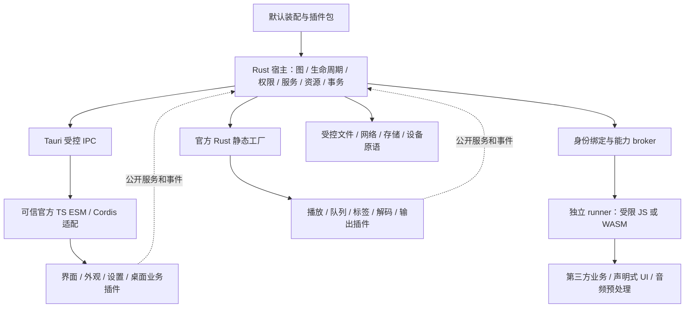

# 架构设计：插件宿主与跨端契约

## 设计结论与适用范围

采用 **Rust 全局治理 + 选择性 Cordis 核心适配 + 多执行环境**。Rust 管理插件目录、依赖图、装配、权限、版本、生命周期和跨端服务权威；Cordis 只辅助可信官方 TS 插件的本地服务代理与资源作用域。业务全部迁入官方插件，基础播放器由默认装配交付，不把播放状态、队列或界面永久留在通用宿主。

本文给出实现依据，与[长期目标](all-business-plugin-system.md)分工；[技术路线 ADR](../decisions/2026-09-30-plugin-host-architecture.md)记录取舍。设计选型已接受，依赖接入、隔离原型、性能预算和平台验证尚未执行；接受设计不等于运行闸门通过。本文不修改代码、安装依赖或批准发布排期。

## 选型依据

| 路线 | 适配性与成本 | 结论 |
| --- | --- | --- |
| 直接复用 Cordis/dsh 宿主全套 | 同进程服务、依赖和 effect 已有实现；Node loader/include、HMR、TS 生命周期无法自然统一 Rust、可信原生音频和第三方权限 | 不采用整体搬迁，不能把两套全局图和权限视为一个宿主 |
| 全自研 | 跨环境治理可一致，但重复实现已成熟的 TS 作用域、服务代理和 effect，增加验证负担 | 作为 Cordis 适配验证失败时的替代方案，公开 SDK 不依赖它 |
| 选择性复用 + Rust 治理 | Cordis Context/Service/Fiber 适配官方 TS；Rust 负责全局事务、隔离 broker、资源确认和原生服务 | 推荐，保留可替换内部适配器，业务不直接依赖 Cordis API |

本地证据：Cordis 核心未直接导入 `node:`；dsh 的浏览器集成使用单独加载器及 Vite 适配，不是 Node loader 原样移植。`vendor/loader/src/internal.ts` 导入 `node:module`，include 依赖文件和进程环境。`fiber.ts` 的 provider epoch 能触发消费者重载，但顶层 disposer 并行执行并记录异常，不能提供全局逆拓扑停止、停止超时或资源清理成功证明；`context.isolate` 只是服务作用域，不是安全隔离。

本次参考源码固定为 `D:/OpenProject/deepseek-harness` HEAD `639ed015397290b3745d163aafe02ffee4aa3f84`，其中 vendor 包为 `@deepseek-ai/cordis@4.0.4`（MIT），是 fork，引用的上游 core 基线为 `4.0.0-rc.7`、commit `56b3d4f725681cf4556c1a8695a709cc3b6eed74`。这些源码证据不能套用于任意同名上游版本；实施前须固定所选制品、传递依赖与许可记录，并重跑 G1，当前 SpMusic 未安装该依赖。

复用范围限定在适配器内，不导入 Node loader、include、HMR 和 dsh 业务包。Rust 先解析并授权 activation，签发绑定事务、part、实例 epoch 和授予版本的激活上下文，TS 适配器才可创建 Context/Fiber。Cordis `inject` 只解析 Rust 已选择的服务 proxy，不能自行解析版本、选择 provider 或成为第二份全局依赖图。需要本地 fiber 重建或依赖变化时，适配器上报 Rust，由 Rust 决定停止/重建；禁止 Cordis 自主改变跨端生命周期。业务 SDK 不暴露 `fork`、`inject` 或全局 Context，G1 必须检验这些约束可执行。

## 职责与依赖方向

| 层 | 责任与实例权威 |
| --- | --- |
| Rust 通用宿主 | 唯一插件目录、安装/装配事务、全局图、能力授予、全局服务注册、实例状态和资源账本；不持有音乐业务策略 |
| Tauri 适配 | 窗口原语、主 WebView 引导、受控 IPC 与事件投递；Rust 从调用端点绑定会话身份，校验后才路由 |
| 官方 TS 适配 | 主 WebView 内随产品打包的可信 ESM、单份 React、受控 SDK、可选 Cordis 作用域；生命周期独立于组件挂载 |
| 官方 Rust 适配 | 随应用静态编译的插件工厂，经同一 manifest、依赖、权限、启动停止与资源规则装配；trait 是同构建内部接口，不是安装 ABI |
| 第三方 runner | 每实例独立进程，TS 采用无环境能力的嵌入 JS 引擎，Rust/其他编译产物采用受限 WASM；只能经 broker 请求授权服务 |
| 业务插件 | 提供/消费版本化业务服务，拥有本域状态；插件 ID、提供器选择、资源权限来自宿主，而不是插件自行注册特权 |



宿主只提供通用渲染槽、平台原语和故障恢复入口。播放器布局、按钮语义、主题、插件管理业务界面也以官方插件提供；必要插件失败时宿主最小恢复入口可诊断和恢复装配，不伪装成另一套播放器。

## 插件描述、装配和服务

### Manifest v1

以下为设计契约；字段必须有 JSON Schema、Rust DTO 与 SDK 类型，缺少、未知或类型错误的关键字段在执行前拒绝。

```ts
type PluginManifestV1 = {
  manifestVersion: 1
  id: string                         // 反向域名标识，如 org.spmusic.playback
  version: string                    // SemVer，安装同 ID 同时选择一个活动版本
  hostApi: string                    // 支持的 SemVer 范围
  parts: Array<{
    id: string                       // 包内唯一
    runtime: 'ts-bundled' | 'rust-static' | 'ts-isolated' | 'wasm-isolated'
    entry: string                    // 包内路径或编译工厂键，禁止任意 URL
    artifactDigest: string
    platforms: string[]              // 明确 os/arch，不能以缺省宣称全平台
    required: boolean
    dependsOn: Array<{ pluginId: string; partId: string; optional: boolean }>
  }>
  dependencies: Array<{ pluginId: string; range: string; optional: boolean }>
  provides: Array<{
    serviceId: string; version: string; schemaDigest: string
    cardinality: 'singleton' | 'provider-set'; partId: string
    stateful: boolean; replacement: 'restart' | 'quiesce'
  }>
  consumes: Array<{ partId: string; serviceId: string; range: string; optional: boolean }>
  capabilities: Array<{ name: string; requestedScope: Record<string, unknown> }>
  config: { version: number; schema: string }
  data: { version: number; migration: 'none' | 'reversible' | 'backup-required' }
}
```

`id` 只允许小写字母、数字、点、连字符，长度最多 128，不作为文件路径。名称/描述等展示元数据由包旁列，可扩展但不改变授权。包来源、信任等级、签名校验结果、实际 grant、必要插件属性和配额属于宿主安装/装配记录，不能由 manifest 自报获得。`parts` 共用包版本与激活事务，禁止 UI v2 与 Rust v1 混合运行。

`provides.partId` 与 `consumes.partId` 都必须引用包内有效 part。每个 consumes 明确调用方 part，Rust 根据解析出的 provider part 建立服务启动边；`parts.dependsOn` 补充不通过服务表达的启动前置关系，同样以目标 part ready 为条件。引用本包时 pluginId 必须等于本包 ID；跨包目标必须来自已声明的 dependencies 或已解析的服务提供包，版本由全局装配固定，part 外键无效在执行前拒绝。显式 part 边、服务边及包级必需依赖的 ready 前置边统一参加拓扑和循环检查。

`parts.required` 表示该 part 必须成功才能提交复合包；`consumes.optional=false` 或 `dependsOn.optional=false` 表示调用方 part 必需该目标就绪才能启动，与目标 part 是否原先可选无关。选择启用 consumer 时，其必需提供者/目标必须纳入激活集，否则执行前拒绝；optional 目标缺失不得阻塞启动，出现/消失通过受控能力事件处理。包级 dependencies 用于版本/存在性约束：必需包在同事务内以其必需 parts 全部 ready 为满足条件，事务外须已 running，禁止等同事务包外部 commit。所有依赖引起的循环均执行前拒绝，不能以 staging 绕过要求。

装配文件包含 `assemblyVersion`、插件 ID/精确版本/摘要、启用状态、必需能力、服务提供器选择、配置版本与授予记录引用。依赖解析先校验 SemVer、平台、服务 schema、冲突和必需能力，再按稳定排序的拓扑图启动；服务依赖也参与图。循环、缺失或重复 singleton 返回明确依赖链。provider-set 可注册多个实现，但由显式选择或业务服务的聚合规则消费，不能依赖加载顺序抢占。可选依赖变化通过受控能力变更事件通知，不静默改变必需依赖。

宿主注册表是唯一服务可见性权威。TS Cordis 只接收已批准服务代理；原生服务使用类型化内部适配器，跨进程/IPC 使用序列化 schema。跨插件不导入实现文件，不公开 React VM、`AppHandle`、rodio 对象或 Rust 内存布局。每个 stateful singleton 只有一个 owner 实例，通过 revision 执行条件提交；插件不得直接写其他实例状态。

### SDK 表面

```ts
interface PluginContext {
  config: Readonly<unknown>           // 启动前已校验的快照
  signal: AbortSignal
  services: {
    call<T>(serviceId: string, method: string, input: unknown,
      options?: { timeoutMs?: number; signal?: AbortSignal; expected?: Expected }): Promise<T>
    subscribe(streamId: string, cursor?: Cursor): Promise<SnapshotSubscription> // 原子快照+增量
    provide(serviceId: string, implementation: unknown): Promise<Disposable>
  }
  tasks: { run<T>(work: (signal: AbortSignal) => Promise<T>): Promise<T> }
  resources: { defer(dispose: () => Promise<void> | void): Disposable }
  ui: { contribute(slotId: string, descriptor: UiContributionV1): Promise<Disposable> }
  storage: { read(key: string): Promise<unknown>; write(key: string, value: unknown): Promise<void> }
  log: { write(level: 'debug' | 'info' | 'warn' | 'error', record: unknown): void }
}
interface Plugin {
  start(ctx: PluginContext): Promise<void>
  stop(reason: 'disable' | 'replace' | 'shutdown' | 'permission-revoked'): Promise<void>
}
```

方法和服务需独立 schema 描述输入、输出、是否有副作用、调用能力、作用域、幂等规则、并发限额及取消提交点；泛型只辅助编译，跨端必须运行时验证。SDK 的 `provide` 只能提交 manifest 声明的服务，真正发布由激活事务完成。所有返回的 `Disposable` 注册到实例作用域；业务开发者无需引用 Cordis 或宿主内部模块。`Expected` 与订阅契约见下节。

SDK `services.subscribe` 是唯一公开订阅入口，下文 `subscribeSnapshot` 是它的原子快照与增量内部语义名称，不是第二个可分离调用的 SDK 方法。

## 消息、事件、身份与错误

wire v1 使用 JSON 可表达 DTO；高位计数、代际和序号用十进制字符串，避免 JS `number` 精度损失。只接受 uint64 范围内规范十进制字符串（除 `0` 外无前导零，无符号或空白），Rust 按 u64、TS SDK 按 BigInt 比较，禁止转为 JS Number 或按字典序比较。二进制数据另走受控资源句柄和有界通道，不嵌入通用 JSON。旧音频 DTO 兼容适配仅用于迁移，不能混用数值比较。

```ts
type Expected = {
  sessionId?: string; trackGeneration?: string; stateRevision?: string
  providerEpoch?: string
}
type RequestV1 = {
  protocolVersion: 1; requestId: string
  serviceId: string; serviceVersion: string; method: string
  timeoutMs: number; expected?: Expected; idempotencyKey?: string; payload: unknown
}
type CallerContext = {               // 由 Rust 绑定端点后补入，不在插件请求中采信
  pluginId: string; instanceId: string; instanceEpoch: string
  assemblyEpoch: string; grantRevision: string; hostSessionId: string
}
type ErrorV1 = {
  domain: 'host' | 'plugin' | 'business'; code: string; message: string
  pluginId?: string; instanceId?: string; serviceId?: string; requestId?: string
  retryable: boolean; recoveryAction?: string
  commitStatus: 'notCommitted' | 'committed' | 'unknown'
}
type ResponseV1 = { protocolVersion: 1; requestId: string } & (
  | { status: 'ok'; result: unknown }
  | { status: 'error'; error: ErrorV1 }
)
type EventV1 = {
  protocolVersion: 1; subscriptionId: string; streamId: string
  providerInstanceId: string; providerEpoch: string; assemblyEpoch: string
  sequence: string; stateRevision: string; sessionId?: string; trackGeneration?: string
  kind: string; payload: unknown; causationRequestId?: string
}
```

Rust 依据 runner 专属连接或可信 TS 适配会话绑定身份。任何请求自报 `pluginId`、grant 或 epoch 均不成为授权依据。官方 TS 共处主 WebView，属于合作可信代码；闭包或 token 不构成同 realm 敌意代码之间的安全隔离。第三方禁止进入该 realm，身份由其 runner 端点独立绑定。

请求 ID 用于关联与去重，不由多个调用者各自递增值决定最新播放意图；播放 actor 接收时分配自己的意图序号。Rust 以单调时钟计算 deadline，并钳制 timeout。入队和副作用提交时都检查身份存活、实例与装配 epoch、grant revision、服务版本以及 expected 条件；旧实例、旧曲目或撤销授权结果不能提交。

取消使用 `{protocolVersion:1, requestId}` 控制消息，按绑定 caller 查找自身在途任务，返回 `cancelled`、`tooLate` 或 `notFound`。取消成功只对尚未提交的请求保证无副作用；已提交返回 `tooLate` 并同步快照。取消与提交由操作 owner 串行裁决，同一请求不能同时产生 cancelled 和成功提交；网络迟到的响应按同一终态去重，超时或 notFound 都不能推断为已取消。写文件进入不可撤销阶段后须安全完成或恢复，不可因超时盲目重试。

副作用服务必须提供版本化 `queryOperation`/恢复契约：按调用者归属与 requestId 或 idempotencyKey 查询 `pending / committed / notCommitted / unknown` 及结果摘要；断连后只能由重认证且有恢复权限的原插件身份查询，不能跨插件枚举。服务 schema 必须固定幂等去重范围（插件身份、方法、业务资源/会话及输入摘要）、持久性和保存期限，相同 key 不同输入拒绝；在期限内恢复不重复提交，超出期限或记录无法恢复返回 unknown 并禁止自动重试。具体保存期限随业务写入契约冻结，未定义这些条件的副作用方法不得发布。`unknown` 表示必须查询/恢复后才能重试，无法消除不确定性时报告人工恢复动作。

宿主错误包括 `PERMISSION_DENIED`、`PERMISSION_REVOKED`、`INSTANCE_STALE`、`VERSION_MISMATCH`、`DEPENDENCY_UNAVAILABLE`、`QUEUE_FULL`、`TIMEOUT`、`STOP_TIMEOUT`、`EVENT_GAP`。取消/被新意图替代不等于播放失败；歌词等补充失败归插件诊断，必要音频失败由播放 owner 决定状态变化。UI 不依据 `message` 分支。

订阅通过 `subscribeSnapshot` 原子建立增量登记并读取同一 revision 的快照，返回 cursor 后接收严格后续增量，不能先读快照再监听而丢事件。cursor 绑定 streamId、providerInstanceId/epoch、assemblyEpoch、sequence；服务 owner 在串行提交点确认快照与 cursor 的一致性。同 stream 同 epoch 序号递增，客户端去重重复序号；重连仅允许相同授权流及相同代际的 cursor，旧代 cursor 返回 `EVENT_GAP` 而不映射到新提供器。保留窗口外或有界缓冲溢出发送 `EVENT_GAP` 并使当前订阅失效，客户端重新获取快照，不继续套用缺口后的增量。旧 provider/assembly/session 事件丢弃；位置遥测可合并，结束、错误和队列变更走可靠有界流并支持缺口恢复。事件订阅也是实例资源。

通用异步 v1 初始工程限额：单 JSON 消息 256 KiB、每实例待处理请求最多 64、活动任务最多 16、缺省 timeout 5 秒且上限 30 秒，实例停止宽限 3 秒。超限拒绝或背压，不使用无界 channel。配额由宿主策略授予并可按服务收紧；这些是设计起始值，不是性能认证，G4/G5 测量后调整并记录兼容影响。大型歌词/图片、批量列表和 PCM 用分页或有界资源通道。

## 生命周期、资源与权限

包状态和实例状态分开记录：包为 `installed / updating / removing`，另记安装事务 `staging / verifying / committing / failed / cancelled`；实例为 `registered → resolving → starting → running → quiescing → stopping → stopped`。失败状态 `failed` 附 `failureStage`、`cleanupStatus: complete|incomplete`、`quarantined: boolean` 和恢复动作；quarantine 是禁止再装配的字段，不是另一个生命周期状态。已安装不代表启用，启用不代表运行；需要重启另记 `pendingRestart`。

复合包与依赖组成 activation transaction。Rust 先解析全图，再按 part/服务依赖拓扑启动；同一复合包的内部依赖也参与检查，内部服务循环同样拒绝。服务先登记在事务 staging，提供者完成 start 和资源确认后标为事务内部 ready；后续 part 可以通过 Rust 的事务路由消费已 ready 的依赖及已有 running 依赖。事务 ID 由激活上下文绑定，插件不能自报并进入其他 staging。禁止让消费者等待整个图 running 才启动，否则首次装配会死锁。

事务内部 ready 不等于外部 running。事务外调用、订阅和 UI 贡献都看不到 staging；所有必需 part ready 后，Rust 原子提交服务目录、可见性与 assembly epoch，统一对外发布并进入 running。失败按逆依赖顺序撤销资源和暂存注册。启动中的业务副作用不能仅靠目录隔离回滚：UI 不挂载，输出不开始播放，外部文件写入不在 start 执行；需要不可逆操作时留待 commit 后的正常服务调用，存储迁移写入 staging namespace。首次装配遇到必需插件失败保留恢复入口，不能装配隐藏业务后备。

停止规则：关闭新调用 admission、失效实例 epoch、退出提供器选择；取消/排空任务，按依赖逆序调用 stop；宿主兜底 dispose 资源、撤销服务、释放句柄、join workers，确认后标 stopped。重复 stop 共用同一完成任务，重启创建新 instanceId/epoch。现有 Cordis effect 清理只是本地辅助，Rust 账本记录 owner、类型、清理动作、deadline 和完成证明。Cordis 顶层 dispose 会记录并吞掉 disposer 异常，因此 Promise fulfilled 或 fiber 消失都不是清理成功证据；适配器必须逐资源回报完成/失败，Rust 核对未清资源、worker join 或进程退出证明后才提交 stopped，不完整时按下述 quarantine 处理。

隔离 runner 超时可终止并等待确认进程退出；可信同进程 Rust 线程不能安全强杀。清理不完整标 `failed, cleanupStatus=incomplete, quarantined=true`，阻止重启同一独占服务或卸载仍被执行的代码，要求修复退出或重启宿主，不伪报 stopped。服务路由撤销不等于释放独占资源 lease；STOP_TIMEOUT 后保留物理设备/资源占用记录，只有真正退出、join 或释放完成证明到达才能复用，不能让新实例抢占仍在使用的设备。实例资源包括任务、定时器、监听、文件/设备句柄、PCM 缓冲、缓存 lease、UI 贡献、Cordis fork 和服务注册。

能力采用名称与范围，例如 `fs.read` 的资源/目录 grant、`fs.write.tags` 的资源 grant、`net.request` 的目标集合、`playback.control` 的会话范围、`device.audio.output`、`window.control` 与 `storage.namespace`。host 检查声明、实际 grant 与运行策略的交集；官方随产品 grant 同样可审计。文件 broker 打开时验证最终资源与已授权范围，防符号链接/路径逃逸，不靠字符串前缀；ResourceRef 使用不透明 ID，读取信息不自动授予修改权。

撤销先原子更新 grant revision 并关闭相关 admission，拒绝旧调用/结果，再取消任务、收回引用和相关资源；共享服务按依赖受控停止或降级。写入不可撤销阶段遵守提交状态与安全恢复规则。清理宽限不是新业务权限，只能执行宿主授予的资源释放动作。

## 执行隔离与界面贡献

官方 TS 采用打包 ESM，官方 Rust 采用静态工厂；二者可以共享进程但必须记录可信代码崩溃影响整个宿主的风险。第三方 native 动态库不加载到宿主，不把任意 sidecar 可执行程序视为受限插件；第三方 Rust 路径是受限 WASM guest，需支持其声明的平台与导入契约。原生输出替换当前只开放官方可信静态工厂；第三方原生 ABI不在本设计支持范围。

第三方 TS 编译为封闭依赖的 JS bundle，推荐每实例 runner 嵌入 QuickJS-ng 类引擎；无 Node、DOM、环境文件/网络绑定、任意模块 resolver。第三方 WASM 推荐 runner 内 Wasmtime 类引擎，不给任意 WASI preopen、socket 或进程能力，业务导入只绑定 broker。两类 guest 使用同一 wire/权限协议，进程隔离承担崩溃与终止边界，引擎承担封闭导入、内存及执行中断；操作系统配额和 runner 协议也必须实测。具体绑定库/版本与平台支持在 G2 原型确认，失败更换执行适配而不改插件治理模型。

执行输入也必须受控：JS 包只接受可解析的源码 bundle，拒绝插件提供的 QuickJS 字节码和预编译缓存。[QuickJS-NG 官方说明](https://quickjs-ng.github.io/quickjs/developer-guide/intro/)提供内存、栈和执行中断 API，并指出其字节码绑定引擎版本且执行前不做安全检查；不能将第三方字节码视为等价源码。WASM 输入先经引擎验证，拒绝 guest 提供的原生预编译产物；仅允许宿主自行编译并绑定引擎版本、选项及制品摘要的内部缓存。[Wasmtime 中断机制](https://docs.wasmtime.dev/examples-interrupting-wasm.html)提供 fuel/epoch 控制，[安全说明](https://docs.wasmtime.dev/security.html)强调宿主导入也影响边界。以上是选型依据，G2 仍需验证配置生效、绕过及耗尽行为，不能据 API 存在宣称运行安全。

第三方 UI 首先使用声明式贡献，由官方界面插件和宿主通用渲染适配消费。`UiContributionV1` 包含 `id`、`slotId`、`kind`（panel/action/settings）、版本化纯数据 `model`、受控 action 引用；不包含 JS 回调、HTML 字符串或不受限 CSS。动作回传 runner，授权与输入照常检查；贡献按实例命名空间登记并返回 dispose。可信官方 React 贡献可在主 WebView 使用组件适配，但对外不公开共享 React 状态。

受控 action 引用是 Rust 登记后签发的不透明 token，绑定贡献者 instance/epoch、grant revision、贡献与 action ID、目标方法及 schema；展示数据不携带可任意改写的目标命令。点击时官方 UI 向宿主提交 token 与经校验输入，宿主以贡献者身份分派 runner 或被允许的服务方法，权限上限仍是贡献者 grant，不能借官方 UI 的较高权限执行。禁用、撤销、更新和 UI 贡献移除均使旧 token 失效。涉及标签写入等要求显式用户动作的操作，还须宿主控制的可信确认交互签发一次性、短期、绑定操作及资源的 user-action proof；runner 自报点击或 `userInitiated: true` 不成立。该证明不扩大 grant，需额外授权时由宿主单独授权。G2 验证重放、旧 epoch、目标替换和通过官方渲染器越权的拒绝路径。

任意第三方 HTML/JS WebView 不在默认支持路径，新增须单独审查 origin、CSP、导航、IPC 与权限。现有 `csp:null`、main 窗口 capability 和缓存 asset scope 不具备该隔离。Tauri [能力文档](https://v2.tauri.app/security/capabilities/)指出自定义 `invoke_handler` 命令默认可由所有窗口/webview调用；必须将命令纳入应用 manifest 权限，封住旧 `audio_*` 裸路径调用或迁入受控路由，创建第三方 WebView 之前验证绕过已关闭。仅不给第三方 `core` 权限不够。

## 音频业务契约与安全替换

官方 `playback` 是播放会话与状态唯一 owner，保留现有 actor 串行提交、代际和最新意图栅栏；其他插件只发请求或带上下文提交结果。`queue` 拥有队列 revision 与随机/循环策略；`metadata` 合并带来源的字段 patch，不能让提供器整份覆盖曲目 ID/路径/时长。自然结束由输出/播放服务通知 owner 并发布 ended，不能依赖 React 轮询才发现。

音频契约分控制面与数据面：控制面描述 `open/prepare/start/pause/seek/stop/close`、能力与 format 协商；数据面传固定容量 PCM block/lease，包含 `sessionId`、session epoch、chain epoch、block sequence、sample format/rate/channel layout、frames、timestamp 与 EOS/error 标志。格式和缓冲所有权显式协商，初始可适配现有 `i16`，不能把 rodio `Source` 或 `Sink` 作为公共 wire 类型。

解码服务在预读 worker 执行经授权的 I/O，向有界 PCM 缓冲提交；DSP 链定义顺序、状态重置、flush、延迟、参数 revision 与旁路模式，输出服务消费已准备块。设备回调及同步处理链不得做网络/磁盘、通用 IPC、等待 runner、无界分配或锁等待。第三方解码/DSP 可经 runner 做块预处理，但回调只消费准备好的缓冲；第三方缺块按明确策略旁路或停播，不在设备线程等待。

当前 `symphonia_source.rs` 的 `next()` 直接 decode/读包，现有 runtime/parser 是进程寿命线程、sender 互持且 join handle 被丢弃，无界 mpsc 和无 deadline recv 也存在。因此“现已实时隔离和可卸载”没有证据。迁移必须增加显式 Shutdown、终止/清理回复、sender 关闭、worker join、背压与 I/O 预读边界，设备 watcher 既有 stop/join 可参考但仍需期限。

替换状态协议：播放 owner 提交 quiesce → 关闭旧会话业务 admission → 输出安全淡出/stop 并确认无旧回调 → 取消解码/DSP任务、flush旧 epoch PCM → 释放设备/资源并确认 → 激活新链及会话 epoch → prepare 后启动。失败在释放旧实例前可恢复旧链；释放后按保存的曲目/位置/队列快照重新启动兼容链，可能有播放间隙。quiesce 无法完成则拒绝替换并要求重启；不承诺解码/输出无中断热更新。独占输出设备同时只允许一个有效 owner。

G4 必须确定测量 profile：平台、设备、sampleRate、blockFrames、队列深度与预读水位。以 `T = blockFrames / sampleRate` 计算每块时间，声明回调/DSP链上界及 P99 预算、runner吞吐与抖动余量、内存和欠载容忍策略。实现前基于当前可听播放基线填写数值并评审，未通过不开放深层替换；本设计不杜撰现有性能结果。SDK 支持路径包括官方静态解码/输出、受限第三方异步元数据/歌词、声明式 UI，以及经 G4 验证的 runner 解码/DSP，覆盖完整长期目标而分阶段验收。

## 配置、存储、安装与回滚

数据根目录按已验证插件 ID 建独立 namespace；配置 `{pluginId, pluginVersion, configVersion, revision, value}` 经 schema 校验，持久数据独立 dataVersion。秘密由受控凭据服务处理，日志和普通配置不保存明文秘密。现有主题 localStorage v2、主题格式 v1–5 必须可读并通过一次性迁移与备份进入外观插件存储，不能直接丢弃用户主题。

安装包使用 manifest、资源与摘要清单；校验包路径、大小、数量、符号链接、摘要、身份、平台、兼容与来源，拒绝路径越界。官方制品信任来自产品发布记录；第三方包的摘要/签名证明来源与完整性，不自动授予能力。签名与发布公钥具体制品方案属于 G3，插件市场/云服务不因此进入范围。

安装更新事务：staging → verify/resolve → 备份装配和数据 → 停止受影响依赖 → staging运行迁移和激活 → 原子切换活动版本/配置 → 记录 commit → 清理旧资源。迁移在独立 staging namespace 执行；提交前取消回收 staging，提交后按回滚流程处理。装配与数据切换须事务日志，启动时恢复中断事务；不能把多个 rename 当成整体原子事务。

失败恢复旧版本、装配和数据快照；不可逆迁移要求备份或拒绝自动降级。卸载先停服务/依赖，再删除包，用户数据按明确保留/删除选择处理；必需官方插件只能在兼容替代就绪或受控关闭产品能力时停用。包里含 rust-static 更新需产品重启，新工厂随新制品提供；不伪称可以运行时安装新静态 Rust 代码。开发重载只作用于允许重载的实例，也执行同样清理和 epoch规则。

## PH-01～PH-11 模块映射

以下是实现责任模块的设计名称，尚未创建目录。

| 需求 | 主模块与适配 | 可检查交付 |
| --- | --- | --- |
| PH-01 | Rust manifest/catalog + schema SDK | 版本、平台、schema与包摘要执行前检查 |
| PH-02 | Rust service registry/router + TS代理/Cordis适配 | singleton/provider-set、owner/revision、禁止内部直连 |
| PH-03 | Rust resolver/assembly | 全局服务依赖拓扑、默认组合、确定provider选择、缺失/循环解释 |
| PH-04 | Rust lifecycle/resource ledger + 各runner scope | 跨part事务、逆序停止、dispose/join证明、超时quarantine |
| PH-05 | Rust config/storage/migration | schema、namespace、版本、备份恢复及秘密分离 |
| PH-06 | Rust event/task broker + SDK | snapshot/cursor、缺口恢复、deadline、取消、背压与代际 |
| PH-07 | Rust policy/capability broker + execution adapters | 调用时身份与grant、撤销、受限guest/runner及可信风险声明 |
| PH-08 | Rust package/install transaction | 包验证、取消、卸载、更新恢复、重启要求 |
| PH-09 | Tauri gateway + runner transport + schema/codegen | wire v1、认证端点、错误/提交状态、断连与IPC绕过关闭 |
| PH-10 | Rust diagnostics + 官方管理UI插件/开发适配 | 实例图、资源/时延、故障链、日志去敏和重载清理 |
| PH-11 | TS/Rust SDK + test host/fixtures | 服务替身、兼容套件、故障注入、默认及替换装配回归 |

## 全部现有业务迁移归属

插件 ID 是建议的稳定命名；可合并同域细分插件，但不能把任何业务改名为宿主基础设施而豁免。

| 当前输入 | 官方插件/服务 | 必须保持的边界 |
| --- | --- | --- |
| `audio/controller.rs`、`runtime.rs`、播放命令与 `useAudioPlayer` 传输逻辑 | `org.spmusic.playback`，`playback.session@1` | 唯一状态owner、actor与意图排序；UI仅呈现及发送请求 |
| `symphonia_source.rs`、`source.rs` 解码、`duration.rs`、下混/ReplayGain | `org.spmusic.decoder`，`audio.decoder@1` | 解码/探测与PCM转换在插件，rodio/Symphonia内部依赖不外泄 |
| runtime输出、`device/*`、设备变化和输出信息 | `org.spmusic.audio-output`，`audio.output@1` | 独占资源、完成通知、stop/join、设备恢复 |
| `playlist.rs`、临时folder/m3u8、前端随机循环/下一首 | `org.spmusic.queue` 与 `org.spmusic.local-source` | 队列策略owner与本地枚举分开；保留会话内非递归范围 |
| `metadata.rs`、CUE/章节内部探测、曲目引用与详情水合 | `org.spmusic.metadata` | 字段来源/优先级、权威身份、现有支持范围与前台/补充任务分离 |
| `lyrics_cache.rs`、sidecar/嵌入读取、前端lyrics/lyricTimeline | `org.spmusic.lyrics` | 读取、缓存、歌词解析业务全迁移；读取不获得写入权 |
| `tag_writer.rs`、显式 `audio_embed_lyrics` | `org.spmusic.tag-editor` | 显式用户动作、安全写回与缓存失效 |
| cover缓存/像素、playlist artwork、ArtworkCanvas视觉资源 | `org.spmusic.artwork` | 业务缓存与尺寸/需求策略在插件，宿主仅资源/二进制通道 |
| PlayerShell/Surface、dock、歌词/封面/队列面板、状态VM与过渡 | `org.spmusic.player-ui` | React呈现和交互业务；不持有另一份权威播放/队列策略 |
| appearance、ThemeManager、主题codec/storage、CSS/motion与图标provider | `org.spmusic.appearance` | 保留用户主题与图标兼容；主题数据不授予执行权限 |
| SettingsDialog、业务选项和设置呈现 | `org.spmusic.settings-ui`，各业务配置服务 | 通用schema存储在宿主，设置内容/默认值/语义在业务插件 |
| WindowBar、getCurrentWindow控制、全屏/窗口记忆；WebView内存业务策略 | `org.spmusic.desktop` | 桌面体验/策略在插件，Tauri及系统低级原语在平台适配 |
| playerCopy、状态/时间格式化、未来语言切换 | `org.spmusic.i18n` | 现有文案集中管理迁移，不因迁移自动增加语言产品能力 |
| DevAudioTools/Settings、demo-player和假歌曲、docs-manager独立入口 | 可选官方 dev/demo/docs-tool 装配 | 开发工具业务同规则；不默认混入播放器生产装配 |
| App/main入口、Toaster、通用组件与工具函数 | 官方UI装配与共享依赖 | 宿主入口只bootstrap；业务toast/错误呈现与页面在插件，UI依赖库不强制逐组件拆插件 |

平台路径创建/通用缓存目录、日志基础、Tauri配置和IPC、任务/存储/权限/渲染原语仍属宿主。曲目缓存策略、窗口业务、歌词规则、动画参数、文案和设置默认值属于插件。后续媒体库/搜索/收藏/历史/网络来源/同步等按目标统一插件化，但本阶段不新增功能。

## 验证闸门与完成判据

| 闸门 | 必需证据与失败处理 |
| --- | --- |
| G1 Cordis适配 | pinned fork/制品/许可、Vite浏览器build无Node polyfill依赖、Rust授权后才建fiber、inject只解已选proxy且无第二全局图、异步startup失败及dispose吞错/挂起与资源完成核对；若无法受Rust权威约束，换自研TS scope adapter，SDK不变 |
| G2 第三方执行 | TS引擎/WASM runner与平台配额原型；拒绝guest字节码/预编译native缓存、验证WASM、伪造身份、环境IO/动态import/未授权导入、无限循环、内存耗尽、崩溃、kill、撤销、旧结果与UI action越权/重放攻击测试；未通过不启用第三方执行 |
| G3 治理事务 | schema/兼容矩阵、循环/冲突、跨part内部ready调用与外部commit可见性、首次装配无running等待死锁、跨part失败、安装取消/断电恢复、签名来源策略、配置迁移与回滚；依赖注册和旧实例资源不得残留 |
| G4 音频与资源 | 迁移前后可听播放/格式/seek/设备基线、实测profile预算、有界PCM与预读、session替换失败、停止join/独占句柄释放；不达标不开放深层替换，重新审查数据面 |
| G5 默认业务装配 | 上表逐项插件归属及调用链、离线默认可用、旧直连退出、主题与设置迁移、业务回归、启动/内存/时延测量；不允许只迁歌词便宣布全面完成 |

设计检查要求：每个公开服务具备schema、版本、owner、授权、取消/提交语义、并发与替换策略；每个资源有清理责任与可观察证明。实现验收还需断连、事件缺口、重复stop、暂停seek、快速A/B/A换曲、多提供器字段合并、权限撤销、更新中断及回滚故障注入。SDK兼容套件覆盖host API/protocol/service版本组合，旧版本拒绝/兼容适配均有证据。

关键风险包括可信同进程故障、原型引擎与OS配额差异、Cordis私有语义漂移、音频回调中的旧I/O、安装事务数据恢复和迁移双状态权威。基线数值、SDK逐业务方法、包签名制品及平台限制需在相应闸门补齐，不影响本次已推荐的职责、执行路径和契约原则。

下一步由 PM 根据设计与验证门槛安排获批任务；Architecture Agent 维护契约变更，Frontend/Rust-Tauri Agent 按明确文件所有权实现，Test Agent 独立验证上述闸门。本次设计不生成任务卡，也不宣称验证已通过。
