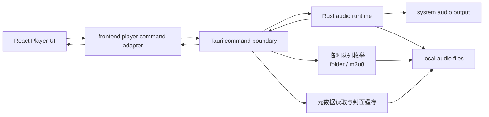
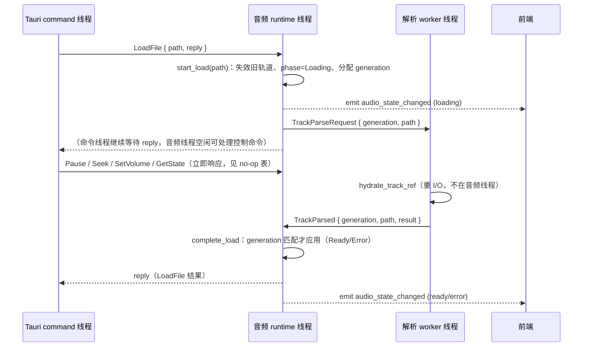

# 架构说明：v0.1 真实本地播放架构契约

## 摘要

v0.1 真实播放以单个本地音频资源的最小闭环为核心：前端通过 Tauri command 访问后端，Rust/Tauri 后端负责文件选择或加载、临时文件夹 / `.m3u8` 队列、播放控制、状态查询、状态事件和稳定错误码。媒体库、数据库、产品级播放列表、网络存储和插件系统仍不进入 v0.1。

本契约在 SP-015 单资源契约基础上，按 2026-07-27 已接受范围与当前实现候选对齐，新增 `audio_open_source`、`audio_hydrate_track`、`audio_list_folder_tracks`、`audio_set_volume`，并把 `audio_state_changed` 从“仅设备变化推送”扩展为“控制 command 与设备变化后广播”。同时定义临时队列 DTO、元数据低频传输与乱序防护原则。当前实现与契约的所有已知差异见「契约一致性与偏差」一节。

## 背景

2026-07-24 的范围变更把真实音乐播放提前纳入 v0.1。2026-07-27 的两项决策进一步收口了仓库中已存在的同目录临时队列、`.m3u8` 临时队列、基础标签 / 嵌入式歌词 / 封面展示和格式兼容性证据。SP-015 的契约按单资源最小闭环编写，未覆盖这些已实现候选能力；本契约负责消除文档与实现偏差，使 Test Agent（SP-018）可以直接映射检查项。

旧 `overall-architecture.md` 和 `player-state-and-fake-track.md` 中“v0.1 不做真实音频 / 不做 Tauri command”的限制已被新决策覆盖；它们关于媒体库、播放列表、数据库、网络存储和插件暂不进入 v0.1 的限制仍然有效。

## 范围

- 定义 v0.1 真实播放 command 契约（12 个已注册 command）。
- 定义同目录临时队列与本地 `.m3u8` 临时队列的 command / DTO、排序、非递归、只读和会话内边界。
- 定义高频播放状态与低频歌曲详情的传输边界，以及 command response、轮询和 `audio_state_changed` 事件的同步 / 乱序原则。
- 定义格式兼容性声明维度（扩展名枚举 vs 内容解码验证）。
- 给 Rust/Tauri Agent、Frontend Agent 和 Test Agent 提供 SP-016 / SP-017 验收与 SP-018 验证的直接输入。

## 不在范围内

- 不实现媒体库、递归文件夹扫描、文件监控、数据库或持久化索引。
- 不实现产品级播放列表、临时队列持久化、跨目录队列管理、播放历史、收藏、网络 HLS 或完整 `m3u8` 导入导出。
- 不实现网络 / sidecar 歌词获取、逐字歌词、歌词 / 封面 / 标签编辑 UI（sidecar 歌词写回问题见「契约一致性与偏差」）。
- 不实现 CUE 分轨与 M4B 章节的公共 Tauri / 前端契约（仓库中的解析模型仅属后端内部研究）。
- 不实现 FFmpeg 运行时 fallback、网络存储播放、真实频谱分析、高级 DSP、独占输出或插件系统。
- 不认证无构建与实机证据的平台（当前证据以 Windows x64 为主）。

## 质量属性

- 性能：播放链路只维护一个当前音频资源和一个播放运行时；目录枚举在每次选择后执行一次，不建立索引，不递归扫描。
- 启动速度：应用启动时不初始化媒体库；音频运行时随应用启动创建，但不打开音频设备或读取文件，直到用户选择资源。
- 内存占用：不缓存整库；封面按会话缓存到应用 cache 目录，`AudioTrackRef` 元数据在前端按需缓存；高频状态 DTO 保持轻量。
- 跨平台一致性：command 契约保持平台无关；v0.1 只验证当前桌面开发环境，其他平台不声明证据。
- 可测试性：所有核心能力都能通过 command 返回值、状态查询、`audio_state_changed` 事件和人工播放检查验证。
- 可维护性：错误码稳定，用户可见文案留给前端，不由 Rust 返回中文文案驱动 UI 判断。
- 扩展性：后续媒体库和播放列表通过新契约接入，不污染 v0.1 单资源播放与临时队列模型。
- 权限最小化：只请求打开用户选择或显式传入的本地文件所需权限；不申请网络、数据库或插件执行权限。

## 建议边界



- React UI 不直接访问文件系统，不直接持有 Rust 内部结构。
- 前端只消费稳定 DTO：`AudioTrackRef`、`AudioFolderPlaylist`、`AudioPlaybackState`、`AudioOpenSourceResult`、`AudioCommandError`。
- Tauri command 是唯一跨前后端边界。
- Rust audio runtime 只管理当前音频资源、播放控制和状态查询。
- 临时队列枚举（同目录音频、本地 `.m3u8`）属于 Rust 本地能力，结果以 `AudioFolderPlaylist` 进入前端。
- 元数据（基础标签、歌词、封面）由 Rust 读取并随低频 `AudioTrackRef` 传输，不进入高频 `AudioPlaybackState`。
- 后续媒体库、播放列表和网络存储不能绕过 command 直接进入 UI。

## Command 契约

### `audio_open_file`

用途：打开原生文件选择器，选择一个本地音频文件并加载为当前播放资源（SP-015 原始入口）。

输入：

```ts
type AudioOpenFileInput = {
  filters?: Array<{ name: string; extensions: string[] }>
}
```

输出：`AudioTrackRef`

约束：

- v0.1 只返回单个文件，不返回播放列表。
- `filters` 缺省时使用后端内置音频扩展名过滤（`default_filters`）。
- 用户取消选择返回 `USER_CANCELLED`。
- 当前前端主入口不使用本 command（改用 `audio_open_source`）；本 command 保留为单文件受控入口，供测试与后续兼容。

### `audio_open_source`

用途：打开原生文件选择器，允许选择本地音频文件或 `.m3u8` 播放列表，并返回可区分的打开结果（v0.1 前端主入口）。

输入：无。

输出：

```ts
type AudioOpenSourceResult =
  | { kind: 'track'; track: AudioTrackRef }
  | { kind: 'playlist'; playlist: AudioFolderPlaylist }
```

约束：

- 选择普通音频文件时返回 `track`，并加载为当前播放资源。
- 选择 `.m3u8` 文件时返回 `playlist`，队列按 `.m3u8` 内容顺序构建，`selectedIndex` 指向队列首条；首条缺失时前端按“歌曲未找到”提示并尝试下一首。不把 `.m3u8` 当音频资源加载。
- 用户取消选择返回 `USER_CANCELLED`。

### `audio_load_file`

用途：加载一个已知本地音频文件路径，主要用于测试、调试和临时队列逐首加载。

输入：

```ts
type AudioLoadFileInput = {
  path: string
}
```

输出：`AudioTrackRef`

约束：

- 后端验证路径存在、可读且能解码，失败返回 `INVALID_PATH` / `FILE_NOT_FOUND` / `UNREADABLE_FILE` / `UNSUPPORTED_FORMAT`。
- 加载过程会替换当前播放资源；加载失败时旧资源已被失效，不会残留可继续播放的旧 sink。
- 不递归读取目录，不把路径写入持久化存储。

### `audio_hydrate_track`

用途：低频读取指定本地音频文件的完整元数据（基础标签、歌词、封面），供前端按需补水详情。

输入：`AudioLoadFileInput`

输出：`AudioTrackRef`

约束：

- 不改变当前播放资源，不进入播放状态机；只读取元数据并缓存封面。
- 前端用于临时队列下一首预取和详情补水，不用于播放进度轮询。
- 文件不可读或不可解码时返回与 `audio_load_file` 相同的稳定错误码。

### `audio_list_folder_tracks`

用途：枚举选中音频文件所在目录的临时队列，或解析本地 `.m3u8` 临时队列。

输入：

```ts
type AudioFolderPlaylistInput = {
  selectedPath: string
}
```

输出：`AudioFolderPlaylist`

约束：

- 目录枚举是非递归、只读、会话内的：只读取选中文件所在目录的直接子文件，按受支持音频扩展名过滤，按文件名稳定排序（大小写不敏感、再按原文件名与路径）。
- 目录枚举不修改任何音频文件内容，不建立媒体库或索引。
- 选中文件所在目录存在按文件名排序第一个可用的 `.m3u8` 时，优先按该 `.m3u8` 构建队列（发现路径不允许越出目录的外部绝对路径）。
- 目录中没有受支持音频时返回 `UNSUPPORTED_FORMAT`。
- 本 command 只描述队列，不加载播放资源。

### `audio_play`

用途：播放当前已加载资源。

输入：

```ts
type AudioPlayInput = {
  restart?: boolean
}
```

输出：`AudioPlaybackState`

约束：

- 未加载资源时返回 `NO_TRACK_LOADED`。
- `restart: true` 表示从头播放当前资源；默认继续当前位置。
- 已停止或已自然结束时播放默认从头开始。

### `audio_pause`

用途：暂停当前播放。

输入：无。

输出：`AudioPlaybackState`

约束：

- 未加载资源时返回 `NO_TRACK_LOADED`。
- 已暂停时重复调用保持幂等。

### `audio_stop`

用途：停止当前播放并把进度回到起点。

输入：无。

输出：`AudioPlaybackState`

约束：

- 未加载资源时可返回 idle 状态，不应导致前端崩溃。

### `audio_seek`

用途：跳转到指定播放位置。

输入：

```ts
type AudioSeekInput = {
  positionMs: number
}
```

输出：`AudioPlaybackState`

约束：

- `positionMs` 必须是非负有限数；超出时长时按后端能力钳制或返回稳定错误，不能静默错误。
- seek 使用容器索引 / pre-roll 路径，索引失败时后端内部回退线性解码；不支持的能力显式返回 `UNSUPPORTED_OPERATION`。

### `audio_set_volume`

用途：设置播放音量。

输入：

```ts
type AudioSetVolumeInput = {
  volume: number
}
```

输出：`AudioPlaybackState`

约束：

- `volume` 必须是 `0.0..=1.0` 的有限数；否则返回 `INVALID_VOLUME`。
- 音量持久于当前运行时；新资源加载不清零。

### `audio_get_state`

用途：查询当前播放状态（轮询与兜底同步接口）。

输入：无。

输出：`AudioPlaybackState`

### `audio_get_current_track`

用途：仅在前端重连、歌曲详情缓存缺失或状态中的 `currentTrackId` 未在本地缓存时，查询当前完整歌曲详情。

输入：无。

输出：`AudioTrackRef | null`

约束：

- 不得用于播放进度轮询或每次控制 command 后的常规同步。
- `AudioTrackRef` 可包含封面、歌词、标签和本地路径，因此只能低频传输。

## 数据契约

### 高频实时状态

```ts
type AudioPlaybackPhase =
  | 'idle'
  | 'loading'
  | 'ready'
  | 'playing'
  | 'paused'
  | 'stopped'
  | 'ended'
  | 'error'

type AudioPlaybackState = {
  phase: AudioPlaybackPhase
  currentTrackId: string | null
  positionMs: number
  durationMs: number | null
  volume: number
  error: AudioCommandError | null
}
```

约束：

- `AudioPlaybackState` 是高频实时 DTO，只包含播放阶段、当前歌曲 ID、进度、时长、音量和错误；不得包含路径、歌词、封面或完整标签。
- `durationMs` 获取不到时允许为 `null`；`positionMs` 获取不到时返回 `0`，并用 `phase` 或 `error` 表达原因。
- `volume` 初始为 `1`，可由 `audio_set_volume` 改变；`AudioPlaybackState` 中的 `volume` 始终反映当前值。

### 低频歌曲详情

```ts
type AudioTrackRef = {
  id: string
  sourcePath: string
  fileName: string
  durationMs: number | null
  metadata: AudioTrackMetadata
}

type AudioTrackMetadata = {
  title: string | null
  artist: string | null
  album: string | null
  albumArtist: string | null
  genre: string | null
  year: number | null
  trackNumber: number | null
  discNumber: number | null
  comment: string | null
  lyrics: string | null
  coverArt: AudioCoverArt | null
}

type AudioCoverArt = {
  mimeType: string
  filePath: string | null
  dataUrl: string | null
  byteLen: number
}
```

约束：

- `AudioTrackRef` 属于低频传输契约，只由打开 / 加载 / 补水 / 当前歌曲详情查询返回，不进入轮询或事件 payload。
- 封面优先以 `filePath`（经 Tauri asset 协议）展示，缺失时使用 `dataUrl` 后备；两者皆空时前端使用明确的后备视觉状态。
- `lyrics` 为原始歌词文本（支持 LRC 时间戳行或纯文本行），解析与高亮由前端负责。
- `id` 是基于本地路径生成的稳定会话标识（`local-` 前缀 + 短哈希），仅用于当前会话内的歌曲匹配，不代表媒体库 ID。

### 临时队列

```ts
type AudioFolderPlaylist = {
  directoryPath: string
  directoryName: string
  sourceKind: 'folder' | 'm3u8'
  sourcePath: string
  sourceName: string
  selectedIndex: number
  tracks: AudioFolderTrackRef[]
}

type AudioFolderTrackRef = {
  id: string
  sourcePath: string
  fileName: string
  available: boolean
}
```

字段说明：

| 字段 | 说明 |
| --- | --- |
| `directoryPath` / `directoryName` | 队列所在目录（`.m3u8` 时为播放列表所在目录）。 |
| `sourceKind` | `folder`：同目录枚举；`m3u8`：本地 `.m3u8` 解析。 |
| `sourcePath` / `sourceName` | `folder` 时即目录本身；`m3u8` 时为 `.m3u8` 文件路径与文件名（去扩展名）。 |
| `selectedIndex` | 当前选中条目在 `tracks` 中的索引；`tracks` 为空时前端不得依赖该值。 |
| `tracks[].available` | 文件是否存在（枚举时的存在性检查），不代表内容可解码。 |

### 错误契约

```ts
type AudioCommandError = {
  code: AudioErrorCode
  message: string
  recoverable: boolean
}

type AudioErrorCode =
  | 'USER_CANCELLED'
  | 'NO_TRACK_LOADED'
  | 'INVALID_VOLUME'
  | 'INVALID_PATH'
  | 'FILE_NOT_FOUND'
  | 'UNREADABLE_FILE'
  | 'UNSUPPORTED_FORMAT'
  | 'PLAYBACK_INIT_FAILED'
  | 'PLAYBACK_FAILED'
  | 'UNSUPPORTED_OPERATION'
  | 'INTERNAL_ERROR'
```

约束：

- `message` 仅用于调试或直接展示的后备文案，前端业务判断必须使用 `code`。
- `recoverable` 表示错误后是否可继续使用当前会话。

## 状态同步

v0.1 采用「command 返回即时状态 + 事件推送 + 播放中轮询」三通道，以 command response 为权威：

1. 每个控制 command（`audio_play` / `audio_pause` / `audio_stop` / `audio_seek` / `audio_set_volume`）返回最新 `AudioPlaybackState`。
2. 后端在控制 command（含加载完成进入 `ready`）与输出设备变化后向 `audio_state_changed` 事件广播同一个轻量 `AudioPlaybackState`。
3. 自然结束不在后端主动广播，而是由播放中（`phase === 'playing'`）每 500ms 调用一次 `audio_get_state` 检测到 `ended` 后呈现；暂停、空闲或拖拽预览期间不轮询。

乱序原则：

- 事件只作为即时提示；以 command response 为准，response 与事件 payload 相同。
- 旧状态事件不得覆盖最新用户意图：前端以「请求代际」与「传输意图守卫」丢弃过期响应 / 事件（seek 与传输请求均使用单调递增代际）。
- `audio_get_state` 轮询响应只在与当前代际一致时才应用，防止轮询期间已发起的新命令被旧快照回滚。
- 任何通道到达的 `currentTrackId` 与前端缓存的 `AudioTrackRef` 不一致时，前端只通过低频 `audio_get_current_track` / `audio_hydrate_track` 补水，不通过轮询或事件传输详情。

## 异步解析 worker（OPT-0001）

本决策（见 `docs/decisions/2026-08-05-OPT-0001-async-track-parsing.md`）覆盖早期「单线程 actor 同步执行 `LoadFile`」的隐含假设：音频 runtime 线程不再承担重 I/O 解析，`hydrate_track_ref`（容器探测、时长解码、元数据与封面读取）移入独立解析 worker 线程。

### 线程模型与消息流



### 代际号规则

- `AudioRuntime` 维护单调递增 `load_generation` 与 `pending_load_generation`；`start_load` 分配并登记代际，`complete_load` 校验代际一致才应用结果。
- controller runtime 循环维护 `pending_load: Option<PendingLoad>`（代际、路径、reply），作为「当前待完成加载」的权威；`TrackParsed` 代际不匹配时丢弃，不回复。
- 并发 `LoadFile`：新加载到达时旧 pending 收到可恢复 `INTERNAL_ERROR`（说明被更新请求取代），新加载正常进行。

### 加载期间控制语义

| 命令 | Loading 期间行为 |
| --- | --- |
| `audio_get_state` | 立即返回 `phase=loading` |
| `audio_pause` | no-op，返回 `phase=loading`，不报错 |
| `audio_seek` | no-op，返回 `phase=loading`，不报错 |
| `audio_set_volume` | 正常更新音量，返回 `phase=loading` |
| `audio_play` | 返回 `NO_TRACK_LOADED`（无可播放轨道） |
| `audio_stop` | 返回 `idle`，不取消在途加载 |

### 边界与残留风险

- 命令契约不变：`audio_load_file` / `audio_open_file` / `audio_open_source` 仍返回 `AudioTrackRef`，reply 在解析完成后发出；controller 阻塞的是 command 线程，音频线程保持空闲。
- `audio_hydrate_track` 仍在 command 线程同步解析（不影响音频线程），解析结果复用与去重见 OPT-0002。
- `play()` 的 `rebuild_sink` 中 `open_source` 仍发生在 runtime 线程（属于开始播放的开销，非加载路径）。
- 解析 worker 为单线程串行；连续换曲时至多产生一个被浪费的过期解析任务。

## 临时队列规则

### 同目录临时队列（`sourceKind: 'folder'`）

- 触发方式：用户选择单个音频文件后，前端调用 `audio_list_folder_tracks` 枚举其所在目录。
- 枚举范围：选中文件所在目录的直接子文件，非递归、只读。
- 过滤：仅受支持音频扩展名的文件。
- 排序：文件名大小写不敏感升序，再按原文件名、路径稳定排序；`selectedIndex` 指向选中文件。
- 会话内：不持久化、不编辑、不导出，与媒体库 / 产品级播放列表无关。
- 播放切换：上一首 / 下一首 / 直接选择 / 自然结束后切换；切换目标不可加载时按错误状态呈现。
- 若目录中存在可用 `.m3u8`，按文件名排序第一个可用播放列表优先于直接枚举（自动发现行为，见「契约一致性与偏差」）。

### 本地 `.m3u8` 临时队列（`sourceKind: 'm3u8'`）

- 触发方式：用户直接选择 `.m3u8` 文件。
- 解析：忽略空行与 `#` 开头的 M3U / HLS 元信息行；忽略 `http://`、`https://`、`ftp://`、`rtsp://`、`rtmp://` 等远程 URL；忽略其他含 `://` 且非 `file://` 的 URI。
- 路径：相对路径按 `.m3u8` 所在目录解析；支持本地绝对路径与 `file://` 路径。直接选择 `.m3u8` 时允许本地绝对路径指向播放列表目录之外的音频；发现路径不允许外部绝对路径。
- 过滤：仅受支持音频扩展名的本地条目进入队列；按播放列表原始顺序排列，按条目去重。
- 缺失条目：文件不存在但仍显示在队列中，`available: false`；播放遇到时提示“歌曲未找到”并继续尝试下一首。
- 边界：不是产品级播放列表支持，也不是 HLS 支持；不保存、不编辑、不导出。

## 元数据边界

- 基础标签（标题、艺术家、专辑、专辑艺术家、流派、年份、音轨、碟号、注释）、歌词与封面由 Rust 只读读取；读取失败时返回空字段并保持前端后备状态，不阻断播放。
- 嵌入式歌词优先；无嵌入式歌词时允许读取同目录同名 `.lrc` 作为展示后备。
- 封面写入应用 cache 目录后以 `filePath` 或 `dataUrl` 展示；不进行网络补全。
- 歌词解析（时间戳行、翻译分隔、自动滚动）由前端完成。

## 格式兼容性声明口径

- 文件选择器、目录枚举与 `.m3u8` 过滤使用扩展名列表，这只是候选提示；容器与 codec 由文件内容决定。
- 目录 / `.m3u8` 队列中的 `available` 只表示文件存在。加载时后端会打开并解码首个音频缓冲，因此“扩展名匹配但内容不可解码”的文件会在加载阶段以 `UNSUPPORTED_FORMAT` 稳定失败，不会进入可播放状态。
- `verified` 只表示仓库确定性语料在指定检查维度与记录环境下通过，不代表所有同扩展名文件均兼容。
- 能力证据按 probe、decode、duration、seek、metadata、真实声卡播放和平台分别表述（详见 `docs/audio-compatibility/format-capability-matrix.md`）；发布说明不得混写或外推。
- 自动化完整解码证据不能替代发布制品的可听播放 smoke。
- 当前 Windows x64 证据作为 v0.1 Windows 候选发布输入；macOS、Linux、ARM64 无实机证据，不得认证。
- FFmpeg 只用于生成测试语料，不进入播放器运行时；Symphonia / libopus 为主路径。

## 契约一致性与偏差

### 与批准范围一致

| 能力 | 契约 / 边界 |
| --- | --- |
| 单文件播放闭环 | `audio_open_source` / `audio_load_file` / `audio_play` / `audio_pause` / `audio_stop` / `audio_seek` / `audio_get_state` / `audio_get_current_track` 与 DTO、错误码符合本契约。 |
| 同目录临时队列 | `audio_list_folder_tracks` 非递归、只读、文件名稳定排序、会话内，明确区分媒体库与产品级播放列表。 |
| 本地 `.m3u8` 临时队列 | 按决策解析本地条目、跳过远程 / HLS 行、缺失条目保留并提示、绝对路径越目录规则与决策一致。 |
| 元数据低频传输 | `AudioPlaybackState` 与 `audio_state_changed` 保持轻量；路径、歌词、封面、完整标签只经低频 `AudioTrackRef` / `audio_hydrate_track` 传输。 |
| 状态事件 | `audio_state_changed` payload 为 `AudioPlaybackState`；控制 command 的事件与 response 同源同值，设备变化单独广播，自然结束经 500ms 轮询检测。 |
| 音量 | `audio_set_volume` 采用 `0.0..=1.0` 归一化区间与 `INVALID_VOLUME` 错误码；`AudioPlaybackState.volume` 反映当前值。 |
| 格式声明 | 扩展名枚举、内容解码、格式矩阵维度分别表述，不冒充“支持所有常见格式”。 |

### 已接受偏差（需 PM / Requirements 在 SP-020 复核口径）

| 偏差 | 说明 | Owner | SP-018 重测条件 |
| --- | --- | --- | --- |
| 同目录自动发现 `.m3u8` | 选中普通音频文件时，若目录存在 `.m3u8`，按文件名排序第一个可用播放列表会优先于直接目录枚举。2026-07-27 决策只描述“直接选择 `.m3u8`”，未明确自动发现行为。 | PM Agent / Requirements Agent（口径复核）；Rust/Tauri Agent（如需调整） | 记录目录同时含音频与 `.m3u8` 时的实际队列来源与排序，确认与批准口径一致。 |
| `audio_open_file` 保留 | 前端主入口使用 `audio_open_source`；`audio_open_file` 仍注册但非主入口，行为与单文件契约一致。 | Architecture Agent | 无独立重测；SP-018 只验证主入口。 |

### 必须修复的偏差

| 偏差 | 说明 | Owner | 修复要求 | SP-018 重测条件 |
| --- | --- | --- | --- | --- |
| sidecar 歌词写回用户音频文件 | `read_metadata_or_default` 在无嵌入式歌词时读取同目录 `.lrc`，并通过 `embed_lyrics` 把歌词写入音频文件标签（临时副本 + 替换原文件）。这违反“只读枚举 / 不编辑标签”的批准边界，属于未批准的写操作，可能修改用户原始文件。 | Rust/Tauri Agent | 移除 `embed_lyrics` 写回路径，sidecar 歌词只作为读取展示后备；写回相关代码与测试一并移除或改为仅在测试语料副本上使用。 | SP-018 验证：加载带 `.lrc` 但无嵌入式歌词的音频后，原音频文件字节与修改时间不变；歌词仍正常展示。 |

## 备选方案与取舍

- 方案 A：前端 `HTMLAudioElement` 直接播放本地路径。优点是简单；缺点是文件权限、Tauri 路径暴露和跨平台行为边界不清，不符合“后端干起来”的目标。
- 方案 B：Rust/Tauri 后端最小音频 runtime + Tauri command + 会话临时队列。优点是边界清晰、后续可扩展；缺点是需要 Rust 依赖和平台音频验证。
- 方案 C：一次性设计完整音频引擎、媒体库和播放队列。优点是长期完整；缺点是范围过大，不适合 v0.1。

取舍：v0.1 采用方案 B。方案 A 被文件权限与跨平台边界排除；方案 C 与已批准范围冲突，留待后续版本。

## 演进路径

- v0.1：单资源真实播放闭环 + 会话临时队列 + 基础元数据展示 + 格式兼容性基线。
- v0.2：播放列表 UI 与真实播放状态联动；临时队列收敛为有明确需求的队列体验。
- v0.3：媒体库最小扫描和索引（需新批准）。
- 后续：播放历史、收藏、真实播放列表、网络存储、输出设备与高级音频能力。

稳定边界：前端不得直接访问本地文件、数据库、网络存储或音频设备；未来本地能力必须通过明确的 Tauri command 契约进入前端。

## 验收标准

- 本文档存在且包含完整 front matter。
- 文档包含 `audio_list_folder_tracks` 的输入、输出、错误语义和非递归 / 只读 / 会话内约束。
- 文档区分临时文件夹队列与媒体库、产品级播放列表。
- `AudioPlaybackState` / `audio_state_changed` 保持轻量；路径、歌词、封面和完整标签只通过低频 `AudioTrackRef` 或等价详情契约传输。
- 文档说明 command response、500ms 轮询和事件并存时避免旧状态覆盖最新用户意图的乱序原则。
- 文档说明目录候选按扩展名枚举与最终按内容解码验证的差异。
- 文档按 probe、decode、duration、seek、metadata、真实声卡和平台区分格式能力证据。
- 文档明确 sidecar 歌词写回为必须修复偏差，并给出 Owner 与 SP-018 重测条件。
- 文档明确不批准递归扫描、持久队列、媒体库、标签编辑、FFmpeg runtime 或无证据平台认证。

## 风险

- 播放库对 seek、duration 或格式支持可能不一致；后端已把不支持的能力显式返回错误码，SP-018 仍需逐项验证。
- 文件选择和文件权限在不同平台可能行为不同；v0.1 先验证当前桌面环境。
- 如果前端依赖 `message` 判断错误，后续本地化会引起回归；必须依赖 `code`。
- sidecar 歌词写回是当前唯一的未批准写操作，若在 SP-018 前未修复，存在修改用户文件的发布风险。
- 目录自动发现 `.m3u8` 的行为若未与批准口径对齐，队列来源可能超出用户预期；需 PM / Requirements 复核。
- 扩展名过滤与内容解码的差异若在 UI 或文档中混淆，会把“候选”升级为“已支持”承诺。

## 建议下一负责 Agent

- Rust/Tauri Agent：修复 sidecar 歌词写回偏差；对已接受偏差按 SP-018 重测条件提供证据。
- Test Agent：执行 SP-018，按本契约映射 command、DTO、事件、状态、错误与边界检查项。
- PM Agent：复核“同目录自动发现 `.m3u8`”口径，必要时在 SP-020 需求基线中明确。
