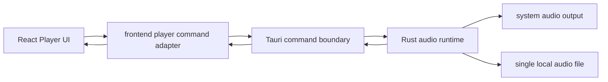

# 架构说明：v0.1 真实本地播放架构契约

## 摘要

v0.1 真实播放只做单个本地音频资源的最小闭环。前端通过 Tauri command 访问后端，Rust/Tauri 后端负责文件选择或加载、播放控制、状态查询和稳定错误码；媒体库、数据库、真实播放列表、网络存储和插件系统仍不进入 v0.1。

## 背景

2026-07-24 的范围变更把真实音乐播放提前纳入 v0.1。旧 `overall-architecture.md` 和 `player-state-and-fake-track.md` 中“v0.1 不做真实音频 / 不做 Tauri command”的限制被新决策覆盖；它们关于媒体库、播放列表、数据库、网络存储和插件暂不进入 v0.1 的限制仍然有效。

## 范围

- 定义 v0.1 最小真实播放 command 契约。
- 定义前端、Tauri command、Rust 音频运行时之间的数据流。
- 定义播放状态、错误码和前端同步边界。
- 给 Rust/Tauri Agent 提供 SP-016 的直接实现输入。

## 不在范围内

- 不实现媒体库、文件夹扫描、数据库或持久化索引。
- 不实现真实播放列表、播放历史、收藏或 `m3u8`。
- 不实现网络存储播放。
- 不实现真实频谱分析、高级 DSP、独占输出或输出设备选择。
- 不实现插件系统。

## 质量属性

- 性能：v0.1 只维护一个当前音频资源和一个播放运行时，不扫描目录，不建立索引。
- 启动速度：应用启动时不初始化媒体库；音频运行时可在第一次打开或加载音频时初始化。
- 内存占用：不缓存整库，不缓存大型封面或歌词；音频缓冲交给播放库管理。
- 跨平台一致性：v0.1 先验证当前桌面开发环境；command 契约保持平台无关。
- 可测试性：所有核心能力都能通过 command 返回值、状态查询和人工播放检查验证。
- 可维护性：错误码稳定，用户可见文案留给前端，不由 Rust 返回中文文案驱动 UI 判断。
- 扩展性：后续媒体库和播放列表通过新契约接入，不污染 v0.1 单资源播放模型。
- 权限最小化：只请求打开用户选择或显式传入的单个音频文件所需权限。

## 建议边界



- React UI 不直接访问文件系统，不直接持有 Rust 内部结构。
- 前端只消费稳定 DTO：`AudioTrackRef`、`AudioPlaybackState`、`AudioCommandError`。
- Tauri command 是唯一跨前后端边界。
- Rust audio runtime 只管理当前音频资源、播放控制和状态查询。
- 后续媒体库、播放列表和网络存储不能绕过 command 直接进入 UI。

## Command 契约

### `audio_open_file`

用途：打开原生文件选择器或等价受控入口，让用户选择一个本地音频文件，并加载为当前播放资源。

输入：

```ts
type AudioOpenFileInput = {
  filters?: Array<{ name: string; extensions: string[] }>
}
```

输出：

```ts
type AudioTrackRef = {
  id: string
  sourcePath: string
  fileName: string
  durationMs: number | null
}
```

约束：

- v0.1 只返回单个文件。
- `sourcePath` 只用于当前会话播放，不代表媒体库路径或持久化记录。
- 如果用户取消选择，返回 `USER_CANCELLED` 错误码或等价可识别结果。

### `audio_load_file`

用途：加载一个已知本地文件路径，主要用于测试、后续前端文件选择替代方案或调试路径。

输入：

```ts
type AudioLoadFileInput = {
  path: string
}
```

输出：`AudioTrackRef`

约束：

- 后端必须验证路径存在且可读。
- 不递归读取目录。
- 不把路径写入持久化存储。

### `audio_play`

用途：播放当前已加载资源。

输入：

```ts
type AudioPlayInput = {
  restart?: boolean
}
```

输出：`AudioPlaybackState`

约束：

- 未加载资源时返回 `NO_TRACK_LOADED`。
- `restart: true` 表示从头播放当前资源；默认继续当前位置。

### `audio_pause`

用途：暂停当前播放。

输入：无。

输出：`AudioPlaybackState`

约束：

- 未加载资源时返回 `NO_TRACK_LOADED`。
- 已暂停时重复调用应保持幂等。

### `audio_stop`

用途：停止当前播放并把进度回到起点。

输入：无。

输出：`AudioPlaybackState`

约束：

- 未加载资源时可返回 idle 状态，不应导致前端崩溃。

### `audio_seek`

用途：跳转到指定播放位置。

输入：

```ts
type AudioSeekInput = {
  positionMs: number
}
```

输出：`AudioPlaybackState`

约束：

- `positionMs` 必须是非负有限数。
- 如果后端播放库暂不支持 seek，SP-016 必须明确返回 `UNSUPPORTED_OPERATION`，不能静默成功。

### `audio_get_state`

用途：查询当前播放状态。

输入：无。

输出：`AudioPlaybackState`

### `audio_get_current_track`

用途：仅在前端重连或歌曲详情缓存缺失时查询当前完整歌曲详情。

输入：无。

输出：`AudioTrackRef | null`

约束：

- 不得用于播放进度轮询或每次控制 command 后的常规同步。
- `AudioTrackRef` 可以包含封面、歌词、标签和本地路径，因此只能低频传输。

## 数据契约

```ts
type AudioPlaybackPhase =
  | 'idle'
  | 'loading'
  | 'ready'
  | 'playing'
  | 'paused'
  | 'stopped'
  | 'ended'
  | 'error'

type AudioPlaybackState = {
  phase: AudioPlaybackPhase
  currentTrackId: string | null
  positionMs: number
  durationMs: number | null
  volume: number
  error: AudioCommandError | null
}

type AudioCommandError = {
  code: AudioErrorCode
  message: string
  recoverable: boolean
}

type AudioErrorCode =
  | 'USER_CANCELLED'
  | 'NO_TRACK_LOADED'
  | 'INVALID_PATH'
  | 'FILE_NOT_FOUND'
  | 'UNREADABLE_FILE'
  | 'UNSUPPORTED_FORMAT'
  | 'PLAYBACK_INIT_FAILED'
  | 'PLAYBACK_FAILED'
  | 'UNSUPPORTED_OPERATION'
  | 'INTERNAL_ERROR'
```

约束：

- `message` 仅用于调试或直接展示的后备文案，前端业务判断必须使用 `code`。
- `volume` v0.1 可以固定为 `1`，除非 SP-016 明确实现音量控制；固定字段是为了状态 DTO 稳定，不代表 UI 必须提供音量控件。
- `durationMs` 获取不到时允许为 `null`。
- `positionMs` 获取不到时返回 `0`，并用 `phase` 或 `error` 表达原因。

## 状态同步

v0.1 推荐采用“前端轮询状态 + command 返回即时状态”的简单方案：

- 每个控制 command 返回最新 `AudioPlaybackState`。
- 前端播放中每 250-500ms 调用 `audio_get_state` 刷新进度。
- 后续版本如需事件推送，再增加 Tauri event；v0.1 不要求事件总线。

## 备选方案与取舍

- 方案 A：前端 `HTMLAudioElement` 直接播放本地路径。优点是简单；缺点是文件权限、Tauri 路径暴露和跨平台行为边界不清，不符合“后端干起来”的目标。
- 方案 B：Rust/Tauri 后端最小音频 runtime + Tauri command。优点是边界清晰、后续可扩展；缺点是需要 Rust 依赖和平台音频验证。
- 方案 C：一次性设计完整音频引擎、媒体库和播放队列。优点是长期完整；缺点是范围过大，不适合 v0.1。

取舍：v0.1 采用方案 B。

## 演进路径

- v0.1：单资源真实播放闭环。
- v0.2：播放列表 UI 与真实播放状态联动。
- v0.3：媒体库最小扫描和索引。
- 后续：播放历史、收藏、真实播放列表、网络存储、输出设备和高级音频能力。

## 验收标准

- 本文档存在且包含完整 front matter。
- command 契约、DTO 和错误码足够 Rust/Tauri Agent 直接实现。
- 文档明确旧 UI-only 限制已被 2026-07-24 范围变更覆盖。
- 文档明确媒体库、数据库、真实播放列表、网络存储和插件系统不进入 v0.1。

## 风险

- 播放库对 seek、duration 或格式支持可能不一致；SP-016 必须把不支持的能力显式返回错误码。
- 文件选择和文件权限在不同平台可能行为不同；v0.1 先验证当前桌面环境。
- 如果前端依赖 `message` 判断错误，后续本地化会引起回归；必须依赖 `code`。

## 建议下一负责 Agent

Rust/Tauri Agent 执行 SP-016，实现最小真实音频播放后端；Frontend Agent 在 SP-016 完成后执行 SP-017；Test Agent 执行 SP-018。
