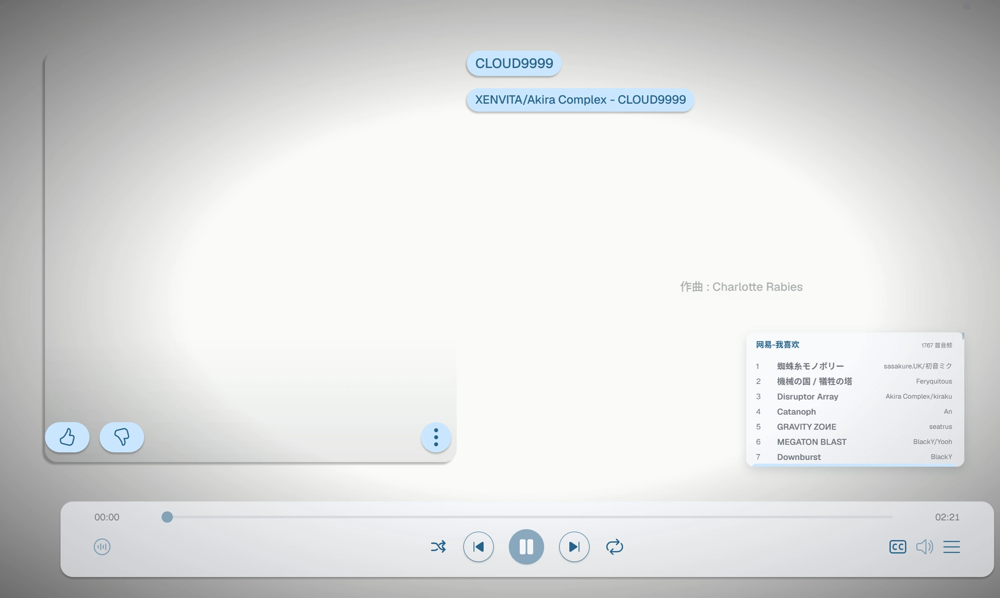

# 切换歌曲时短暂显示尚未加载歌曲状态

## 问题描述

真实播放歌曲时，两首歌曲切换期间会短暂显示“尚未加载歌曲”状态，大约两秒后才能正常播放。

> 当前源码中的空状态文案为“尚未打开音频”。本文沿用来源描述中的“尚未加载歌曲”指代同一切歌空状态。

## 根因分析

本缺陷不是播放队列被清空，也不是界面动画性能问题，而是前端把后端合法的“替换加载态”错误投影成了“播放器没有歌曲”。

切换歌曲时，Rust 音频运行时会先停止并失效旧音源，再异步解析新音源。这个安全策略会暂时产生：

```text
phase = loading
currentTrackId = null
```

`currentTrackId = null` 在这里表示“后端当前没有已确认、可播放的音频资源”，不表示“用户会话中从未选择歌曲”。前端目前没有区分这两种语义，而是直接通过该字段派生展示歌曲。

完整因果链为：

1. 用户点击上一首、下一首或队列歌曲，或者当前歌曲自然结束并触发自动切歌。
2. 前端进入歌曲选择流程，调用 `audio_load_file` 并等待新歌曲解析完成。
3. 后端执行替换加载：立即清除旧 sink、路径和当前歌曲，进入 `loading`，广播 `currentTrackId = null`。
4. 前端的 `applyAudioState` 接收该事件，把真实音频状态更新为 `loading/null`，并清空当前音频详情。
5. 前端展示歌曲只由 `audioState.currentTrackId` 查找；字段为空后，派生的 `track` 立即变成 `null`。
6. `PlayerSurface` 将 `track = null` 解释为真正空播放器，挂载 `EmptyPlayerState`。
7. 新歌曲完成解码、时长探测和元数据读取后，后端进入 `ready`，随后自动播放；前端获得新歌曲 ID 和详情，正常界面才恢复。

首个错误状态是第 5 步：前端把“切换事务正在加载”折叠成了“UI 无歌曲”。后端的安全失效和 `loading/null` 广播符合现有契约，不属于错误。

## 证据

- `useAudioPlayer.ts` 的上一首、下一首、队列选择和自然结束入口最终都进入 `loadFolderAudioTrack`。
- Rust `AudioRuntime::start_load` 明确先调用 `invalidate_loaded_audio()`，再进入 `Loading`；现有单元测试也要求此时旧歌曲为空。
- Controller 在解析完成前立即广播一次状态，因此前端必然收到 `loading/null`。
- `applyAudioState` 在 ID 为空时清除 `audioTrack`；展示 `track` 又完全依赖 `currentTrackId`。
- `PlayerSurface` 当前仅有“存在 track 的正常内容”和 `EmptyPlayerState` 两种内容状态，没有歌曲切换中的过渡状态。
- 新歌曲加载会验证音频源、解码首个缓冲、读取时长及元数据/封面；这些操作决定空状态窗口的持续时间。

用户观察到的约两秒很可能主要来自新歌曲解析与元数据读取，但本次没有用户机器的运行日志，尚不能量化各阶段耗时。该耗时只是放大因素，不是空状态出现的根因。

## 解决方案

推荐在前端拆分“引擎确认状态”和“界面展示状态”，不修改 Rust/Tauri 的安全契约。

### 1. 建立切歌展示事务

在 `useAudioPlayer` 中增加独立的歌曲选择/展示状态，例如：

```ts
type PendingTrackSelection = {
  requestId: number
  targetTrackId: string
  sourcePath: string
  displayTrack: Track
}
```

- 发起切歌前记录目标歌曲和单调递增的请求 ID。
- `displayTrack` 优先使用已经加载的完整歌曲数据，其次使用预取缓存，最后使用播放队列中已有的文件名占位信息。
- 后端的 `AudioPlaybackState` 继续如实保存，不应乐观伪造 `currentTrackId`。

### 2. 明确界面内容状态

为播放器视图模型增加明确的内容状态，例如：

```ts
type PlayerContentState = 'empty' | 'loading' | 'track' | 'error'
```

- 已有歌曲切换时：继续显示上一首或已知目标歌曲的展示内容，并给出“正在加载音频”反馈；不能挂载空播放器。
- 首次加载且没有可保留歌曲时：显示专用 Loading 状态，而不是“尚未打开音频”。
- 新歌曲确认后：原子替换为新歌曲完整信息并清除 pending 状态。
- 加载失败后：结束 pending 状态并显示明确错误；不得把旧歌曲继续表现为可播放的当前歌曲。

### 3. 保留真实加载语义

收到 `loading + currentTrackId=null` 时仍应更新真实后端状态，但不能仅凭 `currentTrackId` 清除界面展示内容。只有真正的空会话，或替换加载以 `error/null` 结束时，才进入空或错误内容状态。

切换期间应统一禁用会再次发起选择或传输的控件，避免界面上显示歌曲但后端尚无可操作资源。当前前端会串行拒绝第二次选择，界面禁用状态也应与该行为一致。

### 4. 防止异步乱序

所有 hydrate、load、state event 和 command resolve 的提交都应核对选择请求 ID 与目标歌曲 ID，只允许当前选择事务更新或清除展示状态。后端已有 generation 过滤，前端仍需要保护自身的展示事务。

### 5. 正确使用预取

当前下一首预取结果只进入前端 Map，真实切歌仍会重新调用完整 `loadAudioFile`，且预取数据没有提前写入展示歌曲列表。可让切歌展示状态消费预取结果以更快显示完整元数据；解析缓存复用属于后续性能优化，不能替代上述状态修复。

## 不采用的方案

- 不给空状态增加固定两秒延迟、debounce 或 CSS 隐藏；慢文件仍会复现，而且属于掩盖症状。
- 不忽略所有 `currentTrackId = null` 事件；真正的 idle、error 和无歌曲状态也会失真。
- 不永久使用 `track ?? previousTrack`；加载失败后会继续显示过期歌曲。
- 不在前端伪造后端 `currentTrackId`；这会错误启用 play、seek 等操作。
- 不让后端在 Loading 时继续报告旧歌曲 ID；旧 sink 和路径已经失效，该 ID 会谎报可播放资源。
- 不只优化解析或预取耗时；即使窗口变短，错误状态建模仍然存在。

## 实施结果

- 前端已将后端音频引擎状态与界面展示状态拆分，增加 `empty`、`loading`、`track` 和 `error` 内容状态。
- 切歌事务使用单调请求 ID、目标歌曲 ID、源路径、替换是否开始以及目标元数据是否已返回等阶段信息，保护异步结果提交。
- 已有歌曲切换时保留展示内容并进入 loading；首次加载使用现有 shadcn `Empty` 和 `Skeleton` 显示专用加载状态，不再渲染“尚未打开音频”。
- 后端 `loading/currentTrackId=null` 契约保持不变；迟到的 loading 事件不会清除同一请求已经返回的新歌曲元数据。
- state event 先到和 command promise 先完成两种时序均可最终提交目标歌曲；pending 只由持有匹配请求 ID 的命令路径结算。
- 替换开始前失败且后端仍确认旧歌曲时，保留真实仍在播放的旧歌曲并显示错误反馈；替换开始后失败则清除旧展示并进入错误状态。
- 已知缺失的队列歌曲会标记“歌曲未找到”并禁用；M3U8 自动导航可跳过缺失项；全部条目缺失时会明确结算为错误，不会永久停留在 loading。
- 切歌、播放、seek 和 stop 的 busy 状态及 handler 守卫已对齐；旧 getState、hydrate、volume、轮询和传输结果通过 generation、请求 ID 或歌曲 ID 防止覆盖当前事务。
- 音量连续拖动仍保留 latest-wins 合并，自然结束自动切歌不会被在途音量请求阻断。
- Rust/Tauri 音频状态机及 command/event 契约未修改。

## 验证结果

- `git diff --check`：通过，仅有工作树换行符提示。
- `npm.cmd run lint`：通过。
- `npm.cmd run build`：通过，仅有既存的大 chunk 警告。
- `cargo test --lib audio::runtime::tests`：21 项通过，0 项失败，43 项被过滤。
- 独立静态时序复验通过：覆盖 event-first、command-first、失败、取消、缺失歌曲、全缺失 M3U8、旧异步结果和控件互斥路径，未发现新的 P0/P1 实现缺陷。
- 尚未在真实 Tauri 环境使用慢速或大文件采集 IPC 时序并进行肉眼无闪烁验证，因此当前状态为“待验证”，暂不关闭。

## 验证方案

记录以下时序：目标歌曲、pending request ID、每次 `audio_state_changed` 的 `phase/currentTrackId`、command 完成、展示歌曲 ID 和播放器内容状态。

修复前基线：

```text
选择 B
→ loading/null
→ displayTrackId = null
→ EmptyPlayerState 挂载
→ ready/playing B
→ displayTrackId = B
```

修复后应为：

```text
选择 B
→ pending = B
→ loading/null（真实后端状态保留）
→ contentState = loading，EmptyPlayerState 从不挂载
→ ready/playing B
→ 原子提交 B 并清除 pending
```

必须覆盖：

- 下一首、上一首、队列选择和自然结束自动切歌。
- 已预取与未预取歌曲、慢速或大文件。
- 首次加载没有旧歌曲时显示专用 Loading 状态。
- 加载失败、文件消失和格式不支持时不永久保留旧歌曲。
- 切换期间重复点击不会产生第二个无提示请求或让旧异步结果覆盖新选择。
- 新歌曲缺少封面或歌词时，不残留上一首的元数据。
- `npm run lint`、`npm run build`、Rust 音频状态机测试和实际 Tauri 时序验证通过。

## 期望行为

歌曲切换期间不应短暂显示“尚未加载歌曲”状态，应保持与正常切歌过程一致的播放反馈。

## 截图



## 记录信息

- 提出日期：2026-08-12 11:52
- 来源：`更改项目.xlsx（Sheet1 A10:F10）`
- 来源图片：`Sheet1 C10` 的内嵌图片
- 审核状态：已完成前端、Rust/Tauri 和架构跨层根因分析，并完成独立静态时序复验。
- 修复状态：解决方案已实施，自动化检查通过；待真实 Tauri 慢文件切歌验收后关闭。
