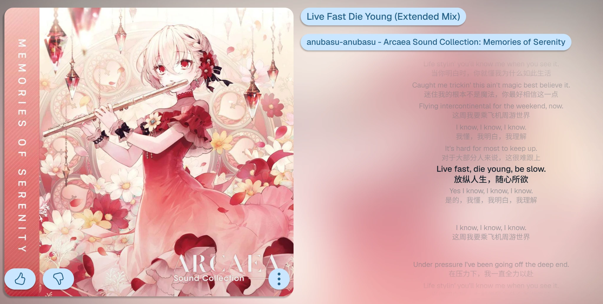

# 歌词行间距偏短

## 问题描述

相邻两句歌词之间的间距偏短，当前歌词区域显得较为拥挤。

## 期望行为

歌词间距应参考设计稿进行调整，或在保持可读性的前提下适当增大。

## 修复状态

- [x] 主题模型提供紧密歌词间距和普通/长间隔歌词间距配置。
- [x] 主题管理的播放器设置中可分别调整两类歌词间距。
- [x] 歌词面板通过主题运行时生成的 CSS 变量应用间距设置。

## 验证结果

- 主题管理提供“紧密歌词间距”和“普通/长间隔歌词间距”滑块。
- 普通/长间隔歌词间距不会小于紧密歌词间距，避免配置产生倒置。
- 歌词面板根据相邻歌词的间隔类型消费对应主题变量。
- 本问题已具备用户可调节能力，按用户确认关闭。

## 截图

## 记录信息

- 提出日期：2026-08-12 11:56
- 来源：`更改项目.xlsx（Sheet1 A11:F11）`
- 来源图片：`Sheet1 C11` 的内嵌图片
- 审核状态：已确认通过主题管理提供歌词间距调整能力。
- 修复状态：已修复并关闭。
