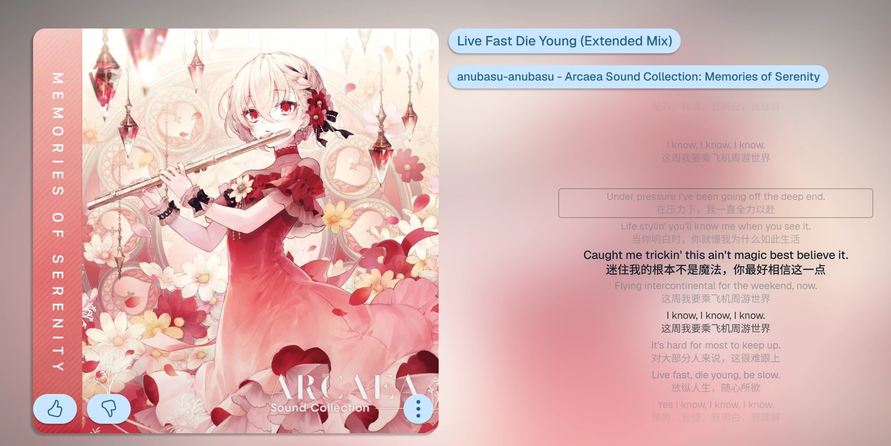

# 点击歌词后按下 Shift 错误显示黑色圆角焦点框

## 问题描述

点击某行歌词后按下 Shift 键，此前点击并保留焦点的歌词会错误显示黑色圆角框，不符合设计预期。

## 复现步骤

1. 播放一首包含歌词的歌曲。
2. 点击任意一行歌词，使播放进度跳转到该歌词对应的时间。
3. 在歌词项仍保留焦点时按住 Shift 键。
4. 观察此前点击的歌词外围出现黑色圆角框。

## 根因分析

歌词行当前使用带有 `role="button"` 和 `tabIndex={0}` 的 `li` 元素实现。鼠标点击歌词后，浏览器会把焦点保留在该歌词行上；点击处理只执行播放进度跳转，没有在指针交互结束后释放焦点。

当随后按下 Shift 时，Chromium 将输入方式视为键盘交互，已经获得焦点的歌词行开始匹配 `:focus-visible`。歌词样式为该状态定义了带圆角的 `outline`，因此显示出截图中的黑色圆角框。

因果链为：

`点击歌词` → `歌词行获得并保留焦点` → `按下 Shift，输入方式切换为键盘` → `歌词行匹配 :focus-visible` → `渲染圆角 outline`。

截图中圆角框围住的是此前点击的歌词，而当前播放歌词仍在下方以粗体显示，也说明该方框属于焦点状态，不是当前歌词状态或播放时间轴状态。

## 解决方案

在歌词行的点击处理函数中区分指针与键盘激活：

- 指针点击歌词完成跳转后，主动对该歌词行调用 `blur()`，清除鼠标点击遗留的焦点。
- 通过键盘 Tab 聚焦、Enter 或 Space 激活歌词时继续保留焦点和 `:focus-visible` 轮廓，保证键盘用户能识别当前位置。
- 保留现有 `tabIndex` 和焦点轮廓样式；不应直接删除 `:focus-visible`、禁用 outline 或取消歌词的键盘可聚焦能力，否则会造成可访问性回归。

实现让点击处理接收事件，并仅在 `event.detail > 0`、确认是指针生成的点击时执行 `event.currentTarget.blur()`；键盘处理仍沿用现有 Enter/Space 跳转逻辑。

修复后应验证：

- 鼠标点击歌词后按住 Shift，不再出现圆角框。
- 使用 Tab 聚焦歌词时仍显示清晰焦点轮廓。
- Enter 和 Space 仍可跳转到对应歌词时间。
- 当前歌词高亮、自动滚动和歌词点击跳转不受影响。

## 修复结果

- 指针点击歌词时先完成播放进度跳转，再清除该歌词项的焦点。
- 键盘或合成点击的 `event.detail` 为 `0`，不会清除焦点。
- 保留 `tabIndex`、Enter/Space 键盘处理和 `:focus-visible` 轮廓。

## 验证结果

- 指针点击歌词后按 Shift：不再出现圆角焦点框。
- Enter 和 Space 激活歌词：播放进度正常跳转，焦点及轮廓保持可见。
- 当前歌词的高亮属性和歌词列表自动滚动正常。
- 页面控制台没有新增 warning 或 error。
- `npm.cmd run lint`：通过。
- `npm.cmd run build`：通过，仅有既存的大 chunk 警告。
- `git diff --check`：通过，仅有既存的 LF 到 CRLF 提示。

## 期望行为

鼠标点击歌词后按下 Shift 键，不应为此前点击的歌词显示黑色圆角框；键盘导航产生的正常焦点提示仍应保留。

## 截图

## 记录信息

- 提出日期：2026-08-12 11:59
- 来源：`更改项目.xlsx（Sheet1 A12:F12）`
- 来源图片：`Sheet1 C12` 的内嵌图片
- 审核状态：已补充稳定复现步骤并完成前端代码路径诊断。
- 修复状态：已修复并通过独立前端交互验证。
