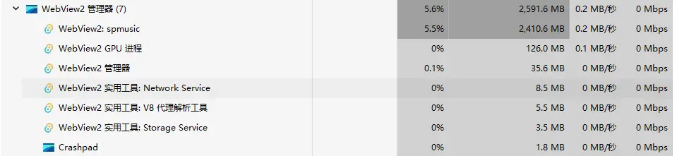

# 连续切歌导致 WebView2 内存异常增长与卡顿

## 问题描述

播放音乐或连续切换歌曲时，SpMusic 的 WebView2 渲染进程内存占用曾持续升高；快速切歌还会造成界面卡顿。复测中曾出现多次切歌后占用超过 `7 GB` 且长时间不回落的情况。

来源截图显示，任务管理器中 `WebView2: spmusic` 进程占用约 `2,410.6 MB` 内存，其所在的 WebView2 进程组合计约占用 `2,591.6 MB`。该截图能够证明单个时间点的高内存占用，但不足以单独确认持续增长趋势或内存泄漏根因。

后续使用包含 `1769` 首歌曲的播放列表重复切歌，确认问题与歌曲切换时触发的队列、封面背景、歌词和 WebView2 渲染资源生命周期有关，而不是 Tauri 主进程本身持续增长。

## 诊断演进

1. 初期怀疑封面与背景缓存未释放。限制旧资源生命周期后，单次切歌增量由约 `30–40 MB` 降至约 `3 MB`，但内存仍只涨不降，说明缓存并非唯一原因。
2. 空界面对比显示，开发模式的 WebView2 Private 基线约为 `475 MiB`，Release 空界面约为 `240 MiB`。Release 构建能够显著降低开发服务器、调试代码和未优化资源带来的基础开销，但不能自动修复连续切歌导致的资源滞留。
3. `1769` 首队列原先一次性渲染全部条目，并在歌曲切换时连带更新大量 DOM；封面和环境背景同时保留较大的 Canvas backing store，并持续进行图片读取、解码和转场。
4. 快速选择不同歌曲时，过期封面任务仍可能进入 Rust 读取、像素传输、Canvas 创建和解码路径；歌词每行各自持有事件处理器、ref 与尺寸观察，也放大了切歌时的 DOM、监听器和观察器开销。
5. 诊断数据表明，增长主体不完全位于 JavaScript heap。即使 JS 对象已可回收，Chromium Renderer 的原生分配和高水位仍可能暂时保留，因此还需要在一批 UI 更新稳定后安全地通知 WebView2 执行内存整理。

## 根因分析

本问题不是单一缓存对象未调用释放，而是多条高开销路径在切歌时叠加：

- **全量队列 DOM**：长播放列表的全部行常驻并参与更新，造成数千个元素、节点与监听器占用。
- **无界的封面图像工作**：快速切歌会为马上过期的歌曲重复启动封面读取、像素传输和 Canvas 资源创建；背景与封面的高分辨率 backing store 又放大了原生内存峰值。
- **歌词逐行绑定资源**：每行歌词分别创建处理器、ref 和观察目标，增加 Renderer 的 DOM 与 native embedder 压力。
- **WebView2 回收时机滞后**：Chromium 会保留已经释放但尚未归还的渲染内存高水位；原有整理通知只覆盖少量封面转场场景，快速选择经合并后可能无法及时达到触发条件。
- **开发模式基础开销较高**：`npm run tauri dev` 的调试环境显著高于 Release，放大了任务管理器中的静止占用和封面切换延迟，但不是连续增长的根因。

## 最终解决方案

在不改变现有封面和背景视觉效果的前提下，采用以下组合修复：

1. **队列虚拟化**：长队列只渲染可见范围及少量 overscan 行，保留滚动、当前歌曲定位、选择和禁用语义，不再让上千个队列项同时常驻 DOM。
2. **封面资源有界化**：将 Rust 读取到 Canvas 呈现之间的像素和 Canvas 资源纳入有上限的资源池；新歌曲选择会淘汰或取消过期工作，空资源会主动释放 backing store。
3. **快速选择负载削峰**：已缓存、已预取或正在加载的封面继续立即复用；只有完全冷启动的封面请求会进行短时 trailing debounce，使快速连点只为最终歌曲执行前景加载。下一首候选仍通过有界预取降低正常切歌等待。
4. **限制环境背景 backing store**：环境背景 Canvas 的最大 backing edge 限制为 `1024`，专辑封面继续保留原有清晰度、模糊、亮度、饱和度和转场效果。
5. **歌词资源收敛**：歌词点击和键盘交互改为列表级事件委托；每个歌词面板只保留一个 `ResizeObserver`，避免逐行处理器、ref 回调和观察目标随歌词数量增长。
6. **稳定后内存整理**：前端在一批快速 UI 选择稳定后发送一次完成通知；Rust/WebView2 协调器通过 debounce、冷却、single-flight 和失败退避控制 memory-pressure 通知，不在每次切歌时强制 GC，也不会因前台播放而暂停窗口。

## 验证结果

### 独立性能验证

- 开发模式空界面 WebView2 Private 基线约 `475 MiB`，Release 空界面约 `240 MiB`，确认 Release 构建显著降低基础开销。
- 以 `80 ms` 间隔连续执行 `20` 次下一首后，Renderer Private 峰值约为 `394.79 MiB`，空闲 `30` 秒后回落至约 `318.07 MiB`，未再复现持续上涨到 `1.5–7 GB` 且不回落的现象。
- DOM 节点峰值相较修复前降低约 `64%`，空闲 `30` 秒后降低约 `83%`。
- 事件监听器峰值相较修复前降低约 `65%`，空闲 `30` 秒后基本回到基线。
- 长任务由修复前 `22` 个、累计约 `1695 ms`，降至 `5` 个、累计约 `285 ms`。
- 长播放列表滚动、当前歌曲自动定位、队列选择、歌词交互、封面与环境背景视觉效果保持正常。

### 用户 Release 验收

- 快速切歌时，一首歌曲带来的内存增量约为 `15 MB`。
- 连续快速切换后，WebView2 内存较难超过 `700 MB`。
- 正常播放数秒后可观察到内存回收。
- `npm run tauri dev` 下封面切换仍比 Release 慢；这是开发构建的已知性能差异，Release 作为本问题的性能验收基准。

## 期望行为

- 播放音乐期间的内存占用应保持在合理且稳定的范围内，不应随播放时长、切歌次数或界面操作持续无界增长。
- 停止播放、切换歌曲或释放不再使用的音频与界面资源后，相应内存应能被回收。
- 若达到异常内存阈值，应能够通过可重复的运行时证据定位具体进程、资源类型和触发路径。

## 截图

## 记录信息

- 提出日期：2026-08-14 11:36
- 来源：`更改项目.xlsx（Sheet1 A15:F15）`
- 来源图片：`Sheet1 C15` 的内嵌富数据图片
- 审核状态：已完成根因诊断、独立性能验证和用户 Release 验收；严重程度仍未单独定级。
- 修复状态：已修复并完成。

## 已知限制

- Chromium/WebView2 会保留一定的 Renderer 和 GPU 内存高水位，快速切歌期间出现短时峰值属于预期；验收重点是峰值有界，并能在 UI 稳定和正常播放后回落。
- 开发模式包含 Vite、调试代码和未优化资源，基础内存及封面切换速度不能直接代表 Release 表现。
