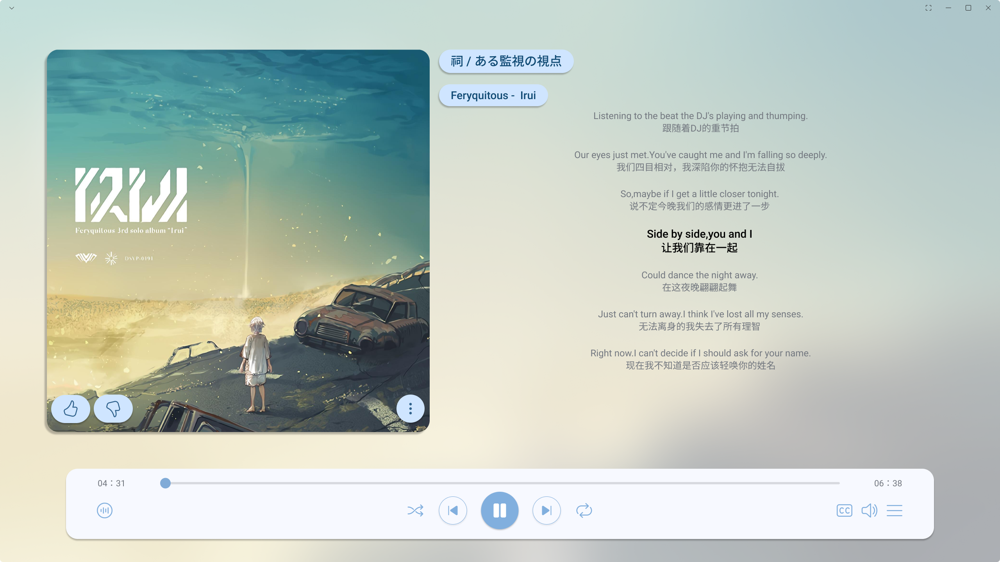

# UI 规格：播放界面

## 摘要

本规格定义 SpMusic v0.1 播放界面的信息结构、视觉方向、组件映射、交互状态和验收标准。用户提供的界面图作为视觉参考：保留大封面、右侧当前内容区和底部控制条的播放器气质，但 v0.1 只实现假歌曲、UI-only 进度、演示频谱和基础播放控制。

## 输入与约束

- `SP-003` 要求产出播放界面、可见状态、控制区和空歌曲列表状态的 UI 规格。
- `v0.1` 只支持前端内存状态，不读取本地音频文件，不触发真实播放。
- 播放状态只使用 `paused` / `playing`，不新增加载、缓冲、错误、随机、循环等真实音频状态。
- `Track` 当前字段为 `id`、`title`、`artist`、`album`、`durationSeconds`，不得为了截图效果提前加入真实封面、歌词、文件路径或来源字段。
- 已接入 shadcn/ui，当前配置使用 `base-nova`、`lucide` 图标、`@/components/ui` 别名。已存在 `Button`、`Badge`、`Card`、`Empty`、`Tooltip`、`Separator` 等组件。
- 用户截图中的点赞、踩、更多菜单、随机、循环、音量、字幕和歌词展示不进入 v0.1 主流程；如保留视觉占位，必须不可交互且不得暗示能力已完成。

## 目标

- 启动后首屏直接呈现播放界面，不出现模板页、开屏页或营销页。
- 让用户一眼识别当前歌曲、播放状态、播放进度和基础控制。
- 将现有工程验证型界面收敛为更接近桌面播放器的沉浸式布局。
- 为 Frontend Agent 提供可实现的布局、组件、状态和文案规则。
- 为 Test Agent 提供可客观检查的验收点。

## 不在范围内

- 不设计真实音频播放、音量调节、进度拖动同步真实音频、缓冲或音频错误恢复。
- 不设计真实歌词、歌词滚动、歌词翻译、歌词文件读取或歌词同步。
- 不设计真实封面抓取、本地文件读取、媒体库、播放列表管理、播放队列页面或 `m3u8` 能力。
- 不设计点赞、收藏、评分、随机、循环、字幕、均衡器、更多菜单、在线服务或插件入口。
- 不新增主题导入、主题编辑器、完整国际化框架或用户自定义动效系统。

## 用户场景

- 用户打开应用后，看到一个完整播放器界面，能确认这是 SpMusic，而不是模板项目。
- 用户查看当前歌曲信息，至少能看到歌曲名、艺术家、专辑、时长中的 3 类信息。
- 用户点击播放 / 暂停，界面在 `paused` 与 `playing` 之间切换。
- 用户点击上一首 / 下一首，当前歌曲基于假歌曲数据切换，进度回到 `0`。
- 用户在空歌曲列表分支中看到稳定 Empty State，控制按钮不可用且界面不崩溃。

## 界面结构

| 区域 | 目的 | 内容 | 交互 | 验收点 |
| --- | --- | --- | --- | --- |
| 应用容器 | 承载首屏播放界面 | 背景、主内容、底部控制条 | 无直接交互 | 首屏不显示模板内容 |
| 当前歌曲视觉区 | 建立播放器主视觉 | 演示封面或抽象封面、产品标识、当前状态 | 不提供封面编辑或抓取入口 | 有稳定视觉区域，缺少封面数据时不空白 |
| 当前歌曲信息区 | 展示当前曲目信息 | 歌曲名、艺术家、专辑、时长、播放状态 Badge | 状态随当前歌曲和播放状态变化 | 展示至少 3 类当前歌曲信息 |
| 状态文本区 | 替代截图中的歌词区 | 当前歌曲摘要、UI-only 状态说明或演示文案 | 不滚动、不同步、不标记为歌词 | 不出现“歌词已支持”的文案 |
| 演示频谱区 | 表达 UI-only 音频视觉化 | 固定演示频谱条或等价动效 | `playing` 时可增强动效，`paused` 时静止或弱化 | 不依赖真实音频分析 |
| 底部控制条 | 提供基础播放控制 | 进度、已播 / 总时长、上一首、播放 / 暂停、下一首 | 点击按钮切换 UI 状态 | 只出现 v0.1 已批准控制 |
| Empty State | 处理空歌曲列表 | 空状态标题、说明、禁用控制 | 不提供导入文件按钮 | 空列表分支可渲染且不崩溃 |

## 视觉层级与布局

- 桌面宽屏（大于等于 `1180px`）：主内容使用左右两列。左侧为大封面视觉区，右侧为当前歌曲信息、状态文本和演示频谱；底部控制条固定在内容下方，不覆盖主内容。
- 普通桌面窗口（`820px` 到 `1179px`）：封面和信息区仍保持左右布局，但压缩横向间距；控制条保持单行，时间文本和进度条优先保留。
- 窄屏窗口（小于 `820px`）：主内容改为单列，封面在上，歌曲信息和状态文本在下，控制条允许换行但按钮组居中。
- 最小可用宽度为 `320px`。长歌曲名、专辑名和艺术家名必须换行或截断，不得挤出容器。
- 视觉优先级为：当前歌曲名 > 播放 / 暂停按钮 > 进度 > 艺术家 / 专辑 / 时长 > 演示频谱 > 状态说明。
- 封面视觉区可以使用渐变、图标和产品标识作为演示封面，但不得展示文件路径、真实封面抓取状态或在线图片加载状态。
- 底部控制条采用浅色面板，边框和阴影应克制。普通卡片圆角不超过 `8px`；圆形图标按钮和进度滑块手柄可使用胶囊圆角。
- 配色建议：中性浅背景、白色或近白控制面、青绿色主强调色、蓝色播放状态强调、暖色暂停提示。避免整页只由单一青绿色或蓝色构成。
- 字号建议：歌曲名 `32px` 到 `42px`，区域标题 `16px` 到 `20px`，正文和状态文本 `14px` 到 `16px`，按钮可访问名称不依赖可见文字。

## 组件映射

| 界面元素 | 建议组件 | 状态 | 文案来源 | 备注 |
| --- | --- | --- | --- | --- |
| 主容器 | 原生 `main` + CSS grid/flex | 常规 / 空列表 | `appCopy.shellLabel` | 不需要 `Card` 包裹整个页面 |
| 当前歌曲视觉区 | `Card` 或普通 `section` | 有歌曲 / 空歌曲 | `appCopy.productName` | 不嵌套卡片；缺少封面时用演示视觉 |
| 当前歌曲标题 | 原生 `h1` / `h2` | 有歌曲 / 空歌曲 | `Track.title` 或空状态文案 | 应使用 `aria-live="polite"` |
| 艺术家、专辑、时长 | `dl` 或紧凑信息组 | 有歌曲 | `Track` 字段 | 信息组不做成多层卡片 |
| 播放状态 | `Badge` | `paused` / `playing` | `appCopy.playbackStatus` | 状态值仍为英文枚举 |
| 上一首 / 下一首 | `Button` `size="icon"` 或等价尺寸 | 可用 / 禁用 | `appCopy.controls` | 使用 lucide `SkipBack` / `SkipForward` |
| 播放 / 暂停 | `Button` | `paused` / `playing` / 禁用 | `appCopy.controls` | 使用 `aria-pressed` 表达切换状态 |
| 进度条 | 原生 `input[type=range]` 或现有样式轨道 | 可用 / 禁用 | `appCopy.progress` | v0.1 表达 UI-only 进度；若改用 shadcn `Slider` 需 Frontend Agent 判断是否新增组件 |
| 演示频谱 | 原生 `div` + CSS token | `paused` / `playing` / 空频谱 | `appCopy.spectrum` | 不映射真实音频分析 |
| 空状态 | `Empty` 或现有空状态结构 | 空歌曲 / 空频谱 | `appCopy.nowPlaying`、`appCopy.queue` | 不出现“导入音乐”按钮 |
| 提示说明 | `Tooltip` | 控件悬停 / 聚焦 | `appCopy.controls` | 图标按钮应有可访问名称 |

## 交互状态矩阵

| 状态 | 触发条件 | 可见反馈 | 可操作项 | 禁用项 | 验收方式 |
| --- | --- | --- | --- | --- | --- |
| `paused` | 初始状态或用户点击暂停 | 播放按钮显示播放图标，状态 Badge 显示“已暂停” | 播放、上一首、下一首 | 无，除非歌曲列表为空 | 点击播放后切到 `playing` |
| `playing` | 有当前歌曲时点击播放 | 播放按钮显示暂停图标，状态 Badge 显示“播放中”，频谱可增强 | 暂停、上一首、下一首 | 无 | 点击暂停后切到 `paused` |
| `trackChanged` | 点击上一首或下一首 | 当前歌曲信息变化，进度归零 | 播放 / 暂停、上一首、下一首 | 无 | 当前歌曲 ID 基于假数据切换 |
| `progressCapped` | UI-only 进度达到或超过时长 | 进度显示在总时长上限内 | 播放 / 暂停、上一首、下一首 | 进度不得超过最大值 | 进度文本不超过总时长 |
| `emptyTracks` | `tracks.length === 0` | 显示 Empty State，状态保持暂停 | 无主要播放操作 | 播放、上一首、下一首、进度 | 空列表不崩溃，不渲染 undefined |
| `singleTrack` | `tracks.length === 1` | 上一首 / 下一首后仍为同一首 | 播放 / 暂停、上一首、下一首 | 无 | 连续切歌当前 ID 仍有效 |
| `invalidCurrentTrack` | `currentTrackId` 不存在于 `tracks` | 回退到第一首或 Empty State | 同正常状态 | 取决于是否有歌曲 | 不渲染 undefined 字段 |
| `emptySpectrum` | `spectrumBars.length === 0` | 频谱区显示后备说明或静态占位 | 播放控制仍可用 | 无 | 频谱区域不导致布局坍塌 |

## 空、加载、错误和禁用状态

- 空歌曲列表：显示标题“暂无演示歌曲”和说明“当前没有可用于界面验证的歌曲数据”。不得显示“选择文件”“导入音乐”“扫描文件夹”等未批准入口。
- 当前歌曲缺失：如果歌曲列表非空，界面回退到第一首；如果歌曲列表为空，显示 Empty State。
- 空频谱：显示静态后备区域或“暂无演示频谱”，不得显示真实音频错误。
- 加载状态：v0.1 不设计伪加载状态，因为数据来自本地固定假数据。
- 错误状态：v0.1 不设计真实音频或文件读取错误；异常数据只通过 Empty State 或安全回退处理。
- 禁用状态：歌曲列表为空时禁用播放 / 暂停、上一首、下一首和进度条；禁用控件保持可见但有 `disabled` 和可感知的视觉弱化。

## 可访问性要求

- 页面使用一个 `main`，并用可见标题或 `aria-labelledby` 标识。
- 当前歌曲信息变化区域使用 `aria-live="polite"`，避免频繁打断读屏。
- 播放 / 暂停按钮使用 `aria-pressed`；图标按钮必须提供 `aria-label`。
- 焦点顺序为：当前歌曲区域、进度条、上一首、播放 / 暂停、下一首、频谱或状态区。若存在演示歌曲列表，列表项在控制区之后。
- 键盘用户可通过 `Tab` 到达所有可操作控件，并通过 `Enter` 或 `Space` 触发按钮。
- 可点击目标最小尺寸为 `44px`。底部控制条在窄屏下不得让按钮相互重叠。
- 文本对比度：正文至少满足 4.5:1，大号歌曲名至少满足 3:1；禁用态也要能辨认。
- `prefers-reduced-motion: reduce` 下，频谱动效应静止或移除过渡。

## 文案

- 产品身份：`SpMusic`。
- 页面标题：`SpMusic 播放界面`。
- 当前歌曲区标签：`正在播放`。
- 播放状态：`已暂停`、`播放中`。业务状态仍使用 `paused` / `playing`。
- 控制按钮可访问名称：`上一首`、`播放`、`暂停`、`下一首`。
- 进度标签：`播放进度`、`已播放`、`总时长`。
- 频谱标题：`演示频谱`，说明为`当前播放视觉`或同义短句。
- 空歌曲标题：`暂无演示歌曲`；说明为`当前没有可用于界面验证的歌曲数据。`
- 文案应集中在 `copy`、`texts` 或 `messages` 对象中，v0.1 不要求完整 i18n 框架。
- 不使用“歌词”“真实播放”“导入音乐”“媒体库”“收藏”“音量”“播放列表管理”等会暗示未批准能力的可见文案。

## 验收标准

- `docs/ui/player-shell.md` 存在，并包含 YAML front matter。
- 规格定义应用容器、当前歌曲视觉区、当前歌曲信息区、底部控制条、演示频谱和 Empty State。
- 规格明确截图中的歌词、点赞、音量、随机、循环、字幕和更多菜单不进入 v0.1 主流程。
- 规格定义 `paused`、`playing`、上一首、下一首、进度上限、空歌曲列表、单曲列表、异常当前歌曲和空频谱状态。
- 规格给出桌面宽屏、普通桌面窗口和窄屏窗口的布局变化。
- 规格给出可映射到现有 shadcn/ui 基底的组件建议，且不要求 UI/UX Agent 安装新组件。
- 规格给出基础视觉 token 建议，包括颜色、间距、圆角、状态色和字号层级。
- 规格明确用户可见文案和集中管理建议。
- 规格明确 v0.1 不实现真实音频播放、本地文件读取、媒体库、真实播放列表、歌词、封面抓取、插件和主题导入能力。

## 风险与开放问题

- 用户截图的视觉完成度高，但其中包含多项 v0.1 未批准能力；实现时必须优先遵守 Sprint 范围。
- 如果 Frontend Agent 直接照搬截图中的所有按钮，会导致范围膨胀和验收歧义。
- 如果把状态文本区命名为歌词区，用户会误认为 v0.1 已支持歌词能力。
- 是否在 `SP-008` 中保留右侧演示歌曲列表，应由 Frontend Agent 根据当前实现取舍；v0.1 不要求完整列表管理 UI。
- 如果需要把进度条替换为 shadcn `Slider` 或 `Progress`，应由 Frontend Agent 判断是否新增组件，并保持不引入真实音频进度语义。

## 建议下一负责 Agent

Frontend Agent 使用本规格完成 `SP-008` 播放界面视觉与交互修正。Test Agent 后续验证状态矩阵、响应式布局、空状态和范围排除项。
